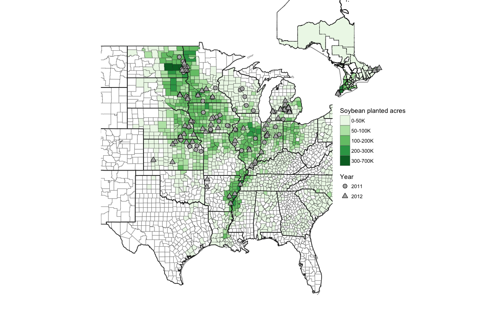
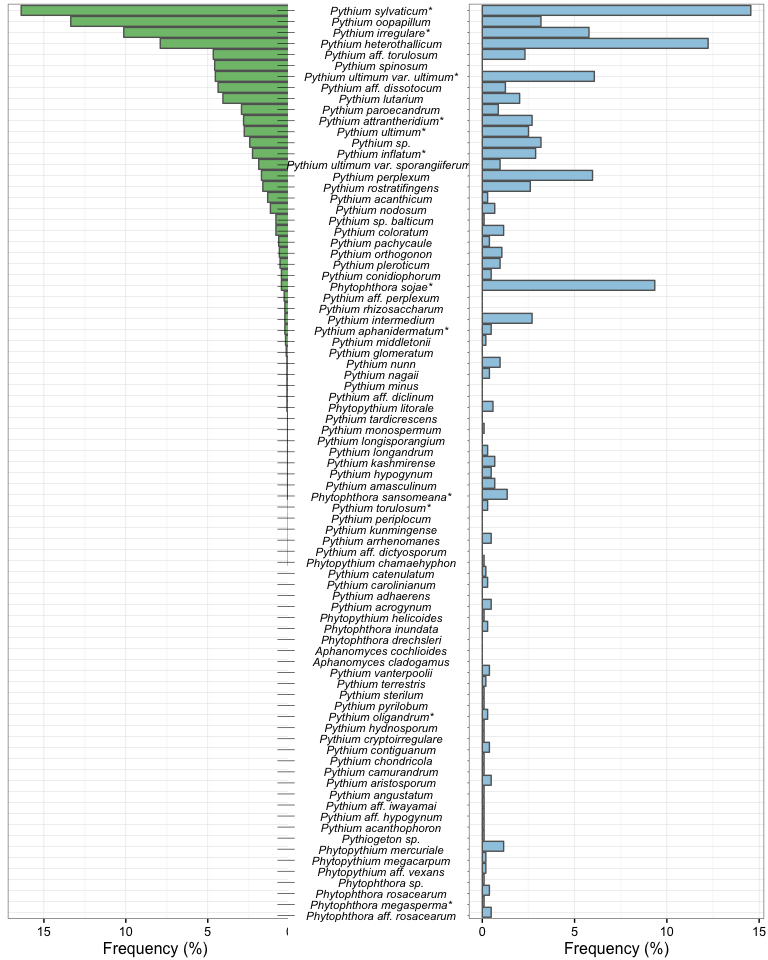
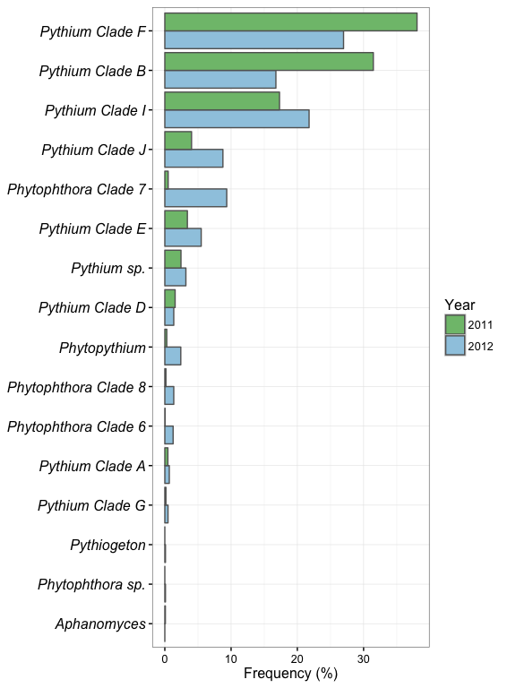

# Oomycete species associated with soybean seedlings in the U.S.
J. Alejandro Rojas  

#Part I: identification and pathogenicity characterization

## Figures and analyses

__Figure 1.__ Map of sampled soybean fields in 2011 and 2012, and intensity of 
planted soybean acres demonstrated by color intensity at the county/parish level. 

__Figure 2.__ Frequency at which different Oomycete species were recovered from 
diseased soybean seedlings in 2011 and 2012.  (*) Species previously reported as 
associated with soybean in the fungal-host database (<http://nt.ars-grin.gov/fungaldatabases/fungushost/fungushost.cfm>).

__Figure 3.__  Frequency of the oomycete species summarized by clade for 2011 
and 2012. Oomycete genera outside of Pythium and Phytophthora were summarized 
by genus.  Those species designated as spp. are not well resolved based only on
the ITS sequence.

## Tables

You can also embed plots, for example:

Note that the `echo = FALSE` parameter was added to the code chunk to prevent printing of the R code that generated the plot.
