# Diversity and ecology of oomycetes associated wiht soybean seedlings
J. Alejandro Rojas  
April 19, 2016  


```
## Warning: replacing previous import 'BiocGenerics::Position' by
## 'ggplot2::Position' when loading 'phyloseq'
```

```
##     phyloseq      ggplot2 RColorBrewer         plyr        dplyr 
##         TRUE         TRUE         TRUE         TRUE         TRUE 
##        tidyr        knitr     magrittr          ape        vegan 
##         TRUE         TRUE         TRUE         TRUE         TRUE 
##       ggtree      cowplot      ggrepel       gtable    gridExtra 
##         TRUE         TRUE         TRUE         TRUE         TRUE
```

##Read files for OTU analyses

```r
#Import BIOM, sample data and tree files
OTU_file <- "../data/clean/Seqs_11_12.OTU.biom"
Metadata_file <- "../data/clean/env_metadata.csv"

Oom_OTU <- import_biom(OTU_file)

#Oom_tree <- read_tree(Tree_file)
Oom_data <- import_qiime_sample_data(Metadata_file)

#Covert year to factor
Oom_data$Year <- as.factor(Oom_data$Year)

#Rename tax ranks to actual names
colnames(tax_table(Oom_OTU)) <- c("Phylum","Class","Order",
                                  "Family","Genus","Clade","Species")

#Merge phyloseq objects
Oom_biom <- merge_phyloseq(Oom_OTU, Oom_data) 
```

##Read files for phylotype analyses

```r
#Import files
otu_phylo <- read.csv("../data/clean/OTU.phylotype.txt", sep = "\t", 
                      row.names = 1, header = TRUE)
taxa_phylo <- read.csv("../data/clean/Taxa.phylotype.txt", sep = "\t", 
                       row.names = 1, header = TRUE)

#Transform to phyloseq objects
otu_phylo <- otu_table(otu_phylo, taxa_are_rows = TRUE)
taxa_phylo <- tax_table(as.matrix(taxa_phylo))

#Phyloseq object
Oom_phylo <- phyloseq(otu_phylo, taxa_phylo)
Oom_phylo <- merge_phyloseq(Oom_phylo, Oom_data)
```

##Richness analyses

```r
#Plotting richness
plot_richness(Oom_biom, "St_Yr", 
              measures = c("InvSimpson","Shannon","Chao1"), color = "Year")
```

```
## Warning: Removed 250 rows containing missing values (geom_errorbar).
```

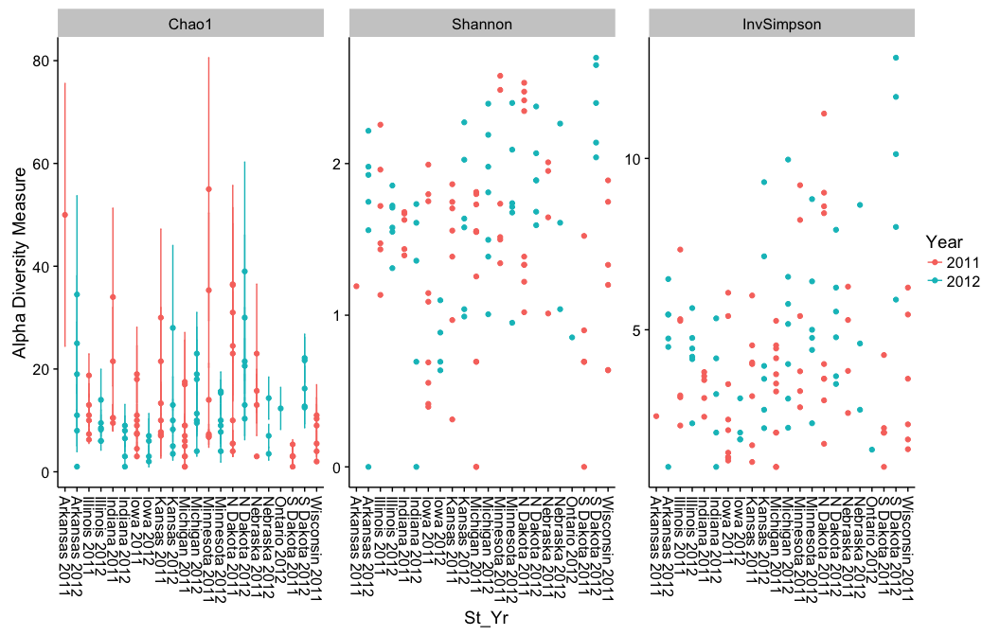

```r
#Table richness
Tb_richness <- estimate_richness(Oom_biom, 
                                 split = TRUE, 
                                 c("Observed", "Shannon", "Simpson")) %>% 
  add_rownames(var = "sample") %>%
  mutate(Evenness = Shannon/log(Observed))

samp_size <- colSums(otu_table(Oom_biom))
samp_size <- data.frame(samp_size) %>% add_rownames(var = "sample")

smp_state <- data.frame(sample_data(Oom_biom)[,1:5]) %>% 
  add_rownames(var = "sample")

Tb_richness_final <- left_join(Tb_richness, samp_size, by = "sample") %>%
  left_join(smp_state, by = "sample") %>%
  filter(Observed > 1) %>%
  ddply(c("St_Yr"), summarise, 
        N = length(sample),
        Isolates = sum(samp_size),
        mean.Observed = mean(Observed),
        sd.Observed = sd(Observed, na.rm = TRUE),
        mean.Shannon = mean(Shannon),
        sd.Shannon = sd(Shannon, na.rm = TRUE),
        mean.Simpson = mean(Simpson),
        sd.Simpson = sd(Simpson, na.rm = TRUE),
        mean.Evenness = mean(Shannon/log(Observed)),
        sd.Evenness = sd(Shannon/log(Observed), na.rm = TRUE))

kable(Tb_richness_final, digits = 3)
```


St_Yr              N   Isolates   mean.Observed   sd.Observed   mean.Shannon   sd.Shannon   mean.Simpson   sd.Simpson   mean.Evenness   sd.Evenness
---------------  ---  ---------  --------------  ------------  -------------  -----------  -------------  -----------  --------------  ------------
Arkansas 2011      1        320          14.000            NA          1.191           NA          0.597           NA           0.451            NA
Arkansas 2012      5         74           8.600         3.050          1.886        0.247          0.809        0.027           0.908         0.064
Illinois 2011      6        243           9.000         3.225          1.663        0.403          0.730        0.119           0.771         0.136
Illinois 2012      6        147           7.167         1.472          1.621        0.188          0.745        0.094           0.838         0.117
Indiana 2011       5        398          10.200         1.789          1.562        0.136          0.688        0.059           0.680         0.087
Indiana 2012       4         30           4.750         1.893          1.349        0.464          0.688        0.137           0.927         0.070
Iowa 2011          9        398           6.889         3.257          1.092        0.627          0.482        0.269           0.572         0.259
Iowa 2012          4         19           2.750         0.957          0.828        0.209          0.514        0.105           0.889         0.171
Kansas 2011        7        213           7.429         2.760          1.363        0.550          0.615        0.261           0.701         0.283
Kansas 2012        6         93           6.667         2.658          1.591        0.513          0.729        0.137           0.870         0.114
Michigan 2011      9        188           5.889         2.804          1.404        0.437          0.695        0.117           0.884         0.096
Michigan 2012      7        134           8.286         3.729          1.752        0.486          0.761        0.125           0.866         0.113
Minnesota 2011     6        185          10.667         6.186          1.859        0.537          0.774        0.104           0.827         0.102
Minnesota 2012     6        130           8.167         4.070          1.762        0.487          0.776        0.113           0.888         0.033
N Dakota 2011      9        210           9.556         5.637          1.784        0.635          0.758        0.162           0.874         0.168
N Dakota 2012      6        162          10.667         2.875          1.916        0.281          0.793        0.065           0.823         0.094
Nebraska 2011      4         75           7.750         3.686          1.654        0.457          0.750        0.102           0.865         0.076
Nebraska 2012      3         49           6.667         4.041          1.638        0.612          0.764        0.131           0.930         0.027
Ontario 2012       1         64           9.000            NA          0.854           NA          0.334           NA           0.389            NA
S Dakota 2011      5         23           2.800         1.304          0.901        0.359          0.559        0.116           0.953         0.078
S Dakota 2012      5        114          13.000         3.808          2.385        0.295          0.889        0.038           0.942         0.035
Wisconsin 2011     6         51           4.667         1.966          1.241        0.532          0.619        0.205           0.846         0.174


```r
#Summarizing by state
Oom_phylo_state <- tax_glom(Oom_phylo, taxrank = "Clade")
Oom_phylo_state <- merge_samples(Oom_phylo_state, "St_Yr")

#Transform counts for plot
#Oom_phylo_state <- transform_sample_counts(Oom_phylo_state, 
#                                           function(x) 100 * x/sum(x))
State_Year <- psmelt(Oom_phylo_state)

#Color scale
pal <- colorRampPalette(brewer.pal(12, "Paired"))

#Reorder factor
Clade_factor <- State_Year %>% group_by(Clade) %>% dplyr::summarise(sum(Abundance))
Clade_factor <- Clade_factor[order(-Clade_factor$`sum(Abundance)`),]
Clade_factor <- Clade_factor$Clade
State_Year$Clade <- factor(State_Year$Clade, levels = Clade_factor)
levels(State_Year$Clade)
```

```
##  [1] "Pythium_Clade_F"      "Pythium_Clade_B"      "Pythium_Clade_I"     
##  [4] "Pythium_Clade_J"      "Pythium_Clade_E"      "Phytophthora_Clade_7"
##  [7] "Pythium_sp."          "Pythium_Clade_D"      "Phytopythium"        
## [10] "Phytophthora_Clade_8" "Phytophthora_Clade_6" "Pythium_Clade_A"     
## [13] "Pythium_Clade_G"      "Aphanomyces"          "Phytophthora_sp."    
## [16] "Pythiogeton"
```

```r
data_state <- dplyr::select(State_Year, Sample, Abundance, Clade)
data_state <- data_state[with(data_state, order(Clade, as.numeric(Clade))),]

#Plot
(ByState <- ggplot(data = data_state, aes(Sample, Abundance, fill = Clade)) +
  geom_bar(stat = "identity", position = position_fill()) + coord_flip() +
  scale_fill_manual(values = pal(18)) + 
   theme(text = element_text(size = 15)) + theme_gray())
```

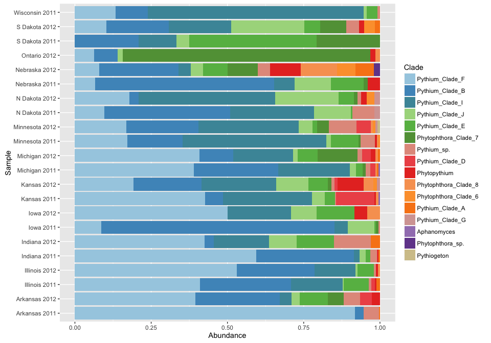


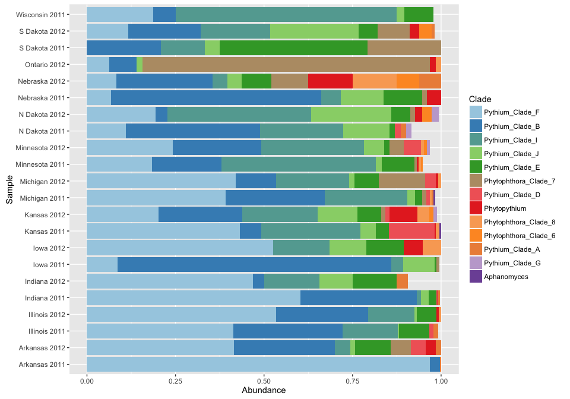

## Rarefaction curves

```r
## DATA ##

psdata <- merge_samples(Oom_phylo, "St_Yr")
psdata
```

```
## phyloseq-class experiment-level object
## otu_table()   OTU Table:         [ 83 taxa and 22 samples ]
## sample_data() Sample Data:       [ 22 samples by 46 sample variables ]
## tax_table()   Taxonomy Table:    [ 83 taxa by 7 taxonomic ranks ]
```

```r
sample_sums(psdata)
```

```
##  Arkansas 2011  Arkansas 2012  Illinois 2011  Illinois 2012   Indiana 2011 
##            320             76            244            149            400 
##   Indiana 2012      Iowa 2011      Iowa 2012    Kansas 2011    Kansas 2012 
##             33            397             24            216             94 
##  Michigan 2011  Michigan 2012 Minnesota 2011 Minnesota 2012  N Dakota 2011 
##            192            137            187            131            167 
##  N Dakota 2012  Nebraska 2011  Nebraska 2012   Ontario 2012  S Dakota 2011 
##            163             75             50             64             24 
##  S Dakota 2012 Wisconsin 2011 
##            117            113
```

```r
### Calculate alpha diversity ###
set.seed(42)

calculate_rarefaction_curves <- function(psdata, measures, depths) {
  require('plyr') # ldply
  require('reshape2') # melt

  estimate_rarified_richness <- function(psdata, measures, depth) {
    if(max(sample_sums(psdata)) < depth) return()
    psdata <- prune_samples(sample_sums(psdata) >= depth, psdata)

    rarified_psdata <- rarefy_even_depth(psdata, depth, verbose = FALSE)

    alpha_diversity <- estimate_richness(rarified_psdata, measures = measures)

    # as.matrix forces the use of melt.array, which includes the Sample names (rownames)
    molten_alpha_diversity <- melt(as.matrix(alpha_diversity), varnames = c('Sample', 'Measure'), value.name = 'Alpha_diversity')

    molten_alpha_diversity
  }

  names(depths) <- depths # this enables automatic addition of the Depth to the output by ldply
  rarefaction_curve_data <- ldply(depths, estimate_rarified_richness, psdata = psdata, measures = measures, .id = 'Depth', .progress = ifelse(interactive(), 'text', 'none'))

  # convert Depth from factor to numeric
  rarefaction_curve_data$Depth <- as.numeric(levels(rarefaction_curve_data$Depth))[rarefaction_curve_data$Depth]

  rarefaction_curve_data
}

rarefaction_curve_data <- calculate_rarefaction_curves(psdata, c('Observed', 'Shannon'), rep(c(1, 5, 10, 1:20 * 10), each = 10))
```

```
## Loading required package: reshape2
```

```r
summary(rarefaction_curve_data)
```

```
##      Depth                  Sample         Measure     Alpha_diversity 
##  Min.   :  1.00   Arkansas.2011: 460   Observed:3380   Min.   : 0.000  
##  1st Qu.: 10.00   Illinois.2011: 460   Shannon :3380   1st Qu.: 1.932  
##  Median : 60.00   Indiana.2011 : 460                   Median : 2.589  
##  Mean   : 67.64   Iowa.2011    : 460                   Mean   : 7.106  
##  3rd Qu.:110.00   Kansas.2011  : 460                   3rd Qu.:13.000  
##  Max.   :200.00   Michigan.2011: 440                   Max.   :27.000  
##                   (Other)      :4020
```

```r
### Summarize alpha diversity ###
rarefaction_curve_data_summary <- ddply(rarefaction_curve_data, c('Depth', 'Sample', 'Measure'), summarise, Alpha_diversity_mean = mean(Alpha_diversity), Alpha_diversity_sd = sd(Alpha_diversity))

### Add sample data ###
smp_dt <- as.data.frame(sample_data(psdata))
row.names(smp_dt) <- gsub(pattern = " ",replacement = ".", x = row.names(smp_dt))
rarefaction_curve_data_summary_verbose <- merge(rarefaction_curve_data_summary, smp_dt,
                                                by.x = 'Sample', by.y = 'row.names')

### plot ###
ggplot(
  data = rarefaction_curve_data_summary_verbose,
  mapping = aes(
    x = Depth,
    y = Alpha_diversity_mean,
    ymin = Alpha_diversity_mean - Alpha_diversity_sd,
    ymax = Alpha_diversity_mean + Alpha_diversity_sd,
    colour = State2,
    group = Sample)) + 
  geom_smooth() + 
  #geom_pointrange() + 
  facet_wrap(facets = ~ Measure, scales = 'free_y') + 
  theme_gray()
```

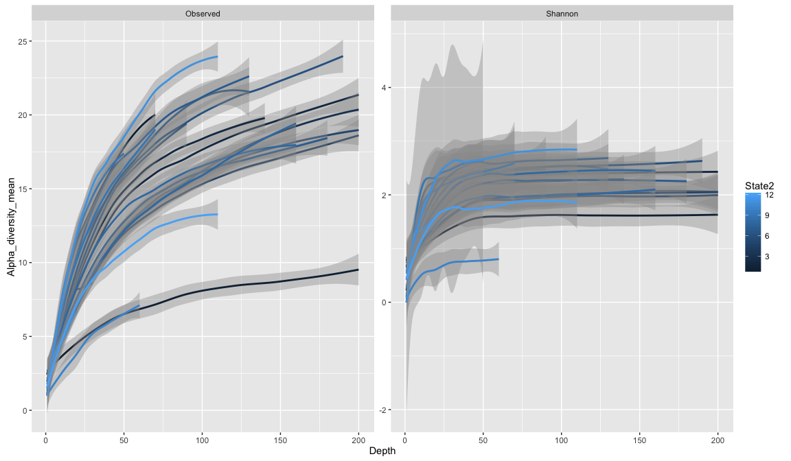


## Latitude/Longitude gradient

```r
#Richness data
richness2 <- estimate_richness(Oom_biom, 
                                 split = TRUE, 
                                 c("Observed", "Shannon", "Simpson", "Chao1", "InvSimpson")) %>% 
  add_rownames(var = "sample")


samp_size <- colSums(otu_table(Oom_biom))
samp_size <- data.frame(samp_size) %>% add_rownames(var = "sample")

#Sample data
smp_state2 <- data.frame(sample_data(Oom_biom)[,c(1:5,8,9)]) %>% 
  add_rownames(var = "sample")
smp_state2 <- left_join(smp_state2, samp_size, by = "sample")

#Merging tables together
lt_rch_data <- left_join(smp_state2, richness2, by = "sample")
lt_rch_data <- lt_rch_data[!is.na(lt_rch_data[,7]),]
lt_rch_data <- lt_rch_data[(lt_rch_data[,9]) >= 10,]

#Correlation
cor.test(lt_rch_data$Lat, lt_rch_data$Observed, method = "spearman")
```

```
## Warning in cor.test.default(lt_rch_data$Lat, lt_rch_data$Observed, method =
## "spearman"): Cannot compute exact p-value with ties
```

```
## 
## 	Spearman's rank correlation rho
## 
## data:  lt_rch_data$Lat and lt_rch_data$Observed
## S = 86029, p-value = 0.0824
## alternative hypothesis: true rho is not equal to 0
## sample estimates:
##       rho 
## 0.1883719
```

```r
cor.test(lt_rch_data$Lat, lt_rch_data$Simpson, method = "spearman")
```

```
## Warning in cor.test.default(lt_rch_data$Lat, lt_rch_data$Simpson, method =
## "spearman"): Cannot compute exact p-value with ties
```

```
## 
## 	Spearman's rank correlation rho
## 
## data:  lt_rch_data$Lat and lt_rch_data$Simpson
## S = 80545, p-value = 0.02596
## alternative hypothesis: true rho is not equal to 0
## sample estimates:
##       rho 
## 0.2401049
```

```r
cor.test(lt_rch_data$Lat, lt_rch_data$Shannon, method = "spearman")
```

```
## Warning in cor.test.default(lt_rch_data$Lat, lt_rch_data$Shannon, method =
## "spearman"): Cannot compute exact p-value with ties
```

```
## 
## 	Spearman's rank correlation rho
## 
## data:  lt_rch_data$Lat and lt_rch_data$Shannon
## S = 78536, p-value = 0.01602
## alternative hypothesis: true rho is not equal to 0
## sample estimates:
##       rho 
## 0.2590589
```

```r
cor.test(lt_rch_data$Long, lt_rch_data$Shannon, method = "spearman")
```

```
## Warning in cor.test.default(lt_rch_data$Long, lt_rch_data$Shannon, method =
## "spearman"): Cannot compute exact p-value with ties
```

```
## 
## 	Spearman's rank correlation rho
## 
## data:  lt_rch_data$Long and lt_rch_data$Shannon
## S = 129750, p-value = 0.03803
## alternative hypothesis: true rho is not equal to 0
## sample estimates:
##        rho 
## -0.2241301
```

```r
#Plot
(Obs_plot <- ggplot(lt_rch_data, aes(x = Lat, y = Observed)) + 
  geom_point(size = 2, alpha = 0.5) + geom_smooth(method = lm) + theme_gray() +
  labs(x = "Latitude", y = "Observed OTUs") +
  annotate("text", x=45, y=0.4, label = "p-value = 0.0813\nrho = 0.189", 
           fontface = "bold", hjust = 0))
```

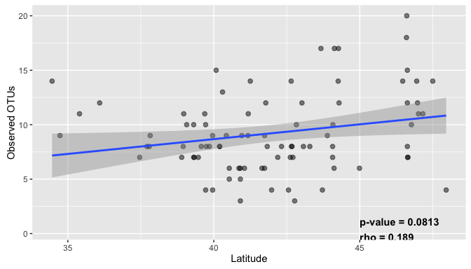

```r
(Obs_plot2 <- ggplot(lt_rch_data, aes(x = Lat, y = Shannon)) + 
  geom_point(size = 2, alpha = 0.5) + geom_smooth(method = lm) + theme_gray() +
  labs(x = "Latitude", y = "Shannon diversity index") +
  annotate("text", x=45, y=0.4, label = "p-value = 0.016\nrho = 0.258", 
           fontface = "bold", hjust = 0))
```

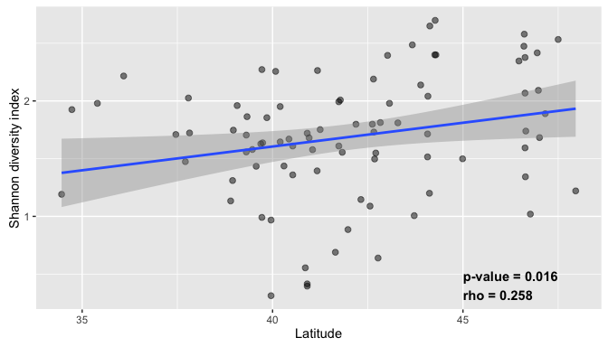

```r
(Obs_plot3 <- ggplot(lt_rch_data, aes(x = Long, y = Shannon)) + 
  geom_point(size = 2, alpha = 0.5) + geom_smooth(method = lm) + theme_gray() +
  labs(x = "Longitude", y = "Shannon diversity index") +
  annotate("text", x=-88, y=0.4, label = "p-value = 0.037\nrho = -0.224", 
           fontface = "bold", hjust = 0))
```

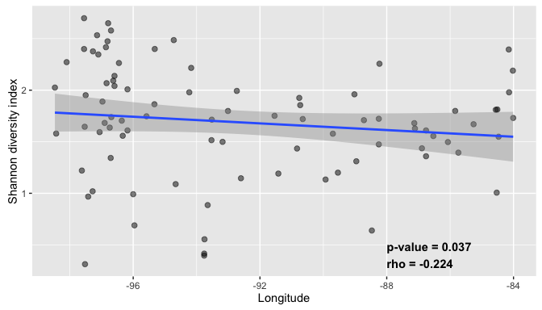

```r
#grid.arrange(Obs_plot2, Obs_plot3)
```

##Cluster analysis - OTU


```r
#Phyloseq otu table to vegan otu table
Oom_st <- prune_samples(!(grepl('MICO|ONSO', sample_names(Oom_biom))), Oom_biom)
Oom_st <- merge_samples(Oom_biom, "St_Yr")
tb_otu <- veganotu(Oom_st)
tb_otu <- tb_otu[row.names(tb_otu) != "Ontario 2012",]

#Phyloseq sample to vegan sample table
tb_sample <- vegansam(Oom_st)

#Relative abundance and bray-curtis distance
tb_otu <- decostand(tb_otu, method = "total")
tb_otu.bc <- vegdist(tb_otu, method = "bray")
tb_otu.pa.bc <- vegdist(tb_otu, method = "bray", binary = TRUE)

tb.otu.cl <- as.phylo(hclust(tb_otu.bc, method = "ward.D2"))
tb.otu.pa <- as.phylo(hclust(tb_otu.pa.bc, method = "ward.D2"))

cls <- list(c1 = c("N Dakota 2011", "N Dakota 2012", 
                   "Minnesota 2011", "Minnesota 2012"),
            c2 = c("S Dakota 2011", "S Dakota 2012", "Iowa 2011", 
                   "Iowa 2012", "Nebraska 2011"),
            c3 = c("Wisconsin 2011", "Illinois 2011", "Illinois 2012", 
                   "Indiana 2011", "Indiana 2012", "Michigan 2011", 
                   "Michigan 2012"),
            c4 = c("Kansas 2011", "Kansas 2012", "Arkansas 2011", 
                   "Arkansas 2012"))

tb.otu.cl <- groupOTU(tb.otu.cl, cls)
tb.otu.pa <- groupOTU(tb.otu.pa, cls)

t1.otu <- ggtree(tb.otu.cl, branch.length = 'branch.length') + 
  #geom_text(aes(label = label, hjust = -0.05)) + 
  ggplot2::xlim(0,1) + geom_tiplab(aes(color = group, label = label)) +
  scale_color_brewer(type = "div", palette = "Set1")
```

```
## Found more than one class "phylo" in cache; using the first, from namespace 'phyloseq'
## Found more than one class "phylo" in cache; using the first, from namespace 'phyloseq'
```

```r
ggtree(tb.otu.pa) + geom_text(aes(label = label, hjust = -0.05)) + ggplot2::xlim(0,0.6)
```

```
## Found more than one class "phylo" in cache; using the first, from namespace 'phyloseq'
## Found more than one class "phylo" in cache; using the first, from namespace 'phyloseq'
```

```
## Warning: Removed 20 rows containing missing values (geom_text).
```

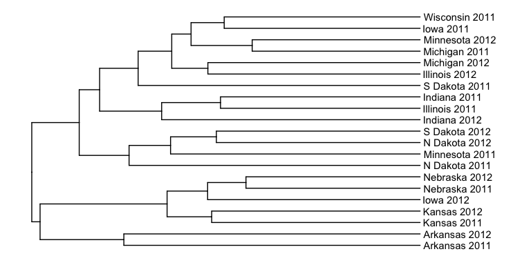

```r
t2.otu <- ggtree(tb.otu.pa, branch.length = 'branch.length') + 
  #geom_text(aes(label = label, hjust = -0.05)) + 
  ggplot2::xlim(0,0.6) + geom_tiplab(aes(color = group, label = label)) +
  scale_color_brewer(type = "div", palette = "Set1")
```

```
## Found more than one class "phylo" in cache; using the first, from namespace 'phyloseq'
## Found more than one class "phylo" in cache; using the first, from namespace 'phyloseq'
```

```r
gridExtra::grid.arrange(t1.otu, t2.otu, ncol = 2)
```

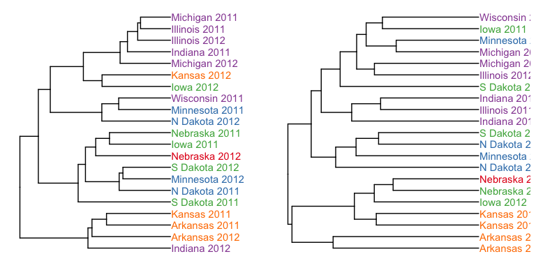


##Cluster analysis - phylotype


```r
#Phyloseq otu table to vegan otu table
Oom_ph.1 <- prune_samples(!(grepl('MICO|ONSO', sample_names(Oom_phylo))), Oom_phylo)
Oom_ph <- merge_samples(Oom_ph.1, "St_Yr")
tb_ph <- veganotu(Oom_ph)
tb_ph <- tb_ph[row.names(tb_ph) != "Ontario 2012",]

#Phyloseq sample to vegan sample table
tb_sp_ph <- vegansam(Oom_ph)

#Relative abundance and bray-curtis distance
tb_ph <- decostand(tb_ph, method = "total")
tb_ph.bc <- vegdist(tb_ph, method = "bray")
tb_ph.pa.bc <- vegdist(tb_ph, method = "jaccard", binary = TRUE)

tb.ph.cl <- as.phylo(hclust(tb_ph.bc))
tb.ph.pa <- as.phylo(hclust(tb_ph.pa.bc))

tb.ph.cl <- groupOTU(tb.ph.cl, cls)
tb.ph.pa <- groupOTU(tb.ph.pa, cls)


ggtree(tb.ph.cl, layout="rectangular") + 
  geom_text(aes(label = label, hjust = -0.05)) + ggplot2::xlim(0,0.6) + theme_tree2()
```

```
## Found more than one class "phylo" in cache; using the first, from namespace 'phyloseq'
## Found more than one class "phylo" in cache; using the first, from namespace 'phyloseq'
```

```
## Warning: Removed 20 rows containing missing values (geom_text).
```

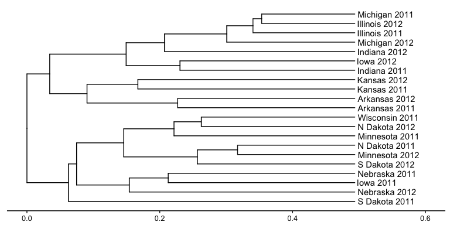

```r
t1.ph <- ggtree(tb.ph.cl, branch.length = 'branch.length') + 
  #geom_text(aes(label = label, hjust = -0.05)) + 
  ggplot2::xlim(0,0.6) + geom_tiplab(aes(label = label)) +
  scale_color_brewer(type = "div", palette = "Set1") + xlab("Height") + ylab("Cluster dendogram")
```

```
## Found more than one class "phylo" in cache; using the first, from namespace 'phyloseq'
## Found more than one class "phylo" in cache; using the first, from namespace 'phyloseq'
```

```r
ggtree(tb.ph.pa) + 
  geom_text(aes(label = label, hjust = -0.05)) + ggplot2::xlim(0,0.6)
```

```
## Found more than one class "phylo" in cache; using the first, from namespace 'phyloseq'
## Found more than one class "phylo" in cache; using the first, from namespace 'phyloseq'
```

```
## Warning: Removed 20 rows containing missing values (geom_text).
```

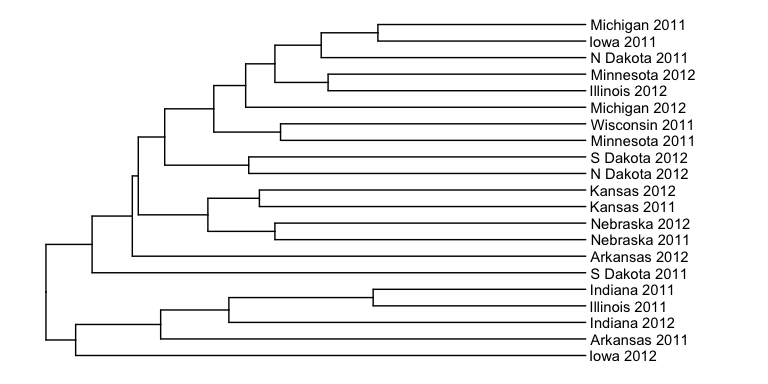

```r
t2.ph <- ggtree(tb.ph.pa, branch.length = 'branch.length') + 
  #geom_text(aes(label = label, hjust = -0.05)) + 
  ggplot2::xlim(0,0.6) + geom_tiplab(aes(color = group, label = label)) +
  scale_color_brewer(type = "div", palette = "Set1")
```

```
## Found more than one class "phylo" in cache; using the first, from namespace 'phyloseq'
## Found more than one class "phylo" in cache; using the first, from namespace 'phyloseq'
```

```r
#gridExtra::grid.arrange(t1.ph, t2.ph, ncol = 2)
#gridExtra::grid.arrange(t1.otu, t2.otu, t1.ph, t2.ph, ncol = 2)
```


```r
plot_grid(t1.ph, Obs_plot2, labels = c("A", "B"), ncol = 1,
          align = "h"
          #rel_widths = c(0.85,1,1), rel_heights = c(0.5,1,1) 
          )
```

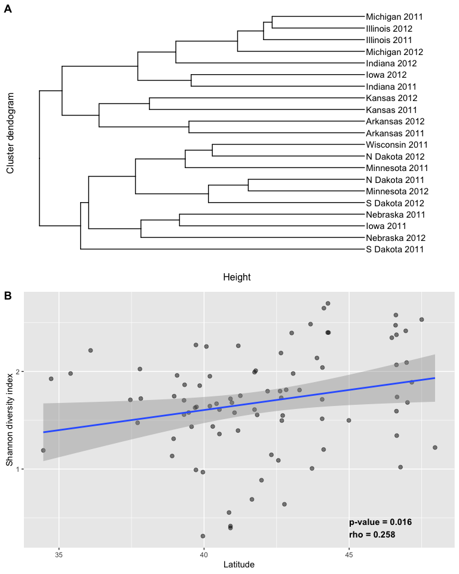

```r
(plot_grid(t1.ph, Obs_plot2, Obs_plot3, labels = c("A", "B", "C"), ncol = 1,
          align = "h"
          #rel_widths = c(0.85,1,1), rel_heights = c(0.5,1,1) 
          ))
```

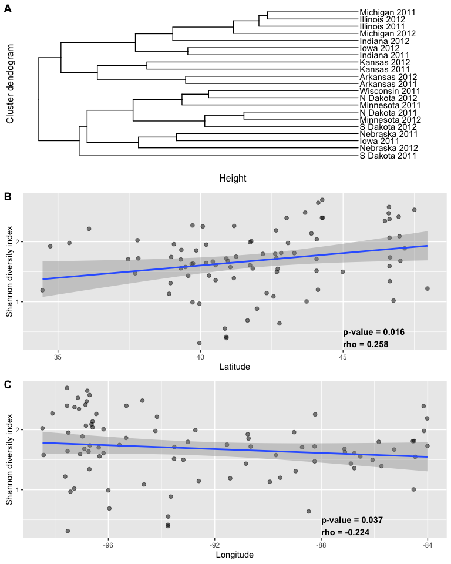


## Analysis of similarity (ANOSIM) for different parameters


```r
Oom_grp <- get_variable(Oom_biom, "State2")
Oom_st_ano <- anosim(distance(Oom_biom, "bray"), Oom_grp)

Oom_biom_lt <- prune_samples(!is.na(Oom_biom@sam_data$Lat), Oom_biom)

Lat_grp <- cut(get_variable(Oom_biom_lt, "Lat"), c(32,42,50))
(Oom_lt_ano <- anosim(distance(Oom_biom_lt, "bray"), Lat_grp))
```

```
## 
## Call:
## anosim(dat = distance(Oom_biom_lt, "bray"), grouping = Lat_grp) 
## Dissimilarity: bray 
## 
## ANOSIM statistic R: 0.1033 
##       Significance: 0.001 
## 
## Permutation: free
## Number of permutations: 999
```

```r
Long_grp <- cut(get_variable(Oom_biom_lt, "Long"), c(-80,-95,-110))
(Oom_lg_ano <- anosim(distance(Oom_biom_lt, "bray"), Long_grp))
```

```
## 
## Call:
## anosim(dat = distance(Oom_biom_lt, "bray"), grouping = Long_grp) 
## Dissimilarity: bray 
## 
## ANOSIM statistic R: 0.04035 
##       Significance: 0.094 
## 
## Permutation: free
## Number of permutations: 999
```

```r
Yr_grp <- get_variable(Oom_biom, "Year")
Oom_yr_ano <- anosim(distance(Oom_biom, "bray"), Yr_grp)

StYr_grp <- get_variable(Oom_biom, "St_Yr")
Oom_styr_ano <- anosim(distance(Oom_biom, "bray"), StYr_grp)
```

## ADONIS for different parameters

```r
df <- as(sample_data(Oom_biom), "data.frame")
d <- distance(Oom_biom, "bray")

Oom_adonis <- adonis(d ~ State2 + Year + State2*Year, df)

kable(Oom_adonis$aov.tab, digits = 3, 
      caption = "__Table 2.__ Comparison of community structure (beta diversity)\
      using Bray-curtis distance by State and year.")
```


Table: __Table 2.__ Comparison of community structure (beta diversity)
      using Bray-curtis distance by State and year.

                Df   SumsOfSqs   MeanSqs   F.Model      R2   Pr(>F)
------------  ----  ----------  --------  --------  ------  -------
State2          11       9.576     0.871     2.908   0.207    0.001
Year             1       0.702     0.702     2.346   0.015    0.002
State2:Year      9       5.259     0.584     1.952   0.113    0.001
Residuals      103      30.835     0.299        NA   0.665       NA
Total          124      46.371        NA        NA   1.000       NA

##Ordination analysis

```r
Oom_biom2 <- prune_samples(!is.na(Oom_biom@sam_data$Lat), Oom_biom)

colors2 <- c("#77C7C6",
"#C37F3B",
"#869BCF",
"#7DD54E",
"#C67BB7",
"#CDC84A",
"#CC6569",
"#83D693",
"#7A7678",
"#698547",
"#D3C1A7")

Oom_biom_ord <- ordinate(Oom_biom2, "PCoA", "bray")
ord_plot <- plot_ordination(Oom_biom2, Oom_biom_ord, color = "State2", shape = "Year")
(ord_plot.f <- ord_plot + geom_point(size = 4, alpha = 0.7) + 
  scale_colour_manual(values = colors2) +
  theme_light() + labs(color = "State", shape = "Year"))
```

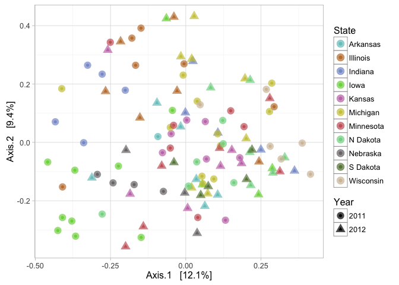

## Environmental/Edaphic factor analysis


```r
## Environment fit analysis
bray.pcoa <- ordinate(Oom_biom2, method = "PCoA", "bray")
env <- as.data.frame(Oom_biom2@sam_data)

Oom_env <- envfit(bray.pcoa$vectors, env, permutations = 999)
```

```
## Warning in as.matrix.data.frame(P): Setting class(x) to NULL; result will
## no longer be an S4 object
```

```r
fit_data <- as.data.frame(scores(Oom_env, display = "vectors")) %>%
  add_rownames(var = "Env.var") %>%
  bind_cols(data.frame(Oom_env$vectors$r, Oom_env$vectors$pvals)) %>%
  rename(R2 = Oom_env.vectors.r, P.value = Oom_env.vectors.pvals) %>%
  arrange(P.value)
  
## Supplementary material version

kable(fit_data, digits = 3, caption = "__Supp. table 1.__ Significance and correlation\
of vectors fitted into PCoA ordination of oomycete communities associated with\
soybean seedlings")
```


Table: __Supp. table 1.__ Significance and correlation
of vectors fitted into PCoA ordination of oomycete communities associated with
soybean seedlings

Env.var            Axis.1   Axis.2      R2   P.value
----------------  -------  -------  ------  --------
Long               -0.025    0.401   0.161     0.001
Precip             -0.279    0.275   0.154     0.001
Precip_AMJ_12      -0.101   -0.349   0.132     0.001
Precip_AMJ_11      -0.303    0.278   0.169     0.001
Precip_AMJ         -0.405   -0.024   0.165     0.001
Precip_30yr_avg    -0.279    0.189   0.113     0.002
Tmin_AMJ_11        -0.290    0.109   0.096     0.002
Db3rdbar            0.016    0.307   0.095     0.004
Tmean_AMJ_12       -0.295   -0.057   0.090     0.004
Lat                 0.308   -0.053   0.097     0.005
Tmean_AMJ_11       -0.296    0.061   0.091     0.005
TMin_30yr_avg      -0.284    0.102   0.091     0.006
Tmax_AMJ_12        -0.296   -0.047   0.090     0.006
Tmin_AMJ_12        -0.283   -0.066   0.084     0.007
TMean_30yr_avg     -0.286    0.069   0.087     0.008
Tmax_AMJ_11        -0.289    0.019   0.084     0.008
TMax_30yr_avg      -0.284    0.037   0.082     0.012
Clay               -0.066   -0.259   0.072     0.019
CEC7               -0.116   -0.234   0.068     0.020
pHwater             0.251   -0.084   0.070     0.020
TMin_yr            -0.198    0.160   0.065     0.023
WC3rdbar           -0.131   -0.222   0.066     0.028
Tmin_AMJ           -0.241    0.029   0.059     0.030
EC                  0.196   -0.119   0.053     0.046
Sand                0.153    0.167   0.051     0.048
TMean_yr           -0.188    0.093   0.044     0.084
OrgMatter           0.181   -0.077   0.038     0.096
Silt               -0.190   -0.031   0.037     0.120
Tmean_AMJ          -0.188    0.013   0.036     0.133
Tmax_yr            -0.171    0.028   0.030     0.173
ECEC               -0.088    0.138   0.027     0.226
Tmax_AMJ           -0.140    0.001   0.020     0.336
Slope_Avg          -0.053    0.096   0.012     0.520
Shape_Area         -0.103   -0.011   0.011     0.562
Shape_Length       -0.079   -0.051   0.009     0.602
AWC                -0.034   -0.077   0.007     0.659
Aspect              0.003    0.055   0.003     0.850

```r
## Reduced version

#kable(fit_data[fit_data$P.value < 0.05,], digits = 3, caption = "__Table 3.__ Significance and correlation\
#of vectors fitted into PCoA ordination of oomycete communities associated with\
#soybean seedlings")
```

### Results ordination and environmental data


```r
## Vectors for plot
fit_reduced <- fit_data[fit_data$P.value < 0.05,] 

fit_plot <- as.data.frame(scores(Oom_env, display = "vectors")) %>%
  add_rownames(var = "Env.var") %>%
  inner_join(fit_reduced, by = "Env.var") %>%
  arrange(P.value) %>%
  slice(c(10,1,5,19,18,8,20,22,2,17,15,12,21,6,23))

fit_plot$Env.var2 <- c("Latitude", "Longitude", "Precip. Season","CEC", "Clay (%)", 
                       "Bulk density", "Soil pH", "Water content", 
                       "Annual Total Precip.", "Max. Temp 30yr", 
                       "Mean Temp 30yr", "Min. Temp 30yr",
                       "Annual Min. Temp","Precip. 30yr", "Min. Temp Season")

## paper version
kable(fit_plot, digits = 3, caption = "__Table 3.__ Significant factors using\
      ‘envfit’ function from vegan that affect oomycete community associated\
      with soybean seedlings.")
```


Table: __Table 3.__ Significant factors using
      ‘envfit’ function from vegan that affect oomycete community associated
      with soybean seedlings.

Env.var            Axis.1.x   Axis.2.x   Axis.1.y   Axis.2.y      R2   P.value  Env.var2             
----------------  ---------  ---------  ---------  ---------  ------  --------  ---------------------
Lat                   0.308     -0.053      0.308     -0.053   0.097     0.005  Latitude             
Long                 -0.025      0.401     -0.025      0.401   0.161     0.001  Longitude            
Precip_AMJ           -0.405     -0.024     -0.405     -0.024   0.165     0.001  Precip. Season       
CEC7                 -0.116     -0.234     -0.116     -0.234   0.068     0.020  CEC                  
Clay                 -0.066     -0.259     -0.066     -0.259   0.072     0.019  Clay (%)             
Db3rdbar              0.016      0.307      0.016      0.307   0.095     0.004  Bulk density         
pHwater               0.251     -0.084      0.251     -0.084   0.070     0.020  Soil pH              
WC3rdbar             -0.131     -0.222     -0.131     -0.222   0.066     0.028  Water content        
Precip               -0.279      0.275     -0.279      0.275   0.154     0.001  Annual Total Precip. 
TMax_30yr_avg        -0.284      0.037     -0.284      0.037   0.082     0.012  Max. Temp 30yr       
TMean_30yr_avg       -0.286      0.069     -0.286      0.069   0.087     0.008  Mean Temp 30yr       
TMin_30yr_avg        -0.284      0.102     -0.284      0.102   0.091     0.006  Min. Temp 30yr       
TMin_yr              -0.198      0.160     -0.198      0.160   0.065     0.023  Annual Min. Temp     
Precip_30yr_avg      -0.279      0.189     -0.279      0.189   0.113     0.002  Precip. 30yr         
Tmin_AMJ             -0.241      0.029     -0.241      0.029   0.059     0.030  Min. Temp Season     

```r
ord_plot.data <- plot_ordination(Oom_biom2, Oom_biom_ord, 
                            color = "State2", shape = "Year", justDF = TRUE)

(ord.plot.env <- ggplot(data = ord_plot.data, aes(x = Axis.1, y = Axis.2)) + 
  geom_point(aes(color=State2, shape=Year), size = 4, alpha = 0.7) + 
  #scale_color_brewer(type = "div", palette ="Spectral") +
  labs(color = "State", shape = "Year", x = "PCoA 1 [12.1%]", y = "PCoA 2 [9.4%]") +
  scale_colour_manual(values = colors2) +
  geom_segment(data = fit_plot, aes(x = 0, xend = Axis.1.x, y = 0, yend = Axis.2.x), 
               arrow = arrow(length = unit(0.1,"cm")), color = "black", size = 0.8) + 
  geom_label_repel(data = fit_plot, aes(x = Axis.1.x, y = Axis.2.x, label = Env.var2), 
            size = 3, force = 1) + #facet_wrap(~Year) +
  theme_gray())
```

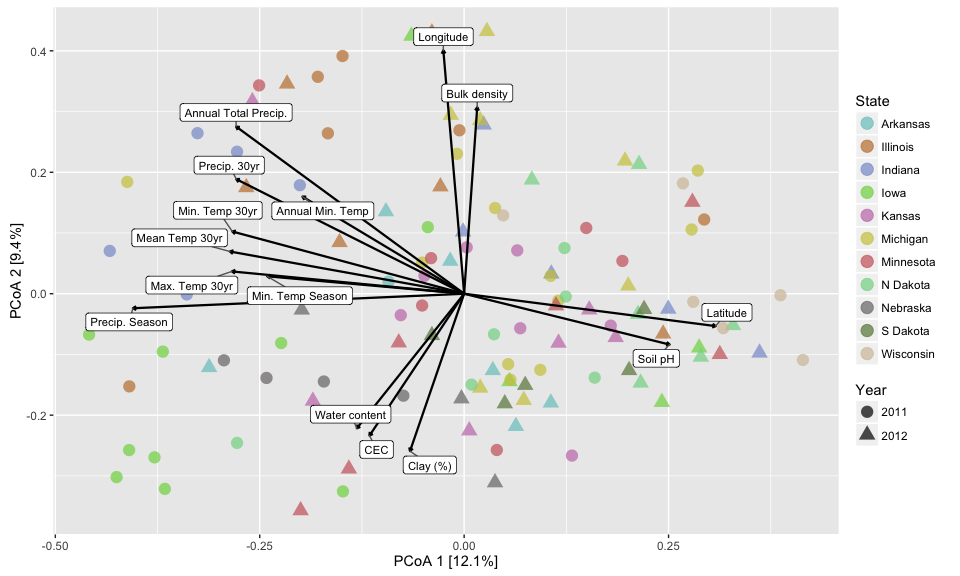

## Correlation of environmental parameters with PCoA axes


```r
#Season precipitation correlation with axis
P.cor <- cor.test(ord_plot.data[,"Axis.1"], log10(ord_plot.data[,"Precip_AMJ"]), method = "spearman")
```

```
## Warning in cor.test.default(ord_plot.data[, "Axis.1"],
## log10(ord_plot.data[, : Cannot compute exact p-value with ties
```

```r
Tmin.cor <- cor.test(ord_plot.data[,"Axis.1"], ord_plot.data[,"Tmin_AMJ"], method = "spearman")
```

```
## Warning in cor.test.default(ord_plot.data[, "Axis.1"], ord_plot.data[,
## "Tmin_AMJ"], : Cannot compute exact p-value with ties
```

```r
Clay.cor <- cor.test(ord_plot.data[,"Axis.2"], ord_plot.data[,"Clay"], method = "spearman")
```

```
## Warning in cor.test.default(ord_plot.data[, "Axis.2"], ord_plot.data[,
## "Clay"], : Cannot compute exact p-value with ties
```

```r
Blk.cor <- cor.test(ord_plot.data[,"Axis.2"], ord_plot.data[,"Db3rdbar"], method = "spearman")
```

```
## Warning in cor.test.default(ord_plot.data[, "Axis.2"], ord_plot.data[,
## "Db3rdbar"], : Cannot compute exact p-value with ties
```

```r
Lat.cor <- cor.test(ord_plot.data[,"Axis.1"], ord_plot.data[,"Lat"], method = "spearman")
```

```
## Warning in cor.test.default(ord_plot.data[, "Axis.1"], ord_plot.data[,
## "Lat"], : Cannot compute exact p-value with ties
```

```r
Long.cor <- cor.test(ord_plot.data[,"Axis.2"], ord_plot.data[,"Long"], method = "spearman")
```

```
## Warning in cor.test.default(ord_plot.data[, "Axis.2"], ord_plot.data[,
## "Long"], : Cannot compute exact p-value with ties
```

```r
#Plotting ordination 
Prec <- ggplot(ord_plot.data, aes(x = Axis.1, y = Precip_AMJ)) + 
  geom_smooth(method = lm, color = "gray14") +
  geom_point(aes(color = Lat), size = 3) + 
  theme_gray() +
  scale_color_gradientn(colours= c("#ef8a62","#67a9cf")) +
  labs(y = "Precipitation season (mm)", color = "Latitude") +
  annotate("text", x = 0.15, y = 210, 
           label = paste("p-value =", format(P.cor$p.value, digits = 3),
                         "\nrho =", round(P.cor$estimate, digits = 3)),
                         fontface = "bold", hjust = 0)


Tmin <- ggplot(ord_plot.data, aes(x = Axis.1, y = Tmin_AMJ)) + 
  geom_smooth(method = lm, color = "gray14") +
  geom_point(aes(color = Lat), size = 3) + 
  theme_gray() +
  scale_color_gradientn(colours= c("#ef8a62","#67a9cf")) +
  labs(y = "Minimum temperature season", color = "Latitude") +
  annotate("text", x = 0.15, y = 16, 
           label = paste("p-value =", format(Tmin.cor$p.value, digits = 3,
                                             scientific = TRUE),
                         "\nrho =", round(Tmin.cor$estimate, digits = 3)),
                         fontface = "bold", hjust = 0)

Clay <- ggplot(ord_plot.data, aes(x = Clay, y = Axis.2)) + 
  geom_smooth(method = lm, color = "gray14") +
  geom_point(aes(color = WC3rdbar), size = 3) + 
  theme_gray() +
  scale_color_gradientn(colours= c("#ef8a62","#67a9cf")) +
  labs(x = "Clay content (%)", color = "Vol. water\ncontent (%)") +
  annotate("text", x = 50, y = 0.38, 
           label = paste("p-value =", format(Clay.cor$p.value, digits = 3, 
                                             scientific = TRUE),
                         "\nrho =", round(Clay.cor$estimate, digits = 3)),
                         fontface = "bold", hjust = 0)

Blk <- ggplot(ord_plot.data, aes(x = Db3rdbar, y = Axis.2)) + 
  geom_smooth(method = lm, color = "gray14") +
  geom_point(aes(color = WC3rdbar), size = 3) + 
  theme_gray() +
  scale_color_gradientn(colours= c("#ef8a62","#67a9cf")) +
  labs(x = "Bulk density (g/cm3)", color = "Vol. water\ncontent (%)") +
  annotate("text", x = 1.58, y = 0.4, 
           label = paste("p-value =", format(Blk.cor$p.value, digits = 3,
                                             scientific = TRUE),
                         "\nrho =", round(Blk.cor$estimate, digits = 3)),
                         fontface = "bold", hjust = 0)

#Grid arregement for linear graphs
plot_grid(Prec, Tmin, Clay, Blk, labels = c("A", "B", "C", "D"), 
          ncol = 2, nrow = 2, align = "h")
```


## Mantel test for parameters

```r
Oom.dist <- distance(Oom_biom2, "bray")
env2 <- data.frame(env[,-c(1:7,12,24)])
env2.dist <- vegdist(env2$Lat, method = "euclidean")

# test.m <- mantel(Oom.dist, env2.dist, method = "pearson")
# test.m$statistic
# 
# length(colnames(env2))

factor_mantel <- function(dist, env){
  n <- length(colnames(env))
  df <- data.frame(Env.var = character(0), stat = numeric(0), pval = numeric(0))
  for (i in seq(1,n,1)) {
    factor_dist <- vegdist(env[,i], method = "euclidean")
    mt_test <- mantel(dist, factor_dist, method = "spearman")
    df <- rbind(df, data.frame(Env.var = colnames(env[i]), 
                               Statistic = mt_test$statistic, 
                               p.val = mt_test$signif))
    }
  df
}


mantel_table <- factor_mantel(Oom.dist, env2)
cor.table <- left_join(fit_data, mantel_table, by = "Env.var")
```

```
## Warning in left_join_impl(x, y, by$x, by$y): joining factor and character
## vector, coercing into character vector
```

```r
kable(cor.table, digits = 3)
```


Env.var            Axis.1   Axis.2      R2   P.value   Statistic   p.val
----------------  -------  -------  ------  --------  ----------  ------
Long               -0.025    0.401   0.161     0.001       0.083   0.003
Precip             -0.279    0.275   0.154     0.001       0.117   0.003
Precip_AMJ_12      -0.101   -0.349   0.132     0.001       0.014   0.338
Precip_AMJ_11      -0.303    0.278   0.169     0.001       0.076   0.039
Precip_AMJ         -0.405   -0.024   0.165     0.001       0.070   0.031
Precip_30yr_avg    -0.279    0.189   0.113     0.002       0.103   0.004
Tmin_AMJ_11        -0.290    0.109   0.096     0.002       0.103   0.010
Db3rdbar            0.016    0.307   0.095     0.004       0.023   0.275
Tmean_AMJ_12       -0.295   -0.057   0.090     0.004       0.155   0.001
Lat                 0.308   -0.053   0.097     0.005       0.115   0.008
Tmean_AMJ_11       -0.296    0.061   0.091     0.005       0.142   0.001
TMin_30yr_avg      -0.284    0.102   0.091     0.006       0.085   0.030
Tmax_AMJ_12        -0.296   -0.047   0.090     0.006       0.158   0.001
Tmin_AMJ_12        -0.283   -0.066   0.084     0.007       0.144   0.001
TMean_30yr_avg     -0.286    0.069   0.087     0.008       0.122   0.002
Tmax_AMJ_11        -0.289    0.019   0.084     0.008       0.173   0.001
TMax_30yr_avg      -0.284    0.037   0.082     0.012       0.153   0.001
Clay               -0.066   -0.259   0.072     0.019       0.151   0.003
CEC7               -0.116   -0.234   0.068     0.020       0.080   0.039
pHwater             0.251   -0.084   0.070     0.020       0.044   0.097
TMin_yr            -0.198    0.160   0.065     0.023       0.068   0.054
WC3rdbar           -0.131   -0.222   0.066     0.028       0.143   0.005
Tmin_AMJ           -0.241    0.029   0.059     0.030       0.106   0.009
EC                  0.196   -0.119   0.053     0.046      -0.011   0.584
Sand                0.153    0.167   0.051     0.048       0.059   0.091
TMean_yr           -0.188    0.093   0.044     0.084       0.112   0.010
OrgMatter           0.181   -0.077   0.038     0.096      -0.017   0.641
Silt               -0.190   -0.031   0.037     0.120       0.035   0.170
Tmean_AMJ          -0.188    0.013   0.036     0.133       0.121   0.004
Tmax_yr            -0.171    0.028   0.030     0.173       0.137   0.001
ECEC               -0.088    0.138   0.027     0.226       0.011   0.430
Tmax_AMJ           -0.140    0.001   0.020     0.336       0.119   0.003
Slope_Avg          -0.053    0.096   0.012     0.520      -0.023   0.693
Shape_Area         -0.103   -0.011   0.011     0.562      -0.008   0.566
Shape_Length       -0.079   -0.051   0.009     0.602      -0.055   0.872
AWC                -0.034   -0.077   0.007     0.659       0.020   0.306
Aspect              0.003    0.055   0.003     0.850       0.032   0.122


## Abundance of top 8 pathogenic species

```r
##Top 8 species
top.sp <- names(sort(taxa_sums(Oom_phylo), TRUE)[1:8])
oom.sp <- prune_taxa(top.sp, Oom_phylo)
oom.sp.st <- merge_samples(oom.sp, "State2")

##Function
getLabelPoint <- function(county) {Polygon(county[c('long', 'lat')])@labpt}

#map data
library(maps)
```

```
## 
##  # maps v3.1: updated 'world': all lakes moved to separate new #
##  # 'lakes' database. Type '?world' or 'news(package="maps")'.  #
```

```
## 
## Attaching package: 'maps'
```

```
## The following object is masked from 'package:plyr':
## 
##     ozone
```

```r
library(sp)
states <- map_data("state")
centroids <- by(states, states$region, getLabelPoint)
centroids <- do.call("rbind.data.frame", centroids)
names(centroids) <- c('long', 'lat')

centroids[row.names(centroids) == "michigan",]$long <- -84.62014
centroids[row.names(centroids) == "michigan",]$lat <- 43.49422

#Transform counts for plot
oom.data.pie <- transform_sample_counts(oom.sp.st, 
                                           function(x) 100 * x/sum(x))
oom.data.pie <- psmelt(oom.data.pie)
oom.data.pie <- oom.data.pie[,c(1:3,6,55,56)] %>%
                mutate(sample = tolower(Sample))

oom.data.pie$sample <- gsub("n dakota","north dakota", oom.data.pie$sample)
oom.data.pie$sample <- gsub("s dakota","south dakota", oom.data.pie$sample)
oom.data.pie$Species <- factor(oom.data.pie$Species,
                               levels(oom.data.pie$Species)[c(7,3,6,8,1,2,5,4)])
#data
oom.pie.0 <- add_rownames(centroids, "sample") %>%
  left_join({distinct(oom.data.pie)}) %>%
  filter(!is.na(Clade))
```

```
## Joining by: "sample"
```

```r
oom.pie <- oom.pie.0 %>% split(., .$sample)

#Color scale
pal2 <- colorRampPalette(brewer.pal(8, "Set3"))

#Pie chart
pies <- setNames(lapply(1:length(oom.pie), function(i){
  ggplot(oom.pie[[i]], aes(x=1, Abundance, fill=Species)) +
    geom_bar(stat="identity", width=1, color="black") + 
    coord_polar(theta="y") + 
    theme_tree() + 
    xlab(NULL) + 
    ylab(NULL) + 
    theme_transparent() +
    scale_fill_manual(values = pal2(8)) +
    theme(plot.margin=unit(c(0,0,0,0),"mm"))
}), names(oom.pie))

#Legend
e1 <- ggplot(oom.pie[[2]], aes(x=1, Abundance, fill=Species)) +
        geom_bar(stat="identity", width=1) + 
        coord_polar(theta="y") + 
  scale_fill_manual(values = pal2(8), 
                    labels = c("Py. sylvaticum","Py. heterothallicum", "Py. oopapillum",
                               "Py. ultimum var. ultimum","Py. aff. dissotocum",
                               "Py. aff. torulosum", "Py. lutarium","Py. irregulare")) +
  theme(legend.text = element_text(face = "italic"))

leg1 <- gtable_filter(ggplot_gtable(ggplot_build(e1)), "guide-box") 

#map
states2 <- subset(states, region %in% c(unique(oom.data.pie$sample), "missouri"))
map.p <- ggplot(states2, aes(long, lat, group=group)) +  
    geom_polygon(fill="gray90", color = "gray20", size=0.125) +
    xlim(-105,-78) +
    theme_transparent(axis.title = element_blank(),
                      axis.text = element_blank(),
                      axis.line = element_blank(),
                      axis.ticks = element_blank()) +
      annotation_custom(grob = leg1, xmin = -81, xmax = -83, ymin = 33, ymax = 40) 

#Final plot
n <- length(pies)
for (i in 1:n) {
    nms <- names(pies)[i]
    dat <- oom.pie.0[which(oom.pie.0$sample == nms)[1], ]
    map.p <- subview(map.p, pies[[i]], x = unlist(dat[["long"]])[1], y=unlist(dat[["lat"]])[1], 0.07, 0.07)
}

print(map.p)
```

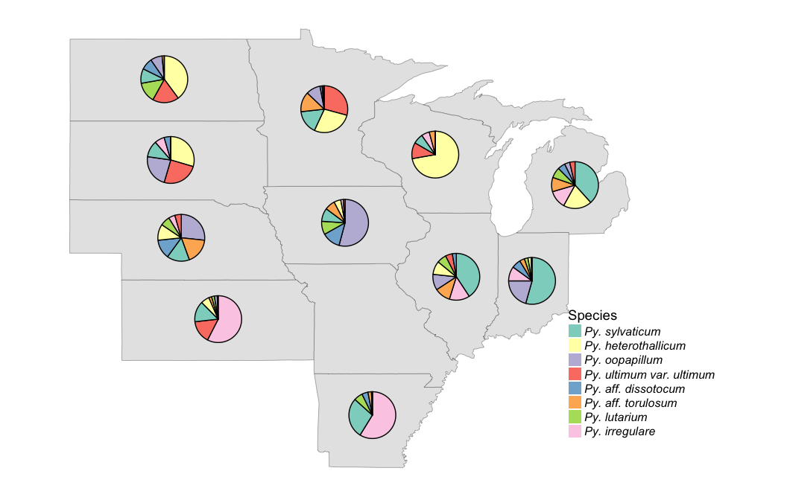

## Correlation of individual species with different parameters using occupancy models


```r
library(ggradar)
library(scales)
library(MASS)
#Oom_phylo.sp <- transform_sample_counts(Oom_phylo, 
#                                     function(x) x/sum(x))
test <- psmelt(Oom_phylo)
head(test)
```

```
##         OTU  Sample Abundance   group State   State2 Year         St_Yr
## 8981 Otu074  ARSO_1       103  ARSO_1  ARSO Arkansas 2011 Arkansas 2011
## 9208 Otu076  INSO_1        95  INSO_1  INSO  Indiana 2011  Indiana 2011
## 5959 Otu049  ARSO_1        79  ARSO_1  ARSO Arkansas 2011 Arkansas 2011
## 7878 Otu065  ARSO_1        66  ARSO_1  ARSO Arkansas 2011 Arkansas 2011
## 1060 Otu009 ONSO2_1        52 ONSO2_1 ONSO2  Ontario 2012  Ontario 2012
## 7449 Otu062  IASO_7        45  IASO_7  IASO     Iowa 2011     Iowa 2011
##      CDL_2011 CDL_2012   Lat   Long Slope_Avg Aspect        SurfText   AWC
## 8981 Soybeans Soybeans 34.46 -91.42     0.057    167       Silt loam 0.180
## 9208     Corn Soybeans 40.30 -86.89     0.685    205       Silt loam 0.144
## 5959 Soybeans Soybeans 34.46 -91.42     0.057    167       Silt loam 0.180
## 7878 Soybeans Soybeans 34.46 -91.42     0.057    167       Silt loam 0.180
## 1060                      NA     NA        NA     NA                    NA
## 7449     Corn Soybeans 40.91 -93.76     0.605     69 Silty clay loam 0.173
##        CEC7   Clay Db3rdbar    EC   ECEC OrgMatter pHwater   Sand   Silt
## 8981 35.000 32.300    1.360 0.000  9.700     0.840   5.400 13.400 54.300
## 9208 17.598 24.428    1.596 0.000 14.037     1.213   6.421 27.994 47.579
## 5959 35.000 32.300    1.360 0.000  9.700     0.840   5.400 13.400 54.300
## 7878 35.000 32.300    1.360 0.000  9.700     0.840   5.400 13.400 54.300
## 1060     NA     NA       NA    NA     NA        NA      NA     NA     NA
## 7449 27.358 36.761    1.431 0.995  0.000     0.814   6.167  9.302 53.937
##      WC3rdbar Water_Source Shape_Length Shape_Area   Precip TMax_30yr_avg
## 8981   31.700     Rain-fed      384.217   8819.025 1375.578         22.51
## 9208   28.819     Rain-fed      385.419   8361.445 1215.619         16.45
## 5959   31.700     Rain-fed      384.217   8819.025 1375.578         22.51
## 7878   31.700     Rain-fed      384.217   8819.025 1375.578         22.51
## 1060       NA                        NA         NA       NA            NA
## 7449   32.988     Rain-fed      387.859   8912.774  946.014         15.81
##      TMean_30yr_avg TMin_30yr_avg Tmax_yr TMean_yr TMin_yr Precip_30yr_avg
## 8981          16.89         11.27  22.897   17.283  11.668         1257.97
## 9208          10.79          5.12  16.558   11.199   5.840          983.87
## 5959          16.89         11.27  22.897   17.283  11.668         1257.97
## 7878          16.89         11.27  22.897   17.283  11.668         1257.97
## 1060             NA            NA      NA       NA      NA              NA
## 7449          10.00          4.19  15.798    9.858   3.918          941.92
##      Tmin_AMJ_12 Tmin_AMJ_11 Tmean_AMJ_12 Tmean_AMJ_11 Tmax_AMJ_12
## 8981      17.210      17.097       22.838       22.832      28.467
## 9208      11.157      11.263       17.840       16.752      24.523
## 5959      17.210      17.097       22.838       22.832      28.467
## 7878      17.210      17.097       22.838       22.832      28.467
## 1060          NA          NA           NA           NA          NA
## 7449      10.833       9.597       17.537       15.442      24.240
##      Tmax_AMJ_11 Precip_AMJ_12 Precip_AMJ_11 Tmin_AMJ Tmean_AMJ Tmax_AMJ
## 8981      28.567        61.440       171.210   17.097    22.832   28.567
## 9208      22.240        54.863       156.853   11.263    16.752   22.240
## 5959      28.567        61.440       171.210   17.097    22.832   28.567
## 7878      28.567        61.440       171.210   17.097    22.832   28.567
## 1060          NA            NA            NA       NA        NA       NA
## 7449      21.287        88.110       155.497    9.597    15.442   21.287
##      Precip_AMJ           Phylum     Class     Order     Family
## 8981    171.210 Heterokontophyta Oomycetes Pythiales Pythiaceae
## 9208    156.853 Heterokontophyta Oomycetes Pythiales Pythiaceae
## 5959    171.210 Heterokontophyta Oomycetes Pythiales Pythiaceae
## 7878    171.210 Heterokontophyta Oomycetes Pythiales Pythiaceae
## 1060         NA Heterokontophyta Oomycetes Pythiales Pythiaceae
## 7449    155.497 Heterokontophyta Oomycetes Pythiales Pythiaceae
##             Genus                Clade              Species
## 8981      Pythium      Pythium_Clade_F     Pythium_spinosum
## 9208      Pythium      Pythium_Clade_F   Pythium_sylvaticum
## 5959      Pythium      Pythium_Clade_F   Pythium_irregulare
## 7878      Pythium      Pythium_Clade_F Pythium_paroecandrum
## 1060 Phytophthora Phytophthora_Clade_7   Phytophthora_sojae
## 7449      Pythium      Pythium_Clade_B   Pythium_oopapillum
```

```r
test %>% filter(Species == "Pythium_sylvaticum"| 
                Species == "Pythium_heterothallicum"|
                Species == "Pythium_oopapillum"|
                Species == "Pythium_ultimum_var._ultimum"|
                Species == "Pythium_aff._dissotocum"|
                Species == "Pythium_aff._torulosum") %>% 
  group_by(Species) %>%
  filter(!is.na(Clay)) %>%
  filter(CEC7 < 100) -> test_dat


pp1 <- ggplot(test_dat, aes(x=pHwater, y=log10(Abundance + 1))) + 
  geom_point(aes(colour=Lat), size = 3, alpha=0.9) + 
  geom_smooth(se = FALSE, method = "glm.nb", colour="grey30") +
  facet_wrap(~ Species) + labs(x="soil pH") +   
  scale_color_continuous(name="Latitude", na.value = "grey50", 
                         low = "#ef8a62", high = "#67a9cf") +
  theme_bw()

pp2 <-ggplot(test_dat, aes(x=Clay, y=log10(Abundance + 1))) + 
  geom_point(aes(colour=Lat), size = 3, alpha=0.9) + 
  geom_smooth(se = FALSE, method = "glm.nb", colour="grey30") +
  facet_wrap(~ Species) + labs(x="Clay percent (%)") +   
  scale_color_continuous(name="Latitude", na.value = "grey50", 
                         low = "#ef8a62", high = "#67a9cf") +
  theme_bw()

pp3 <-ggplot(test_dat, aes(x=Precip_AMJ, y=log10(Abundance + 1))) + 
  geom_point(aes(colour=Lat), size = 3, alpha=0.8) + 
  geom_smooth(se = FALSE, method = "glm.nb", colour="grey30") +
  facet_wrap(~ Species) + labs(x="Seasonal precipitation (mm)") +   
  scale_color_continuous(name="Latitude", na.value = "grey50", 
                         low = "#ef8a62", high = "#67a9cf") +
  theme_bw()

pp4 <- ggplot(test_dat, aes(x=Tmin_AMJ, y=log10(Abundance + 1))) + 
  geom_point(aes(colour=Lat), size = 3, alpha=0.9) + 
  geom_smooth(se = FALSE, method = "glm.nb", colour="grey30") +
  facet_wrap(~ Species) + labs(x="Season minimum temperature (ºC)") +   
  scale_color_continuous(name="Latitude", na.value = "grey50", 
                         low = "#ef8a62", high = "#67a9cf") +
  expand_limits(x=c(4,18)) +
  theme_bw()


pp5 <- ggplot(test_dat[test_dat$CEC < 100,], aes(x=CEC7, y=log10(Abundance + 1))) + 
  geom_point(aes(colour=Lat), size = 3, alpha=0.9) + 
  geom_smooth(se = FALSE, method = "glm.nb", colour="grey30") +
  facet_wrap(~ Species) + labs(x="Cation exchange capacity (meq/100g)") +   
  scale_color_continuous(name="Latitude", na.value = "grey50", 
                         low = "#ef8a62", high = "#67a9cf") +
  theme_bw()

plot_grid(pp1, pp2, labels = c("A", "B"), 
          ncol = 1, nrow = 2, align = "h")
```


```r
plot_grid(pp3, pp4, labels = c("C", "D"), 
          ncol = 1, nrow = 2, align = "h")
```


```r
plot_grid(pp5, labels ="E", 
          ncol = 1, nrow = 2, align = "h")
```


##Ordination by taxa


```r
Oom_biom2 <- prune_samples(!is.na(Oom_biom@sam_data$Lat), Oom_biom)

Oom_biom_ord <- ordinate(Oom_biom2, "PCoA", "bray")
ord_plot2 <- plot_ordination(Oom_biom2, Oom_biom_ord, type = "taxa", color = "Clade")
ord_plot.f2 <- ord_plot2 + geom_point(size = 4, alpha = 0.7) +
  theme_light() + labs(color = "Clade")

## Environment fit analysis
bray.pcoa2 <- ordinate(Oom_biom2, method = "PCoA", "bray")
#env3 <- vegansam(Oom_biom2) %>% select("CDL_2011":"Precip_AMJ")

Oom_env2 <- envfit(bray.pcoa$vectors, env, permutations = 999)
```

```
## Warning in as.matrix.data.frame(P): Setting class(x) to NULL; result will
## no longer be an S4 object
```

```r
fit_data2 <- as.data.frame(scores(Oom_env2, display = "vectors")) %>%
  add_rownames(var = "Env.var") %>%
  bind_cols(data.frame(Oom_env2$vectors$r, Oom_env2$vectors$pvals)) %>%
  rename(R2 = Oom_env2.vectors.r, P.value = Oom_env2.vectors.pvals) %>%
  arrange(P.value)
  

## Vectors for plot
fit_reduced2 <- fit_data2[fit_data2$P.value < 0.05,] 

fit_plot2 <- as.data.frame(scores(Oom_env2, display = "vectors")) %>%
  add_rownames(var = "Env.var") %>%
  inner_join(fit_reduced, by = "Env.var") 


ord_plot.data2 <- plot_ordination(Oom_biom2, Oom_biom_ord, 
                                  type = "taxa", color = "Clade", justDF = TRUE)

(ord.plot.env2 <- ggplot(data = ord_plot.data2, aes(x = Axis.1, y = Axis.2)) + 
  labs(color = "Clade", x = "PCoA 1 [12.1%]", y = "PCoA 2 [9.4%]") +
  geom_segment(data = fit_plot2, aes(x = 0, xend = Axis.1.x, y = 0, yend = Axis.2.x), 
               arrow = arrow(length = unit(0.1,"cm")), color = "black", size = 0.8) + 
  geom_label_repel(data = fit_plot2, aes(x = Axis.1.x, y = Axis.2.x, label = Env.var), 
            size = 2, force = 1, label.size = 0.15) + 
  geom_point(aes(color=Clade), size = 4, alpha = 0.7) + 
  facet_wrap(~Clade) +
  theme_gray())
```

```
## Warning: Removed 1 rows containing missing values (geom_point).
```

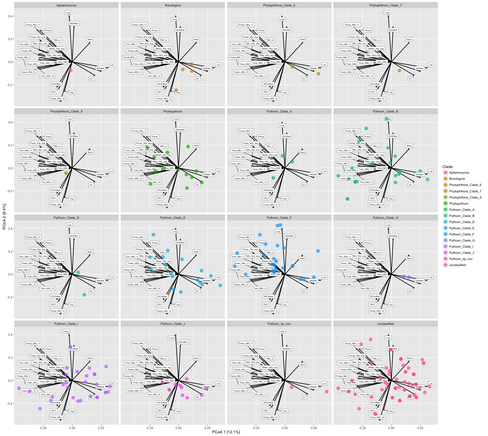
