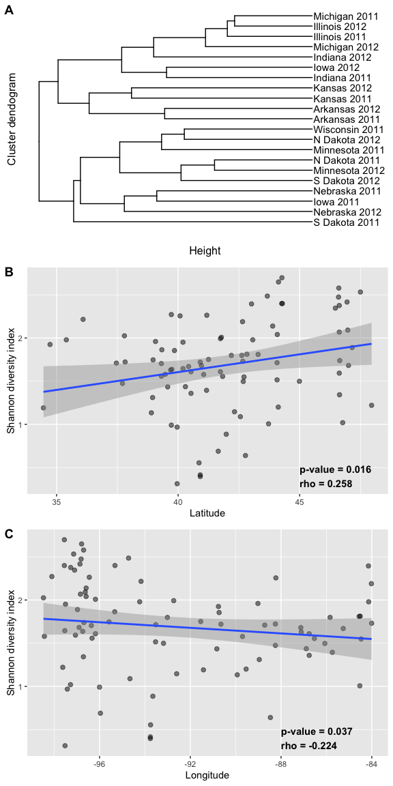
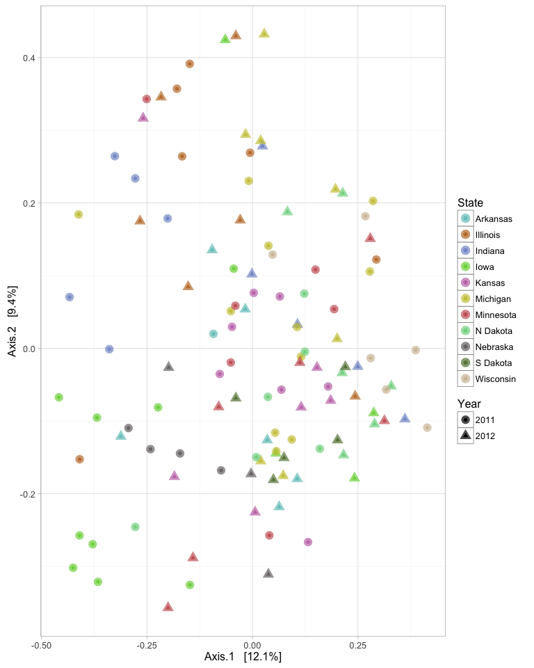
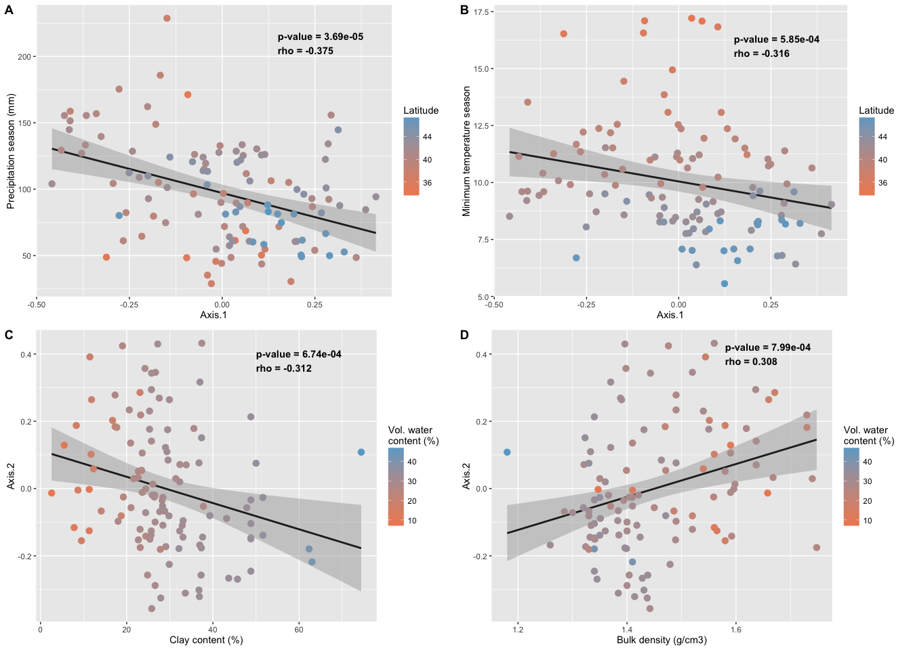
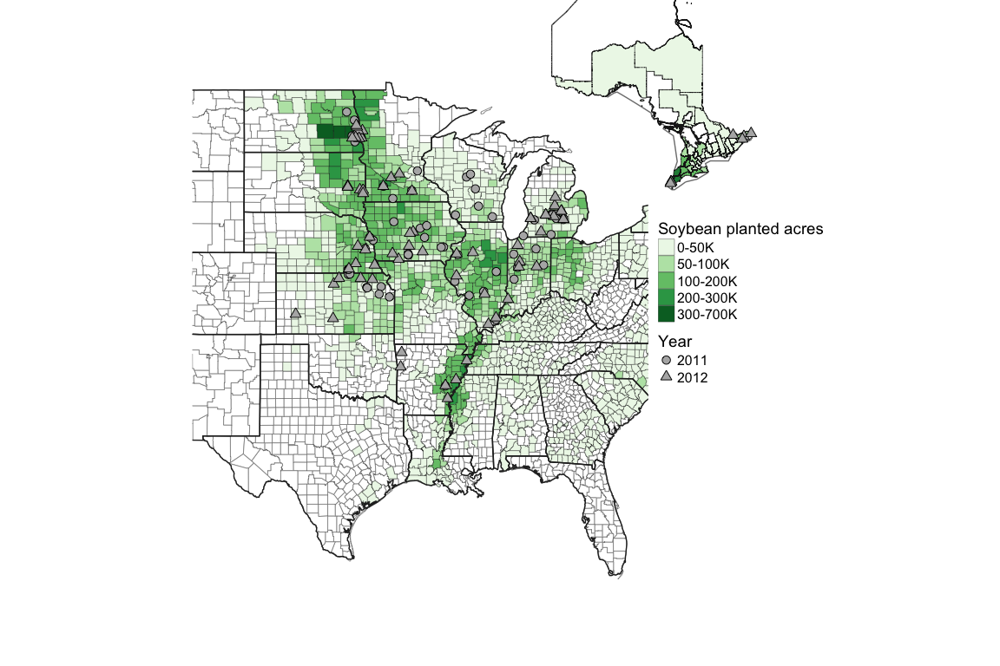
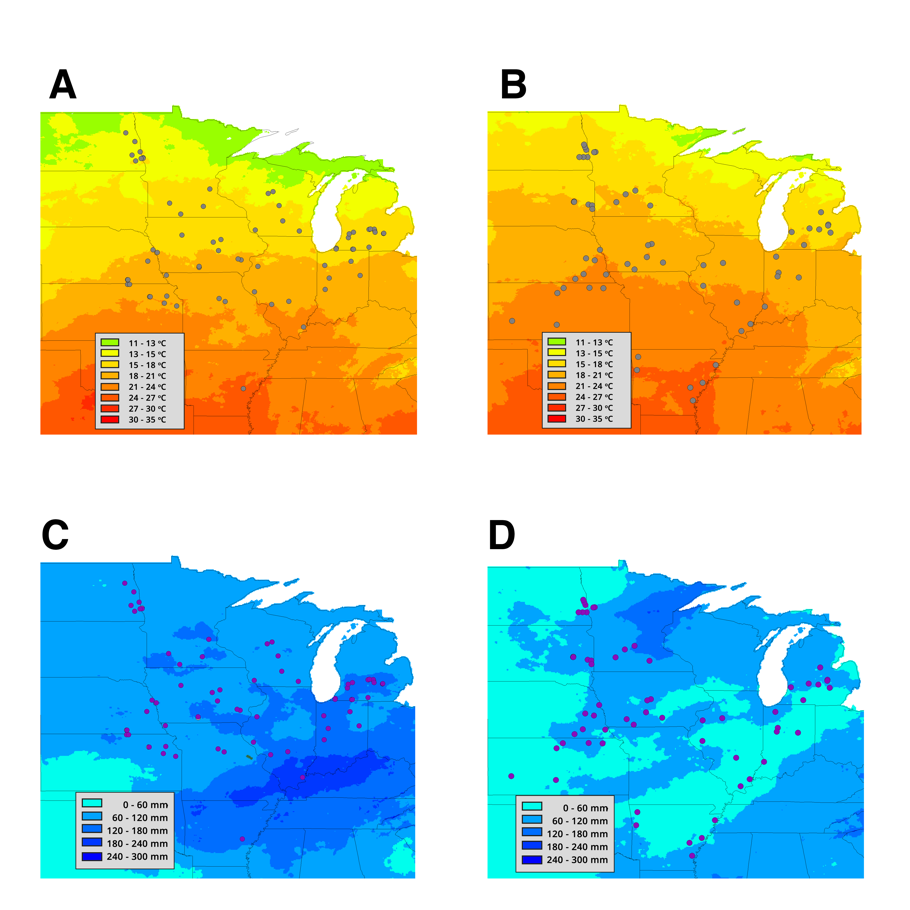
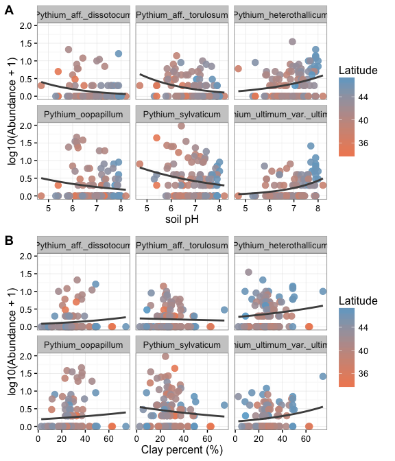
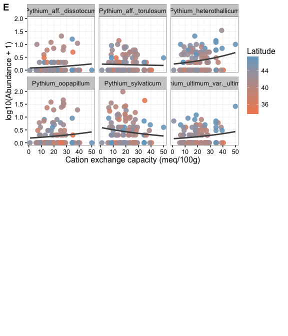

# Oomycete species associated with soybean seedlings in North America
J. Alejandro Rojas  

#Part II: diversity and ecology in relation to environmental and edaphic factors

## Figures and analyses

__Figure 1.__  Relative abundance of OTUs summarized by clade or genera and 
state for 2011 and 2012.  The clades or genera are color coded according to 
the legend from top to bottom

__Figure 2.__  Oomycete community structure of species recovered from soybean 
seedling evaluated by (A) cluster analysis based on Bray-Curtis distance by 
state surveyed.  Dendrogram was constructed using hierarchical clustering with 
complete linkage; (B) diversity of oomycete communities expressed as Shannon 
index across the latitudes of the fields sampled;  (C) diversity of oomycete 
communities expressed as Shannon index across longitudes of the fields sampled.

__Figure 3.__  Principal coordinate analysis (PCoA) of oomycete communities
collected from soybean seedling in the US based on a Bray-Curtis distance 
computed from taxon counts.  Environmental and edaphic factors are plotted as 
vectors based on correlations with community distance.  Only vectors with 
significant correlations are represented and the length of the vector represents
the strength of the correlation. (CEC = Cation Exchange Capacity, Season: 
corresponds to April, May and June where most planting and or sampling was 
conducted).

__Figure 4.__  Representation of the correlation of among community similarity 
(PCoA ordination axis) and four environmental factors: (A) seasonal 
precipitation (mm, from April - June) with samples colored by latitude; 
(B) seasonal minimum temperature (ºC, April - June) with samples colored by 
latitude; (C) clay content (%) with samples colored by volumetric water 
content (%); and (D) bulk density of the soil (gm/cm3) with samples colored by
volumetric water content (%).  Spearman correlation values (rho) and P-value are 
presented for each comparison.  Season refers to the planting and or sampling 
period which ranged from April to June. 

__Figure 5.__  Distribution and abundance of the top 8 pathogenic oomycete
species across the states sampled in 2011 and 2012.

## Tables

__Table 1.__  Oomycete community diversity and evenness by state and year.  Data 
represents state-year average and standard deviation of soybean seedlings 
sampled by field.

St_Yr              N   Isolates   mean.Observed   sd.Observed   mean.Shannon   sd.Shannon   mean.Simpson   sd.Simpson   mean.Evenness   sd.Evenness
---------------  ---  ---------  --------------  ------------  -------------  -----------  -------------  -----------  --------------  ------------
Arkansas 2011      1        320          14.000            NA          1.191           NA          0.597           NA           0.451            NA
Arkansas 2012      5         74           8.600         3.050          1.886        0.247          0.809        0.027           0.908         0.064
Illinois 2011      6        243           9.000         3.225          1.663        0.403          0.730        0.119           0.771         0.136
Illinois 2012      6        147           7.167         1.472          1.621        0.188          0.745        0.094           0.838         0.117
Indiana 2011       5        398          10.200         1.789          1.562        0.136          0.688        0.059           0.680         0.087
Indiana 2012       4         30           4.750         1.893          1.349        0.464          0.688        0.137           0.927         0.070
Iowa 2011          9        398           6.889         3.257          1.092        0.627          0.482        0.269           0.572         0.259
Iowa 2012          4         19           2.750         0.957          0.828        0.209          0.514        0.105           0.889         0.171
Kansas 2011        7        213           7.429         2.760          1.363        0.550          0.615        0.261           0.701         0.283
Kansas 2012        6         93           6.667         2.658          1.591        0.513          0.729        0.137           0.870         0.114
Michigan 2011      9        188           5.889         2.804          1.404        0.437          0.695        0.117           0.884         0.096
Michigan 2012      7        134           8.286         3.729          1.752        0.486          0.761        0.125           0.866         0.113
Minnesota 2011     6        185          10.667         6.186          1.859        0.537          0.774        0.104           0.827         0.102
Minnesota 2012     6        130           8.167         4.070          1.762        0.487          0.776        0.113           0.888         0.033
N Dakota 2011      9        210           9.556         5.637          1.784        0.635          0.758        0.162           0.874         0.168
N Dakota 2012      6        162          10.667         2.875          1.916        0.281          0.793        0.065           0.823         0.094
Nebraska 2011      4         75           7.750         3.686          1.654        0.457          0.750        0.102           0.865         0.076
Nebraska 2012      3         49           6.667         4.041          1.638        0.612          0.764        0.131           0.930         0.027
Ontario 2012       1         64           9.000            NA          0.854           NA          0.334           NA           0.389            NA
S Dakota 2011      5         23           2.800         1.304          0.901        0.359          0.559        0.116           0.953         0.078
S Dakota 2012      5        114          13.000         3.808          2.385        0.295          0.889        0.038           0.942         0.035
Wisconsin 2011     6         51           4.667         1.966          1.241        0.532          0.619        0.205           0.846         0.174

__Table 2.__ Comparison of oomycete community structure (beta diversity) by state 
and year using Bray-Curtis distances.

                Df   SumsOfSqs   MeanSqs   F.Model      R2   Pr(>F)
------------  ----  ----------  --------  --------  ------  -------
State2          11       9.576     0.871     2.908   0.207    0.001
Year             1       0.702     0.702     2.346   0.015    0.002
State2:Year      9       5.259     0.584     1.952   0.113    0.001
Residuals      103      30.835     0.299        NA   0.665       NA
Total          124      46.371        NA        NA   1.000       NA

__Table 3.__  Significance of factors affecting oomycete communites associated 
with soybean seedlings, based on using ‘envfit’ function form vegan.

Env.var            Axis.1.x   Axis.2.x   Axis.1.y   Axis.2.y      R2   P.value  Env.var2             
----------------  ---------  ---------  ---------  ---------  ------  --------  ---------------------
Lat                   0.308     -0.053      0.308     -0.053   0.097     0.005  Latitude             
Long                 -0.025      0.401     -0.025      0.401   0.161     0.001  Longitude            
Precip_AMJ           -0.405     -0.024     -0.405     -0.024   0.165     0.001  Precip. Season       
CEC7                 -0.116     -0.234     -0.116     -0.234   0.068     0.020  CEC                  
Clay                 -0.066     -0.259     -0.066     -0.259   0.072     0.019  Clay (%)             
Db3rdbar              0.016      0.307      0.016      0.307   0.095     0.004  Bulk density         
pHwater               0.251     -0.084      0.251     -0.084   0.070     0.020  Soil pH              
WC3rdbar             -0.131     -0.222     -0.131     -0.222   0.066     0.028  Water content        
Precip               -0.279      0.275     -0.279      0.275   0.154     0.001  Annual Total Precip. 
TMax_30yr_avg        -0.284      0.037     -0.284      0.037   0.082     0.012  Max. Temp 30yr       
TMean_30yr_avg       -0.286      0.069     -0.286      0.069   0.087     0.008  Mean Temp 30yr       
TMin_30yr_avg        -0.284      0.102     -0.284      0.102   0.091     0.006  Min. Temp 30yr       
TMin_yr              -0.198      0.160     -0.198      0.160   0.065     0.023  Annual Min. Temp     
Precip_30yr_avg      -0.279      0.189     -0.279      0.189   0.113     0.002  Precip. 30yr         
Tmin_AMJ             -0.241      0.029     -0.241      0.029   0.059     0.030  Min. Temp Season     

## Supplementary figures

__Supplementary Table 1.__  Significance and correlation of environmental and 
edaphic factors using ‘envfit’ function form vegan that affect oomycete 
community associated with soybean seedlings.

Env.var            Axis.1   Axis.2      R2   P.value
----------------  -------  -------  ------  --------
Long               -0.025    0.401   0.161     0.001
Precip             -0.279    0.275   0.154     0.001
Precip_AMJ_12      -0.101   -0.349   0.132     0.001
Precip_AMJ_11      -0.303    0.278   0.169     0.001
Precip_AMJ         -0.405   -0.024   0.165     0.001
Precip_30yr_avg    -0.279    0.189   0.113     0.002
Tmin_AMJ_11        -0.290    0.109   0.096     0.002
Db3rdbar            0.016    0.307   0.095     0.004
Tmean_AMJ_12       -0.295   -0.057   0.090     0.004
Lat                 0.308   -0.053   0.097     0.005
Tmean_AMJ_11       -0.296    0.061   0.091     0.005
TMin_30yr_avg      -0.284    0.102   0.091     0.006
Tmax_AMJ_12        -0.296   -0.047   0.090     0.006
Tmin_AMJ_12        -0.283   -0.066   0.084     0.007
TMean_30yr_avg     -0.286    0.069   0.087     0.008
Tmax_AMJ_11        -0.289    0.019   0.084     0.008
TMax_30yr_avg      -0.284    0.037   0.082     0.012
Clay               -0.066   -0.259   0.072     0.019
CEC7               -0.116   -0.234   0.068     0.020
pHwater             0.251   -0.084   0.070     0.020
TMin_yr            -0.198    0.160   0.065     0.023
WC3rdbar           -0.131   -0.222   0.066     0.028
Tmin_AMJ           -0.241    0.029   0.059     0.030
EC                  0.196   -0.119   0.053     0.046
Sand                0.153    0.167   0.051     0.048
TMean_yr           -0.188    0.093   0.044     0.084
OrgMatter           0.181   -0.077   0.038     0.096
Silt               -0.190   -0.031   0.037     0.120
Tmean_AMJ          -0.188    0.013   0.036     0.133
Tmax_yr            -0.171    0.028   0.030     0.173
ECEC               -0.088    0.138   0.027     0.226
Tmax_AMJ           -0.140    0.001   0.020     0.336
Slope_Avg          -0.053    0.096   0.012     0.520
Shape_Area         -0.103   -0.011   0.011     0.562
Shape_Length       -0.079   -0.051   0.009     0.602
AWC                -0.034   -0.077   0.007     0.659
Aspect              0.003    0.055   0.003     0.850

__Supplementary Figure 1.__ Map of sampled soybean fields in 2011 and 2012, and intensity of 
planted soybean acres demonstrated by color intensity at the county/parish level. 

__Supplementary Figure 2.__  Climate conditions across soybean fields sampled
in the US from May to June (A) mean temperature 2011, (B) mean temperature 2012,
(C) mean precipitation 2011, and (D) mean precipitation 2012. 

__Supplementary Figure 3.__  Abundance of designated pathogenic oomycete species 
_Py. sylvaticum_, _Py. heterothallicum_, _Py. oopapillum_, _Py. ultimum var. ultimum_, 
_Py. aff. dissotocum_ and _Py. aff. torulosum_ by different environmental factors: 
(a) soil pH, (b) clay percent (%), (c) seasonal precipitation (April – June), 
(d) season minimum temperature (April – June) and, (e) cation exchange 
capacity (CEC).

