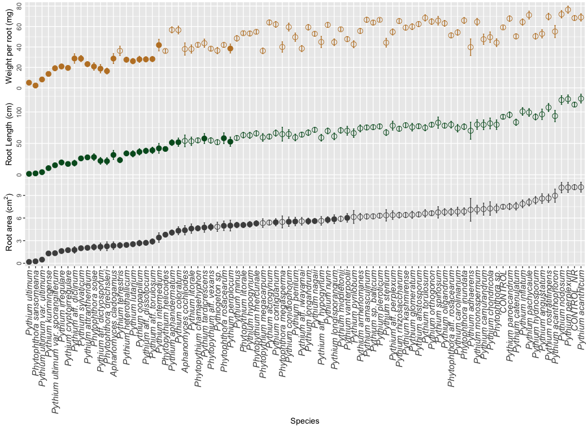
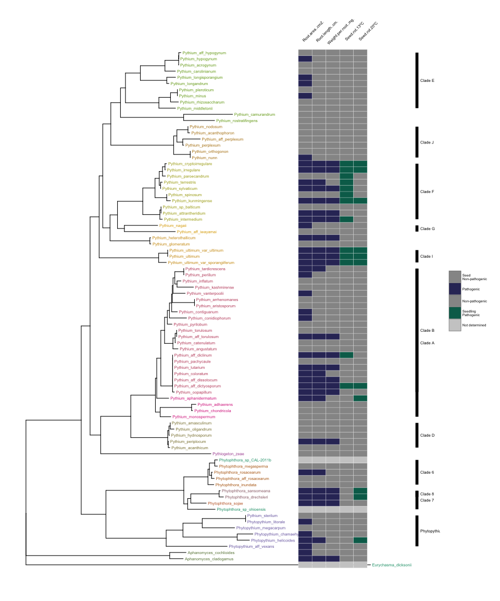
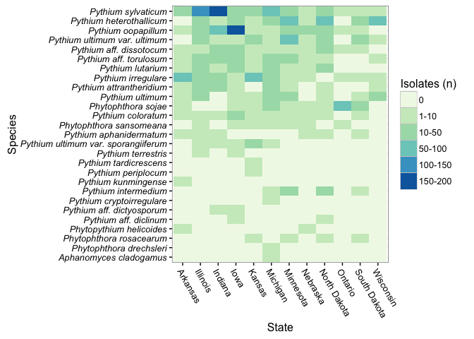

# Oomycete species associated with soybean seedlings in the U.S.
J. Alejandro Rojas  

#Part I: identification and pathogenicity characterization

## Figures and analyses

__Figure 1.__ Map of sampled soybean fields in 2011 and 2012, and intensity of 
planted soybean acres demonstrated by color intensity at the county/parish level. 

__Figure 2.__ Frequency at which different Oomycete species were recovered from 
diseased soybean seedlings in 2011 and 2012.  (*) Species previously reported as 
associated with soybean in the fungal-host database (<http://nt.ars-grin.gov/fungaldatabases/fungushost/fungushost.cfm>).

__Figure 3.__  Frequency of the oomycete species summarized by clade for 2011 
and 2012. Oomycete genera outside of Pythium and Phytophthora were summarized 
by genus.  Those species designated as spp. are not well resolved based only on
the ITS sequence.

For __seed rot analyses__ in detail, please check the 
[seed_rot_data_analysis](Seed_rot_data_analysis.md)

__Figure 4.__ Mean disease severity index of 84 oomycete species screened in a 
seed rot assay at 13ºC and 20ºC.  Bars represent standard error and disease 
severity index values from 0 = non-pathogenic to 100 = highly pathogenic.

__Figure 5.__ (A) Hierarchical analysis of the disease severity index 
of 84 oomycete species to establish three clusters related to pathogenicity on 
soybean and (B) boxplot of disease severity index by clusters at 13°C and 20°C 
as evaluated in a seed rot assay.

For __seedling root rot analyses__ in detail, please check the 
[seedling_data_analysis](Seedling_data_analysis.md)

__Figure 6.__ Mean soybean root area (cm2), mean root length (cm), 
and mean weight per root (mg) after being challenged by 84 oomycete species 
using a soybean seedling root rot assay.  Bars represent standard error and 
darker points represent species significantly different from the non-rice 
control (P < 0.05).

__Figure 7.__ Phylogram for the ITS sequences of the rDNA for oomycete species 
found during the survey.  Phylogenetic distribution of pathogenicity traits 
mapped to taxa represent in the tree.  Tip colors indicate members of different 
clades.  Parameters in light gray represent taxa not isolated in the study.

__Figure 8.__ Prevalence of pathogenic oomycete species, designated based on 
seedling assay data, across the states sampled during the current study.  Color 
gradient indicates number of isolates per species collected per state 
during 2011 and 2012.

## Tables

__Table 1.__  Mean disease severity index (DSI) of soybean cv. `Sloan` seeds in 
response to multiple oomycete species as compared to the non-inoculated control 
at 13ºC or 20ºC.  Only species with significant differences from the control at 
either temperature are represented (Complete table, see Supplementary Table 2).  
A seed rot assay was used to determine pathogenicity of oomycete species using a 
disease severity scale of 0-4 to rate individual seeds.  Data were transformed 
to disease severity index (0=non-pathogenic; 100=highly aggressive).

|Species                             |  N| mean_DI13| std_DI13| Pval_13C| mean_DI20| std_DI20| Pval_20C|   |
|:-----------------------------------|--:|---------:|--------:|--------:|---------:|--------:|--------:|:--|
|Phytophthora drechsleri             |  1|    13.056|    3.194|    1.000|    90.278|    2.017|    0.048|NA |
|Phytophthora sansomeana             |  2|    58.889|   10.007|    1.000|    94.722|    1.308|    0.004|NA |
|Phytopythium helicoides             |  2|    22.500|    1.896|    1.000|    91.944|    1.611|    0.004|NA |
|Pythium aff. diclinum               |  3|    78.704|    2.501|    0.032|    32.963|    5.282|    1.000|NA |
|Pythium aff. dictyosporum           |  2|    93.333|    1.143|    0.006|    85.139|    4.223|    0.017|NA |
|Pythium aphanidermatum              |  3|    53.241|    3.823|    1.000|    99.907|    0.093|    0.000|NA |
|Pythium cryptoirregulare            |  1|    99.722|    0.278|    0.018|    95.556|    1.002|    0.021|NA |
|Pythium intermedium                 |  3|    83.056|    4.780|    0.015|    53.426|    6.643|    1.000|NA |
|Pythium irregulare                  |  3|    98.889|    0.449|    0.001|    80.463|    3.531|    0.027|NA |
|Pythium kunmingense                 |  2|   100.000|    0.000|    0.002|    89.306|    1.496|    0.007|NA |
|Pythium paroecandrum                |  3|    93.981|    1.636|    0.002|    49.259|    4.369|    1.000|NA |
|Pythium spinosum                    |  3|    80.556|    4.118|    0.023|    44.722|    6.999|    1.000|NA |
|Pythium sylvaticum                  |  3|    99.444|    0.244|    0.001|    74.444|    2.636|    0.083|NA |
|Pythium terrestris                  |  1|    99.167|    0.589|    0.021|    77.778|    3.422|    0.270|NA |
|Pythium ultimum                     |  3|    99.167|    0.298|    0.001|    99.259|    0.322|    0.000|NA |
|Pythium ultimum var. sporangiiferum |  3|    96.481|    1.044|    0.001|    98.056|    0.723|    0.001|NA |
|Pythium ultimum var. ultimum        |  3|    99.815|    0.128|    0.001|    99.630|    0.219|    0.000|NA |
|Control                             | NA|     2.579|    0.310|       NA|     8.730|    0.767|       NA|   |

__Table 2.__  Forty-three oomycete species highly aggressive on soybean cv. `Sloan` 
in the seedling root rot assay measured as root area, root length and dry weight
per root.  Only species with significant differences from the non-rice control
are represented (Complete table, see Supplementary Table 3).  Data were analyzed 
by multivariate analysis of variance (MANOVA) combining all the parameters: root 
area, root length and weight per root; and followed by univariate analysis for 
each of the measured parameters.  Plants were grown at 20ºC in a growth chamber
for 2 weeks.

|Species                             |  N| mnv.p|    ar| ar.se|  ar.p|     ln| ln.se|  ln.p|    wpr| wpr.se| wpr.p|
|:-----------------------------------|--:|-----:|-----:|-----:|-----:|------:|-----:|-----:|------:|------:|-----:|
|Aphanomyces cladogamus              |  9| 0.000| 2.330| 0.503| 0.000| 31.646| 7.178| 0.002| 28.667|  4.853| 0.044|
|Aphanomyces cochlioides             |  9| 0.019| 4.379| 0.613| 0.019| 53.977| 9.329| 1.000| 38.000|  6.000| 1.000|
|Phytophthora drechsleri             |  9| 0.000| 2.257| 0.582| 0.000| 21.703| 5.614| 0.000| 16.444|  2.863| 0.000|
|Phytophthora rosacearum             | 27| 0.000| 4.973| 0.631| 0.000| 58.232| 8.622| 0.031| 42.000|  2.377| 1.000|
|Phytophthora sansomeana             | 18| 0.000| 0.258| 0.063| 0.000|  2.254| 0.563| 0.000|  2.333|  0.518| 0.000|
|Phytophthora sojae                  | 27| 0.000| 2.147| 0.389| 0.000| 28.181| 5.324| 0.000| 20.926|  3.647| 0.000|
|Phytopythium aff. vexans            | 18| 0.001| 4.813| 0.442| 0.001| 54.681| 4.386| 0.388| 38.333|  1.955| 0.587|
|Phytopythium chamaehyphon           | 27| 0.000| 4.637| 0.346| 0.000| 54.824| 3.552| 0.163| 42.074|  2.074| 1.000|
|Phytopythium helicoides             | 18| 0.000| 3.794| 0.318| 0.000| 41.125| 2.731| 0.016| 36.111|  1.699| 0.251|
|Phytopythium litorale               | 27| 0.002| 5.076| 0.352| 0.002| 63.166| 4.454| 0.677| 53.481|  1.730| 1.000|
|Phytopythium mercuriale             | 27| 0.005| 5.288| 0.362| 0.005| 65.888| 4.230| 1.000| 54.815|  1.758| 1.000|
|Pythium aff. diclinum               | 27| 0.000| 1.768| 0.426| 0.000| 18.602| 4.557| 0.000| 28.741|  4.584| 0.000|
|Pythium aff. dictyosporum           | 18| 0.000| 2.186| 0.498| 0.000| 22.220| 5.379| 0.000| 18.778|  4.110| 0.000|
|Pythium aff. dissotocum             | 27| 0.000| 2.715| 0.301| 0.000| 38.133| 4.282| 0.000| 27.926|  2.545| 0.000|
|Pythium aff. torulosum              | 27| 0.000| 2.889| 0.352| 0.000| 38.977| 5.004| 0.000| 28.222|  2.536| 0.000|
|Pythium aphanidermatum              | 27| 0.000| 4.073| 0.350| 0.000| 51.256| 4.599| 0.016| 56.741|  2.906| 1.000|
|Pythium attrantheridium             | 27| 0.000| 2.051| 0.247| 0.000| 27.772| 3.462| 0.000| 23.259|  2.368| 0.000|
|Pythium coloratum                   | 27| 0.000| 4.316| 0.521| 0.000| 51.893| 6.566| 0.003| 56.593|  3.759| 1.000|
|Pythium conidiophorum               | 27| 0.002| 5.518| 0.623| 0.002| 64.866| 6.973| 0.343| 59.481|  3.862| 1.000|
|Pythium contiguanum                 | 27| 0.019| 5.440| 0.472| 0.019| 66.416| 4.915| 1.000| 62.074|  2.859| 1.000|
|Pythium cryptoirregulare            |  9| 0.000| 1.740| 0.215| 0.000| 17.280| 2.335| 0.000| 19.556|  2.375| 0.000|
|Pythium heterothallicum             | 27| 0.000| 2.431| 0.254| 0.000| 34.058| 3.957| 0.000| 27.556|  2.349| 0.000|
|Pythium hypogynum                   | 27| 0.002| 5.164| 0.379| 0.002| 62.808| 4.852| 0.339| 53.185|  2.230| 1.000|
|Pythium intermedium                 | 27| 0.000| 3.410| 0.632| 0.000| 42.129| 7.779| 0.000| 41.852|  5.690| 0.000|
|Pythium irregulare                  | 27| 0.000| 1.618| 0.291| 0.000| 19.662| 3.980| 0.000| 20.963|  2.325| 0.000|
|Pythium kunmingense                 | 18| 0.000| 1.301| 0.108| 0.000| 10.641| 1.174| 0.000| 13.667|  1.510| 0.000|
|Pythium litorale                    |  9| 0.023| 4.599| 0.618| 0.023| 53.376| 6.658| 1.000| 38.000|  3.986| 1.000|
|Pythium longandrum                  | 27| 0.049| 5.578| 0.401| 0.049| 67.096| 4.512| 1.000| 59.259|  2.697| 1.000|
|Pythium longisporangium             | 27| 0.004| 5.844| 0.578| 0.004| 61.178| 5.407| 0.139| 44.667|  3.257| 0.894|
|Pythium lutarium                    | 27| 0.000| 2.535| 0.333| 0.000| 33.427| 4.884| 0.000| 26.148|  2.542| 0.000|
|Pythium minus                       | 27| 0.001| 5.075| 0.365| 0.001| 58.632| 3.784| 0.451| 48.444|  2.731| 1.000|
|Pythium nagaii                      | 27| 0.026| 5.602| 0.321| 0.026| 71.571| 3.604| 1.000| 52.889|  2.112| 1.000|
|Pythium nunn                        | 27| 0.039| 5.760| 0.411| 0.039| 69.767| 4.598| 1.000| 61.556|  2.414| 1.000|
|Pythium oopapillum                  | 27| 0.000| 2.670| 0.368| 0.000| 36.522| 4.982| 0.000| 27.926|  2.967| 0.000|
|Pythium periilum                    | 27| 0.002| 5.543| 0.561| 0.002| 59.440| 5.378| 0.186| 49.556|  4.088| 1.000|
|Pythium periplocum                  | 27| 0.000| 4.998| 0.716| 0.000| 52.741| 7.378| 0.000| 38.489|  4.391| 0.003|
|Pythium sylvaticum                  | 27| 0.000| 1.995| 0.241| 0.000| 26.115| 3.424| 0.000| 28.667|  3.027| 0.000|
|Pythium tardicrescens               | 27| 0.000| 4.745| 0.629| 0.000| 57.746| 7.890| 0.001| 43.704|  4.007| 0.104|
|Pythium terrestris                  |  9| 0.000| 2.379| 0.368| 0.000| 23.475| 4.138| 0.000| 36.222|  4.576| 1.000|
|Pythium ultimum                     | 27| 0.000| 0.183| 0.039| 0.000|  1.539| 0.431| 0.000|  5.111|  1.397| 0.000|
|Pythium ultimum var. sporangiiferum | 27| 0.000| 1.337| 0.240| 0.000| 15.196| 3.169| 0.000| 19.200|  2.497| 0.000|
|Pythium ultimum var. ultimum        | 27| 0.000| 0.481| 0.070| 0.000|  4.228| 0.738| 0.000|  8.256|  1.252| 0.000|
|Pythium vanterpoolii                | 27| 0.022| 6.023| 0.567| 0.022| 70.135| 7.034| 1.000| 47.704|  2.306| 1.000|
