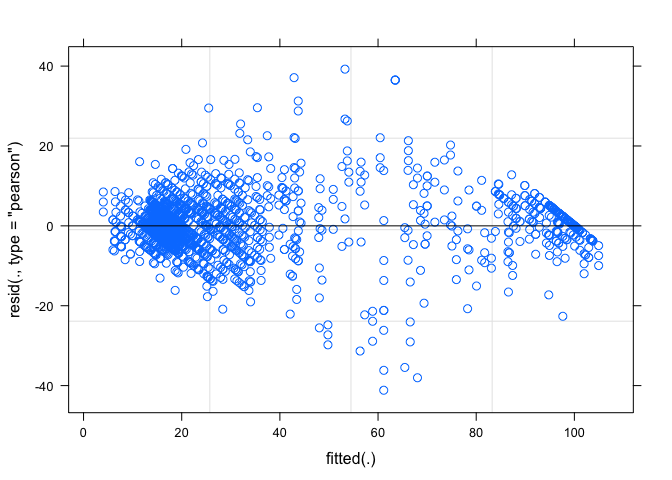
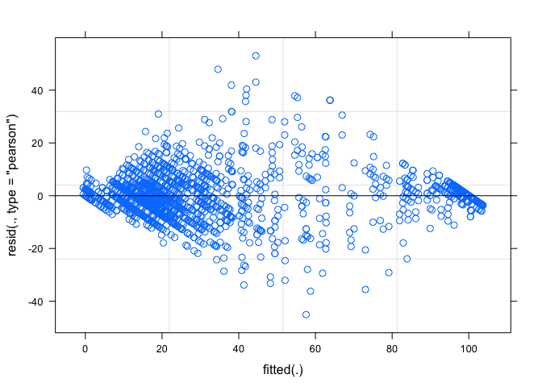

# Seed rot data analysis
Alejandro Rojas  
August 17, 2015  

#Pathogenicity data analysis - Soybean oomycete pathogen survey


```
##      ggplot2 RColorBrewer         grid    gridExtra         plyr 
##         TRUE         TRUE         TRUE         TRUE         TRUE 
##         lme4      lsmeans        knitr        tidyr        dplyr 
##         TRUE         TRUE         TRUE         TRUE         TRUE 
##         MASS 
##         TRUE
```

##Seed rot - Pathogenicity data
Processing the data for graphical exploration and analysis.  

```r
#Reading the file
seed <- read.csv("../data/clean/seed_rot.csv")

#Summarizing data using different parameters by plyr library
seed_sum <- ddply(seed, c("Species", "Temp"), summarise,
              N = length(DIx100),
              mean_DI = mean(DIx100), 
              sd_DI = sd(DIx100),
              se_DI = sd_DI/sqrt(N)
              )
  
#Setting limits for error bars
limits <- aes(ymax = mean_DI + se_DI, ymin=mean_DI - se_DI, col=Temp)
```

Plotting the data by temperature using standard error and summarizing data by species.

```r
#Creating plot for DI mean values
ggplot(seed_sum, aes(x=reorder(Species, mean_DI,median), y=mean_DI)) + 
  geom_point(aes(colour=Temp), stat = "summary", fun.y="mean", size=2) + 
  theme_gray() +
  theme(axis.text.x=element_text(angle=90, hjust = 1, vjust = 0.5, face="italic")) +
  scale_color_manual(values=c("#80b1d3","#fb8072")) +
  geom_errorbar(limits, width=0.2) + 
  labs(x="Species", y="Disease Severity Index")
```


###Seed rot data for 20C
Subsetting the 20C seed rot assay data for statistical analysis, and testing different models to find the best fit:

 * Species as fixed effect
 * Species as fixed effect and experiment as random factor
 * Species as fixed effect, experiment as random factor and Isolates nested within species
 

```r
#Dataset for 20C for seed rot
Seed_20C <- subset(seed, seed$Temp=="20C")

#General model AOV
fit1_20C <- aov(DIx100 ~ Species, data=Seed_20C)
summary(fit1_20C, adjust="bon")
```

```
##               Df  Sum Sq Mean Sq F value Pr(>F)    
## Species       84 1232010   14667   64.89 <2e-16 ***
## Residuals   1841  416133     226                   
## ---
## Signif. codes:  0 '***' 0.001 '**' 0.01 '*' 0.05 '.' 0.1 ' ' 1
```

```r
#Plotting diagnostic plots for fit1 model
par(mfrow=c(2,2)) # optional layout 
plot(fit1_20C)# diagnostic plots
```


```r
#Plotting residuals
par(mfrow=c(1,1)) # optional layout 
hist(fit1_20C$residuals)
```


```r
#Test with random effect fit2 using aov
fit1.2_20C <- aov(DIx100 ~ Species + Species:Isolate + Error(Set), data=Seed_20C)
summary(fit1.2_20C, adjust="bon")
```

```
## 
## Error: Set
##           Df Sum Sq Mean Sq F value   Pr(>F)    
## Species    6 278397   46399   42.26 3.52e-08 ***
## Residuals 14  15370    1098                     
## ---
## Signif. codes:  0 '***' 0.001 '**' 0.01 '*' 0.05 '.' 0.1 ' ' 1
## 
## Error: Within
##                   Df Sum Sq Mean Sq F value Pr(>F)    
## Species           84 954066   11358  207.13 <2e-16 ***
## Species:Isolate  123 307200    2498   45.55 <2e-16 ***
## Residuals       1698  93111      55                   
## ---
## Signif. codes:  0 '***' 0.001 '**' 0.01 '*' 0.05 '.' 0.1 ' ' 1
```

```r
##Model 2 with fixed effect (species) and random effect (set)
fit2_20C <- lmer(DIx100 ~ Species + (1|Set), data=Seed_20C, REML = FALSE)
summary(fit2_20C)
```

```
## Linear mixed model fit by maximum likelihood  ['lmerMod']
## Formula: DIx100 ~ Species + (1 | Set)
##    Data: Seed_20C
## 
##      AIC      BIC   logLik deviance df.resid 
##  15967.2  16451.2  -7896.6  15793.2     1839 
## 
## Scaled residuals: 
##     Min      1Q  Median      3Q     Max 
## -3.9299 -0.3294 -0.0364  0.2355  4.5421 
## 
## Random effects:
##  Groups   Name        Variance Std.Dev.
##  Set      (Intercept)   5.666   2.38   
##  Residual             210.313  14.50   
## Number of obs: 1926, groups:  Set, 21
## 
## Fixed effects:
##                                            Estimate Std. Error t value
## (Intercept)                                 13.1630     5.0136   2.625
## SpeciesAphanomyces cochlioides               1.6928     7.0874   0.239
## SpeciesControl                              -4.4328     5.3108  -0.835
## SpeciesPhytophthora aff. rosacearum          3.2668     5.8867   0.555
## SpeciesPhytophthora drechsleri              77.1237     7.0874  10.882
## SpeciesPhytophthora inundata                 3.1837     5.8867   0.541
## SpeciesPhytophthora megasperma              19.9015     7.0874   2.808
## SpeciesPhytophthora rosacearum              20.8594     5.8867   3.544
## SpeciesPhytophthora sansomeana              81.1111     5.9205  13.700
## SpeciesPhytophthora sojae                   13.9815     5.5819   2.505
## SpeciesPhytophthora sp.                     20.7348     7.0874   2.926
## SpeciesPhytopythium aff. vexans             23.3737     6.2087   3.765
## SpeciesPhytopythium chamaehyphon            24.1928     5.8867   4.110
## SpeciesPhytopythium helicoides              78.7903     6.2087  12.690
## SpeciesPhytopythium litorale                12.4751     5.8867   2.119
## SpeciesPhytopythium megacarpum              23.7903     7.0874   3.357
## SpeciesPhytopythium mercuriale              14.6047     5.8867   2.481
## SpeciesPythiogeton sp.                      27.4015     7.0874   3.866
## SpeciesPythium acanthicum                    2.7321     5.8867   0.464
## SpeciesPythium acanthophoron                14.3459     7.0874   2.024
## SpeciesPythium acrogynum                     1.9800     5.8867   0.336
## SpeciesPythium adhaerens                    14.6237     7.0874   2.063
## SpeciesPythium aff. diclinum                19.8504     5.8867   3.372
## SpeciesPythium aff. dictyosporum            71.9848     6.2087  11.594
## SpeciesPythium aff. dissotocum              13.7037     5.5819   2.455
## SpeciesPythium aff. hypogynum               14.9015     7.0874   2.103
## SpeciesPythium aff. iwayamai                23.2348     7.0874   3.278
## SpeciesPythium aff. perplexum               26.2714     5.8867   4.463
## SpeciesPythium aff. torulosum               25.3704     5.5819   4.545
## SpeciesPythium amasculinum                   1.4850     5.8867   0.252
## SpeciesPythium angustatum                   14.9015     7.0874   2.103
## SpeciesPythium aphanidermatum               86.6702     5.8867  14.723
## SpeciesPythium aristosporum                  4.8825     5.8867   0.829
## SpeciesPythium arrhenomanes                  6.9195     5.8867   1.175
## SpeciesPythium attrantheridium              12.5926     5.5819   2.256
## SpeciesPythium camurandrum                  13.2348     7.0874   1.867
## SpeciesPythium carolinianum                  5.1187     5.8867   0.870
## SpeciesPythium catenulatum                  17.5866     5.8867   2.988
## SpeciesPythium chondricola                  15.4570     7.0874   2.181
## SpeciesPythium coloratum                    36.2998     5.8867   6.166
## SpeciesPythium conidiophorum                11.2073     5.8867   1.904
## SpeciesPythium contiguanum                   3.2763     5.8867   0.557
## SpeciesPythium cryptoirregulare             82.4015     7.0874  11.626
## SpeciesPythium glomeratum                    4.9430     5.8867   0.840
## SpeciesPythium heterothallicum              10.6481     5.5819   1.908
## SpeciesPythium hydnosporum                  18.6515     6.2087   3.004
## SpeciesPythium hypogynum                     3.2158     5.8867   0.546
## SpeciesPythium inflatum                      5.4172     5.8867   0.920
## SpeciesPythium intermedium                  40.1887     5.8867   6.827
## SpeciesPythium irregulare                   66.8519     5.5819  11.977
## SpeciesPythium kashmirense                   3.0306     5.8867   0.515
## SpeciesPythium kunmingense                  76.1515     6.2087  12.265
## SpeciesPythium litorale                     27.6792     7.0874   3.905
## SpeciesPythium longandrum                    3.3689     5.8867   0.572
## SpeciesPythium longisporangium               1.9705     5.8867   0.335
## SpeciesPythium lutarium                     35.6481     5.5819   6.386
## SpeciesPythium middletonii                  16.0862     5.8867   2.733
## SpeciesPythium minus                         3.2668     5.8867   0.555
## SpeciesPythium monospermum                   0.4986     6.2087   0.080
## SpeciesPythium nagaii                        1.4565     5.8867   0.247
## SpeciesPythium nodosum                       4.0284     5.8867   0.684
## SpeciesPythium nunn                          3.9850     5.8867   0.677
## SpeciesPythium oligandrum                    2.1652     5.8867   0.368
## SpeciesPythium oopapillum                   11.6667     5.5819   2.090
## SpeciesPythium orthogonon                    4.8184     5.8867   0.819
## SpeciesPythium pachycaule                    0.9295     5.8867   0.158
## SpeciesPythium paroecandrum                 36.2506     5.8867   6.158
## SpeciesPythium periilum                      7.7113     5.8867   1.310
## SpeciesPythium periplocum                   29.8409     5.8867   5.069
## SpeciesPythium perplexum                     2.2691     5.8867   0.385
## SpeciesPythium pleroticum                    3.4295     5.8867   0.583
## SpeciesPythium pyrilobum                    13.5126     7.0874   1.907
## SpeciesPythium rhizosaccharum                4.2949     5.8867   0.730
## SpeciesPythium rostratifingens               3.3802     5.8867   0.574
## SpeciesPythium sp. balticum                  3.4295     5.8867   0.583
## SpeciesPythium spinosum                     31.7135     5.8867   5.387
## SpeciesPythium sterilum                     32.1237     7.0874   4.532
## SpeciesPythium sylvaticum                   60.8333     5.5819  10.898
## SpeciesPythium tardicrescens                32.3825     5.8867   5.501
## SpeciesPythium terrestris                   64.7483     7.0874   9.136
## SpeciesPythium torulosum                     4.5726     5.8867   0.777
## SpeciesPythium ultimum                      86.2506     5.8867  14.652
## SpeciesPythium ultimum var. sporangiiferum  84.4444     5.5819  15.128
## SpeciesPythium ultimum var. ultimum         86.0185     5.5819  15.410
## SpeciesPythium vanterpoolii                  1.0446     5.8867   0.177
```

```
## 
## Correlation matrix not shown by default, as p = 85 > 20.
## Use print(x, correlation=TRUE)  or
## 	 vcov(x)	 if you need it
```

```r
#Model 2 fitting (fitted vs residuals)
plot(fit2_20C)
```


```r
#lsmeans for model 2
lsmeans_fit2_20C <- lsmeans(fit2_20C,"Species")
```

```
## Loading required namespace: pbkrtest
```

```r
#Print summary for data including mean, SE, df, CIs, t-ratio and p.value
#summary(lsmeans_fit2_20C, infer=c(TRUE,TRUE), adjust="bon")

plot(lsmeans_fit2_20C)
```


```r
#Estimate confidence intervals for model 2
#confint(contrast(lsmeans_fit2, "trt.vs.ctrl", ref=3))
```


```r
#Model 3 with fixed effect (species) and random effect (set) and nested effect (species:isolate)
fit3_20C <- lmer(DIx100 ~ Species + (1|Set) + (1|Species:Isolate), data=Seed_20C, REML = FALSE)
summary(fit3_20C)
```

```
## Linear mixed model fit by maximum likelihood  ['lmerMod']
## Formula: DIx100 ~ Species + (1 | Set) + (1 | Species:Isolate)
##    Data: Seed_20C
## 
##      AIC      BIC   logLik deviance df.resid 
##  14087.0  14576.6  -6955.5  13911.0     1838 
## 
## Scaled residuals: 
##     Min      1Q  Median      3Q     Max 
## -5.5596 -0.4524 -0.0285  0.4412  5.2998 
## 
## Random effects:
##  Groups          Name        Variance Std.Dev.
##  Species:Isolate (Intercept) 159.590  12.633  
##  Set             (Intercept)   9.782   3.128  
##  Residual                     54.807   7.403  
## Number of obs: 1926, groups:  Species:Isolate, 208; Set, 21
## 
## Fixed effects:
##                                            Estimate Std. Error t value
## (Intercept)                                  11.522     12.960   0.889
## SpeciesAphanomyces cochlioides                3.823     18.320   0.209
## SpeciesControl                               -2.791     18.110  -0.154
## SpeciesPhytophthora aff. rosacearum           5.397     15.005   0.360
## SpeciesPhytophthora drechsleri               78.798     18.320   4.301
## SpeciesPhytophthora inundata                  5.010     15.005   0.334
## SpeciesPhytophthora megasperma               21.575     18.320   1.178
## SpeciesPhytophthora rosacearum               22.990     15.005   1.532
## SpeciesPhytophthora sansomeana               81.111     15.765   5.145
## SpeciesPhytophthora sojae                    13.981     14.863   0.941
## SpeciesPhytophthora sp.                      22.409     18.320   1.223
## SpeciesPhytopythium aff. vexans              25.048     15.899   1.575
## SpeciesPhytopythium chamaehyphon             26.323     15.005   1.754
## SpeciesPhytopythium helicoides               80.464     15.899   5.061
## SpeciesPhytopythium litorale                 14.758     15.005   0.984
## SpeciesPhytopythium megacarpum               25.464     18.320   1.390
## SpeciesPhytopythium mercuriale               16.887     15.005   1.125
## SpeciesPythiogeton sp.                       29.075     18.320   1.587
## SpeciesPythium acanthicum                     4.939     15.005   0.329
## SpeciesPythium acanthophoron                 16.020     18.320   0.874
## SpeciesPythium acrogynum                      3.806     15.005   0.254
## SpeciesPythium adhaerens                     16.298     18.320   0.890
## SpeciesPythium aff. diclinum                 21.677     15.005   1.445
## SpeciesPythium aff. dictyosporum             73.659     15.899   4.633
## SpeciesPythium aff. dissotocum               13.704     14.863   0.922
## SpeciesPythium aff. hypogynum                16.575     18.320   0.905
## SpeciesPythium aff. iwayamai                 24.909     18.320   1.360
## SpeciesPythium aff. perplexum                28.554     15.005   1.903
## SpeciesPythium aff. torulosum                25.370     14.863   1.707
## SpeciesPythium amasculinum                    2.855     15.005   0.190
## SpeciesPythium angustatum                    16.575     18.320   0.905
## SpeciesPythium aphanidermatum                88.040     15.005   5.867
## SpeciesPythium aristosporum                   7.165     15.005   0.478
## SpeciesPythium arrhenomanes                   9.202     15.005   0.613
## SpeciesPythium attrantheridium               12.593     14.863   0.847
## SpeciesPythium camurandrum                   14.909     18.320   0.814
## SpeciesPythium carolinianum                   7.249     15.005   0.483
## SpeciesPythium catenulatum                   19.261     15.005   1.284
## SpeciesPythium chondricola                   17.131     18.320   0.935
## SpeciesPythium coloratum                     37.669     15.005   2.510
## SpeciesPythium conidiophorum                 12.577     15.005   0.838
## SpeciesPythium contiguanum                    5.103     15.005   0.340
## SpeciesPythium cryptoirregulare              84.075     18.320   4.589
## SpeciesPythium glomeratum                     6.769     15.005   0.451
## SpeciesPythium heterothallicum               10.648     14.863   0.716
## SpeciesPythium hydnosporum                   20.325     15.899   1.278
## SpeciesPythium hypogynum                      5.499     15.005   0.366
## SpeciesPythium inflatum                       7.624     15.005   0.508
## SpeciesPythium intermedium                   41.558     15.005   2.770
## SpeciesPythium irregulare                    66.852     14.863   4.498
## SpeciesPythium kashmirense                    5.313     15.005   0.354
## SpeciesPythium kunmingense                   77.825     15.899   4.895
## SpeciesPythium litorale                      29.353     18.320   1.602
## SpeciesPythium longandrum                     5.195     15.005   0.346
## SpeciesPythium longisporangium                4.101     15.005   0.273
## SpeciesPythium lutarium                      35.648     14.863   2.398
## SpeciesPythium middletonii                   18.369     15.005   1.224
## SpeciesPythium minus                          5.397     15.005   0.360
## SpeciesPythium monospermum                    2.325     15.899   0.146
## SpeciesPythium nagaii                         3.739     15.005   0.249
## SpeciesPythium nodosum                        6.235     15.005   0.416
## SpeciesPythium nunn                           5.355     15.005   0.357
## SpeciesPythium oligandrum                     3.991     15.005   0.266
## SpeciesPythium oopapillum                    11.667     14.863   0.785
## SpeciesPythium orthogonon                     6.188     15.005   0.412
## SpeciesPythium pachycaule                     2.299     15.005   0.153
## SpeciesPythium paroecandrum                  38.457     15.005   2.563
## SpeciesPythium periilum                       9.842     15.005   0.656
## SpeciesPythium periplocum                    31.971     15.005   2.131
## SpeciesPythium perplexum                      4.476     15.005   0.298
## SpeciesPythium pleroticum                     4.799     15.005   0.320
## SpeciesPythium pyrilobum                     15.187     18.320   0.829
## SpeciesPythium rhizosaccharum                 6.121     15.005   0.408
## SpeciesPythium rostratifingens                5.587     15.005   0.372
## SpeciesPythium sp. balticum                   4.799     15.005   0.320
## SpeciesPythium spinosum                      33.920     15.005   2.261
## SpeciesPythium sterilum                      33.798     18.320   1.845
## SpeciesPythium sylvaticum                    60.833     14.863   4.093
## SpeciesPythium tardicrescens                 34.665     15.005   2.310
## SpeciesPythium terrestris                    66.879     18.320   3.651
## SpeciesPythium torulosum                      6.399     15.005   0.426
## SpeciesPythium ultimum                       88.457     15.005   5.895
## SpeciesPythium ultimum var. sporangiiferum   84.444     14.863   5.682
## SpeciesPythium ultimum var. ultimum          86.019     14.863   5.787
## SpeciesPythium vanterpoolii                   3.175     15.005   0.212
```

```
## 
## Correlation matrix not shown by default, as p = 85 > 20.
## Use print(x, correlation=TRUE)  or
## 	 vcov(x)	 if you need it
```

```r
#Model 3 fitting (fitted vs residuals)
plot(fit3_20C)
```




```r
#lsmeans for model 3
lsmeans_fit3_20C <- lsmeans(fit3_20C, "Species")

#Print summary for data including mean, SE, df, CIs, t-ratio and p.value
#summary(lsmeans_fit3_20C, infer=c(TRUE,TRUE), adjust="bon")

plot(lsmeans_fit3_20C)
```


```r
#Comparing models 2 and 3
anova(fit2_20C, fit3_20C)
```

```
## Data: Seed_20C
## Models:
## fit2_20C: DIx100 ~ Species + (1 | Set)
## fit3_20C: DIx100 ~ Species + (1 | Set) + (1 | Species:Isolate)
##          Df   AIC   BIC  logLik deviance  Chisq Chi Df Pr(>Chisq)    
## fit2_20C 87 15967 16451 -7896.6    15793                             
## fit3_20C 88 14087 14577 -6955.5    13911 1882.2      1  < 2.2e-16 ***
## ---
## Signif. codes:  0 '***' 0.001 '**' 0.01 '*' 0.05 '.' 0.1 ' ' 1
```

Based on the model 3, which is the best model, the data was compared against the control to determine those species that are different.  The p-values were adjusted with bonferroni due to large number of levels.

```r
#Contrast for model 3
CvsA_fit3_20C <- contrast(lsmeans_fit3_20C, "trt.vs.ctrl", ref=3)
Results_fit3_20C <- summary(CvsA_fit3_20C, adjust="bon")
kable(Results_fit3_20C, digits = 3, format = "markdown")
```


|contrast                                      | estimate|     SE|      df| t.ratio| p.value|
|:---------------------------------------------|--------:|------:|-------:|-------:|-------:|
|Aphanomyces cladogamus  - Control             |    2.791| 23.490| 364.281|   0.119|   1.000|
|Aphanomyces cochlioides - Control             |    6.615| 23.490| 364.243|   0.282|   1.000|
|Phytophthora aff. rosacearum - Control        |    8.189| 19.152| 363.376|   0.428|   1.000|
|Phytophthora drechsleri - Control             |   81.589| 23.490| 364.243|   3.473|   0.048|
|Phytophthora inundata - Control               |    7.801| 19.152| 363.376|   0.407|   1.000|
|Phytophthora megasperma - Control             |   24.367| 23.490| 364.243|   1.037|   1.000|
|Phytophthora rosacearum - Control             |   25.781| 19.152| 363.376|   1.346|   1.000|
|Phytophthora sansomeana - Control             |   83.903| 20.324| 363.717|   4.128|   0.004|
|Phytophthora sojae - Control                  |   16.773| 19.152| 363.433|   0.876|   1.000|
|Phytophthora sp. - Control                    |   25.200| 23.490| 364.243|   1.073|   1.000|
|Phytopythium aff. vexans - Control            |   27.839| 20.324| 363.667|   1.370|   1.000|
|Phytopythium chamaehyphon - Control           |   29.115| 19.152| 363.376|   1.520|   1.000|
|Phytopythium helicoides - Control             |   83.256| 20.324| 363.667|   4.097|   0.004|
|Phytopythium litorale - Control               |   17.549| 19.152| 363.384|   0.916|   1.000|
|Phytopythium megacarpum - Control             |   28.256| 23.490| 364.243|   1.203|   1.000|
|Phytopythium mercuriale - Control             |   19.679| 19.152| 363.384|   1.028|   1.000|
|Pythiogeton sp. - Control                     |   31.867| 23.490| 364.243|   1.357|   1.000|
|Pythium acanthicum - Control                  |    7.730| 19.152| 363.333|   0.404|   1.000|
|Pythium acanthophoron - Control               |   18.811| 23.490| 364.243|   0.801|   1.000|
|Pythium acrogynum - Control                   |    6.598| 19.152| 363.376|   0.344|   1.000|
|Pythium adhaerens - Control                   |   19.089| 23.490| 364.243|   0.813|   1.000|
|Pythium aff. diclinum - Control               |   24.468| 19.152| 363.376|   1.278|   1.000|
|Pythium aff. dictyosporum - Control           |   76.450| 20.324| 363.667|   3.762|   0.017|
|Pythium aff. dissotocum - Control             |   16.495| 19.152| 363.433|   0.861|   1.000|
|Pythium aff. hypogynum - Control              |   19.367| 23.490| 364.243|   0.824|   1.000|
|Pythium aff. iwayamai - Control               |   27.700| 23.490| 364.243|   1.179|   1.000|
|Pythium aff. perplexum - Control              |   31.346| 19.152| 363.384|   1.637|   1.000|
|Pythium aff. torulosum - Control              |   28.162| 19.152| 363.433|   1.470|   1.000|
|Pythium amasculinum - Control                 |    5.646| 19.152| 363.384|   0.295|   1.000|
|Pythium angustatum - Control                  |   19.367| 23.490| 364.243|   0.824|   1.000|
|Pythium aphanidermatum - Control              |   90.831| 19.152| 363.384|   4.743|   0.000|
|Pythium aristosporum - Control                |    9.957| 19.152| 363.384|   0.520|   1.000|
|Pythium arrhenomanes - Control                |   11.994| 19.152| 363.384|   0.626|   1.000|
|Pythium attrantheridium - Control             |   15.384| 19.152| 363.433|   0.803|   1.000|
|Pythium camurandrum - Control                 |   17.700| 23.490| 364.243|   0.754|   1.000|
|Pythium carolinianum - Control                |   10.041| 19.152| 363.376|   0.524|   1.000|
|Pythium catenulatum - Control                 |   22.052| 19.152| 363.376|   1.151|   1.000|
|Pythium chondricola - Control                 |   19.922| 23.490| 364.243|   0.848|   1.000|
|Pythium coloratum - Control                   |   40.461| 19.152| 363.384|   2.113|   1.000|
|Pythium conidiophorum - Control               |   15.368| 19.152| 363.384|   0.802|   1.000|
|Pythium contiguanum - Control                 |    7.894| 19.152| 363.376|   0.412|   1.000|
|Pythium cryptoirregulare - Control            |   86.867| 23.490| 364.243|   3.698|   0.021|
|Pythium glomeratum - Control                  |    9.561| 19.152| 363.376|   0.499|   1.000|
|Pythium heterothallicum - Control             |   13.440| 19.152| 363.433|   0.702|   1.000|
|Pythium hydnosporum - Control                 |   23.117| 20.324| 363.667|   1.137|   1.000|
|Pythium hypogynum - Control                   |    8.290| 19.152| 363.384|   0.433|   1.000|
|Pythium inflatum - Control                    |   10.415| 19.152| 363.333|   0.544|   1.000|
|Pythium intermedium - Control                 |   44.350| 19.152| 363.384|   2.316|   1.000|
|Pythium irregulare - Control                  |   69.643| 19.152| 363.433|   3.636|   0.027|
|Pythium kashmirense - Control                 |    8.105| 19.152| 363.384|   0.423|   1.000|
|Pythium kunmingense - Control                 |   80.617| 20.324| 363.667|   3.967|   0.007|
|Pythium litorale - Control                    |   32.145| 23.490| 364.243|   1.368|   1.000|
|Pythium longandrum - Control                  |    7.987| 19.152| 363.376|   0.417|   1.000|
|Pythium longisporangium - Control             |    6.893| 19.152| 363.376|   0.360|   1.000|
|Pythium lutarium - Control                    |   38.440| 19.152| 363.433|   2.007|   1.000|
|Pythium middletonii - Control                 |   21.160| 19.152| 363.384|   1.105|   1.000|
|Pythium minus - Control                       |    8.189| 19.152| 363.376|   0.428|   1.000|
|Pythium monospermum - Control                 |    5.116| 20.324| 363.667|   0.252|   1.000|
|Pythium nagaii - Control                      |    6.531| 19.152| 363.384|   0.341|   1.000|
|Pythium nodosum - Control                     |    9.026| 19.152| 363.333|   0.471|   1.000|
|Pythium nunn - Control                        |    8.146| 19.152| 363.384|   0.425|   1.000|
|Pythium oligandrum - Control                  |    6.783| 19.152| 363.376|   0.354|   1.000|
|Pythium oopapillum - Control                  |   14.458| 19.152| 363.433|   0.755|   1.000|
|Pythium orthogonon - Control                  |    8.979| 19.152| 363.384|   0.469|   1.000|
|Pythium pachycaule - Control                  |    5.091| 19.152| 363.384|   0.266|   1.000|
|Pythium paroecandrum - Control                |   41.249| 19.152| 363.333|   2.154|   1.000|
|Pythium periilum - Control                    |   12.633| 19.152| 363.376|   0.660|   1.000|
|Pythium periplocum - Control                  |   34.763| 19.152| 363.376|   1.815|   1.000|
|Pythium perplexum - Control                   |    7.267| 19.152| 363.333|   0.379|   1.000|
|Pythium pleroticum - Control                  |    7.591| 19.152| 363.384|   0.396|   1.000|
|Pythium pyrilobum - Control                   |   17.978| 23.490| 364.243|   0.765|   1.000|
|Pythium rhizosaccharum - Control              |    8.912| 19.152| 363.376|   0.465|   1.000|
|Pythium rostratifingens - Control             |    8.378| 19.152| 363.333|   0.437|   1.000|
|Pythium sp. balticum - Control                |    7.591| 19.152| 363.384|   0.396|   1.000|
|Pythium spinosum - Control                    |   36.712| 19.152| 363.333|   1.917|   1.000|
|Pythium sterilum - Control                    |   36.589| 23.490| 364.243|   1.558|   1.000|
|Pythium sylvaticum - Control                  |   63.625| 19.152| 363.433|   3.322|   0.083|
|Pythium tardicrescens - Control               |   37.457| 19.152| 363.384|   1.956|   1.000|
|Pythium terrestris - Control                  |   69.670| 23.490| 364.243|   2.966|   0.270|
|Pythium torulosum - Control                   |    9.190| 19.152| 363.376|   0.480|   1.000|
|Pythium ultimum - Control                     |   91.249| 19.152| 363.333|   4.764|   0.000|
|Pythium ultimum var. sporangiiferum - Control |   87.236| 19.152| 363.433|   4.555|   0.001|
|Pythium ultimum var. ultimum - Control        |   88.810| 19.152| 363.433|   4.637|   0.000|
|Pythium vanterpoolii - Control                |    5.967| 19.152| 363.376|   0.312|   1.000|

###Seed rot data for 13C
Subsetting the 13C seed rot assay data for statistical analysis, and testing different models to find the best fit:

 * Species as fixed effect
 * Species as fixed effect and experiment as random factor
 * Species as fixed effect, experiment as random factor and Isolates nested within species
 

```r
#Dataset for 20C for seed rot
Seed_13C <- subset(seed, seed$Temp=="13C")
#General model AOV
fit1_13C <- aov(DIx100 ~ Species, data=Seed_13C)
summary(fit1_13C, adjust="bon")
```

```
##               Df  Sum Sq Mean Sq F value Pr(>F)    
## Species       84 1553136   18490   64.14 <2e-16 ***
## Residuals   1841  530695     288                   
## ---
## Signif. codes:  0 '***' 0.001 '**' 0.01 '*' 0.05 '.' 0.1 ' ' 1
```

```r
#Plotting diagnostic plots for fit1 model
par(mfrow=c(2,2)) # optional layout 
plot(fit1_13C)# diagnostic plots
```


```r
#Plotting residuals
par(mfrow=c(1,1)) # optional layout 
hist(fit1_13C$residuals)
```


```r
##Model 2 with fixed effect (species) and random effect (set)
fit2_13C <- lmer(DIx100 ~ Species + (1|Set), data=Seed_13C, REML = FALSE)
summary(fit2_13C)
```

```
## Linear mixed model fit by maximum likelihood  ['lmerMod']
## Formula: DIx100 ~ Species + (1 | Set)
##    Data: Seed_13C
## 
##      AIC      BIC   logLik deviance df.resid 
##  16456.2  16940.2  -8141.1  16282.2     1839 
## 
## Scaled residuals: 
##     Min      1Q  Median      3Q     Max 
## -4.0748 -0.3724 -0.0465  0.2785  3.8864 
## 
## Random effects:
##  Groups   Name        Variance Std.Dev.
##  Set      (Intercept)   2.534   1.592  
##  Residual             272.955  16.521  
## Number of obs: 1926, groups:  Set, 21
## 
## Fixed effects:
##                                            Estimate Std. Error t value
## (Intercept)                                 8.62079    5.58152   1.545
## SpeciesAphanomyces cochlioides              2.19964    7.89305   0.279
## SpeciesControl                             -6.04142    5.94688  -1.016
## SpeciesPhytophthora aff. rosacearum         6.36631    6.48702   0.981
## SpeciesPhytophthora drechsleri              4.46703    7.89305   0.566
## SpeciesPhytophthora inundata                6.09606    6.48702   0.940
## SpeciesPhytophthora megasperma              3.91147    7.89305   0.496
## SpeciesPhytophthora rosacearum             42.66260    6.48702   6.577
## SpeciesPhytophthora sansomeana             50.27778    6.74481   7.454
## SpeciesPhytophthora sojae                  -6.38889    6.35907  -1.005
## SpeciesPhytophthora sp.                     3.35591    7.89305   0.425
## SpeciesPhytopythium aff. vexans             3.49480    6.86558   0.509
## SpeciesPhytopythium chamaehyphon           24.23668    6.48702   3.736
## SpeciesPhytopythium helicoides             13.91147    6.86558   2.026
## SpeciesPhytopythium litorale               24.71470    6.48702   3.810
## SpeciesPhytopythium megacarpum              6.96703    7.89305   0.883
## SpeciesPhytopythium mercuriale             22.12210    6.48702   3.410
## SpeciesPythiogeton sp.                     37.80036    7.89305   4.789
## SpeciesPythium acanthicum                  12.22222    6.48702   1.884
## SpeciesPythium acanthophoron                1.41147    7.89305   0.179
## SpeciesPythium acrogynum                   14.42939    6.48702   2.224
## SpeciesPythium adhaerens                    1.13369    7.89305   0.144
## SpeciesPythium aff. diclinum               70.07754    6.48702  10.803
## SpeciesPythium aff. dictyosporum           84.74480    6.86558  12.343
## SpeciesPythium aff. dissotocum             41.85185    6.35907   6.581
## SpeciesPythium aff. hypogynum              10.30036    7.89305   1.305
## SpeciesPythium aff. iwayamai                6.96703    7.89305   0.883
## SpeciesPythium aff. perplexum              35.08507    6.48702   5.409
## SpeciesPythium aff. torulosum              42.12963    6.35907   6.625
## SpeciesPythium amasculinum                 10.23262    6.48702   1.577
## SpeciesPythium angustatum                   3.91147    7.89305   0.496
## SpeciesPythium aphanidermatum              44.58447    6.48702   6.873
## SpeciesPythium aristosporum                19.15914    6.48702   2.953
## SpeciesPythium arrhenomanes                18.78877    6.48702   2.896
## SpeciesPythium attrantheridium             16.66667    6.35907   2.621
## SpeciesPythium camurandrum                 -2.47742    7.89305  -0.314
## SpeciesPythium carolinianum                10.25520    6.48702   1.581
## SpeciesPythium catenulatum                  2.80036    6.48702   0.432
## SpeciesPythium chondricola                  0.02258    7.89305   0.003
## SpeciesPythium coloratum                   63.01039    6.48702   9.713
## SpeciesPythium conidiophorum               49.21410    6.48702   7.587
## SpeciesPythium contiguanum                  8.22569    6.48702   1.268
## SpeciesPythium cryptoirregulare            91.13369    7.89305  11.546
## SpeciesPythium glomeratum                  12.11458    6.48702   1.868
## SpeciesPythium heterothallicum             21.66667    6.35907   3.407
## SpeciesPythium hydnosporum                  7.24480    6.86558   1.055
## SpeciesPythium hypogynum                    7.58507    6.48702   1.169
## SpeciesPythium inflatum                    22.03704    6.48702   3.397
## SpeciesPythium intermedium                 74.39928    6.48702  11.469
## SpeciesPythium irregulare                  90.27778    6.35907  14.197
## SpeciesPythium kashmirense                 10.17766    6.48702   1.569
## SpeciesPythium kunmingense                 91.41147    6.86558  13.314
## SpeciesPythium litorale                    10.57814    7.89305   1.340
## SpeciesPythium longandrum                   8.96643    6.48702   1.382
## SpeciesPythium longisporangium              9.60705    6.48702   1.481
## SpeciesPythium lutarium                    54.07407    6.35907   8.503
## SpeciesPythium middletonii                 31.65914    6.48702   4.880
## SpeciesPythium minus                        8.12557    6.48702   1.253
## SpeciesPythium monospermum                  1.51272    6.86558   0.220
## SpeciesPythium nagaii                      11.01099    6.48702   1.697
## SpeciesPythium nodosum                      9.25926    6.48702   1.427
## SpeciesPythium nunn                         8.28817    6.48702   1.278
## SpeciesPythium oligandrum                  11.83680    6.48702   1.825
## SpeciesPythium oopapillum                  42.77778    6.35907   6.727
## SpeciesPythium orthogonon                   7.08447    6.48702   1.092
## SpeciesPythium pachycaule                   4.21410    6.48702   0.650
## SpeciesPythium paroecandrum                85.37037    6.48702  13.160
## SpeciesPythium periilum                     4.69964    6.48702   0.724
## SpeciesPythium periplocum                  35.99594    6.48702   5.549
## SpeciesPythium perplexum                   20.09259    6.48702   3.097
## SpeciesPythium pleroticum                  13.01039    6.48702   2.006
## SpeciesPythium pyrilobum                   26.41147    7.89305   3.346
## SpeciesPythium rhizosaccharum               6.37383    6.48702   0.983
## SpeciesPythium rostratifingens              9.07407    6.48702   1.399
## SpeciesPythium sp. balticum                33.01039    6.48702   5.089
## SpeciesPythium spinosum                    71.94444    6.48702  11.091
## SpeciesPythium sterilum                    21.41147    7.89305   2.713
## SpeciesPythium sylvaticum                  90.83333    6.35907  14.284
## SpeciesPythium tardicrescens               33.51099    6.48702   5.166
## SpeciesPythium terrestris                  90.53297    7.89305  11.470
## SpeciesPythium torulosum                   20.91087    6.48702   3.223
## SpeciesPythium ultimum                     90.55556    6.48702  13.960
## SpeciesPythium ultimum var. sporangiiferum 87.87037    6.35907  13.818
## SpeciesPythium ultimum var. ultimum        91.20370    6.35907  14.342
## SpeciesPythium vanterpoolii                20.07001    6.48702   3.094
```

```
## 
## Correlation matrix not shown by default, as p = 85 > 20.
## Use print(x, correlation=TRUE)  or
## 	 vcov(x)	 if you need it
```

```r
#Model 2 fitting (fitted vs residuals)
plot(fit2_13C)
```


```r
#lsmeans for model 2
lsmeans_fit2_13C <- lsmeans(fit2_13C,"Species")

#Print summary for data including mean, SE, df, CIs, t-ratio and p.value
#summary(lsmeans_fit2_13C, infer=c(TRUE,TRUE), adjust="bon")

plot(lsmeans_fit2_13C)
```


```r
#Estimate confidence intervals for model 2
#confint(contrast(lsmeans_fit2, "trt.vs.ctrl", ref=3))
```


```r
#Model 3 with fixed effect (species) and random effect (set) and nested effect (species:isolate)
fit3_13C <- lmer(DIx100 ~ Species + (1|Set) + (1|Species:Isolate), data=Seed_13C, REML = FALSE)
summary(fit3_13C)
```

```
## Linear mixed model fit by maximum likelihood  ['lmerMod']
## Formula: DIx100 ~ Species + (1 | Set) + (1 | Species:Isolate)
##    Data: Seed_13C
## 
##      AIC      BIC   logLik deviance df.resid 
##  14821.9  15311.5  -7323.0  14645.9     1838 
## 
## Scaled residuals: 
##     Min      1Q  Median      3Q     Max 
## -4.9567 -0.4647 -0.0336  0.3953  5.8344 
## 
## Random effects:
##  Groups          Name        Variance Std.Dev.
##  Species:Isolate (Intercept) 194.765  13.956  
##  Set             (Intercept)   5.878   2.424  
##  Residual                     82.648   9.091  
## Number of obs: 1926, groups:  Species:Isolate, 208; Set, 21
## 
## Fixed effects:
##                                            Estimate Std. Error t value
## (Intercept)                                  8.6739    14.3392   0.605
## SpeciesAphanomyces cochlioides               2.0757    20.2763   0.102
## SpeciesControl                              -6.0945    20.0352  -0.304
## SpeciesPhytophthora aff. rosacearum          6.2424    16.5880   0.376
## SpeciesPhytophthora drechsleri               4.5910    20.2763   0.226
## SpeciesPhytophthora inundata                 6.0134    16.5880   0.363
## SpeciesPhytophthora megasperma               4.0354    20.2763   0.199
## SpeciesPhytophthora rosacearum              42.5387    16.5880   2.564
## SpeciesPhytophthora sansomeana              50.2778    17.4906   2.875
## SpeciesPhytophthora sojae                   -6.3889    16.4903  -0.387
## SpeciesPhytophthora sp.                      3.4799    20.2763   0.172
## SpeciesPhytopythium aff. vexans              3.6187    17.5827   0.206
## SpeciesPhytopythium chamaehyphon            24.1127    16.5880   1.454
## SpeciesPhytopythium helicoides              14.0354    17.5827   0.798
## SpeciesPhytopythium litorale                24.6734    16.5880   1.487
## SpeciesPhytopythium megacarpum               7.0910    20.2763   0.350
## SpeciesPhytopythium mercuriale              22.0808    16.5880   1.331
## SpeciesPythiogeton sp.                      37.9243    20.2763   1.870
## SpeciesPythium acanthicum                   12.2222    16.5880   0.737
## SpeciesPythium acanthophoron                 1.5354    20.2763   0.076
## SpeciesPythium acrogynum                    14.3468    16.5880   0.865
## SpeciesPythium adhaerens                     1.2576    20.2763   0.062
## SpeciesPythium aff. diclinum                69.9949    16.5880   4.220
## SpeciesPythium aff. dictyosporum            84.8687    17.5827   4.827
## SpeciesPythium aff. dissotocum              41.8519    16.4903   2.538
## SpeciesPythium aff. hypogynum               10.4243    20.2763   0.514
## SpeciesPythium aff. iwayamai                 7.0910    20.2763   0.350
## SpeciesPythium aff. perplexum               35.0438    16.5880   2.113
## SpeciesPythium aff. torulosum               42.1296    16.4903   2.555
## SpeciesPythium amasculinum                   9.9847    16.5880   0.602
## SpeciesPythium angustatum                    4.0354    20.2763   0.199
## SpeciesPythium aphanidermatum               44.3366    16.5880   2.673
## SpeciesPythium aristosporum                 19.1178    16.5880   1.153
## SpeciesPythium arrhenomanes                 18.7475    16.5880   1.130
## SpeciesPythium attrantheridium              16.6667    16.4903   1.011
## SpeciesPythium camurandrum                  -2.3535    20.2763  -0.116
## SpeciesPythium carolinianum                 10.1313    16.5880   0.611
## SpeciesPythium catenulatum                   2.9243    16.5880   0.176
## SpeciesPythium chondricola                   0.1465    20.2763   0.007
## SpeciesPythium coloratum                    62.7625    16.5880   3.784
## SpeciesPythium conidiophorum                48.9662    16.5880   2.952
## SpeciesPythium contiguanum                   8.1431    16.5880   0.491
## SpeciesPythium cryptoirregulare             91.2576    20.2763   4.501
## SpeciesPythium glomeratum                   12.0319    16.5880   0.725
## SpeciesPythium heterothallicum              21.6667    16.4903   1.314
## SpeciesPythium hydnosporum                   7.3687    17.5827   0.419
## SpeciesPythium hypogynum                     7.5438    16.5880   0.455
## SpeciesPythium inflatum                     22.0370    16.5880   1.328
## SpeciesPythium intermedium                  74.1514    16.5880   4.470
## SpeciesPythium irregulare                   90.2778    16.4903   5.475
## SpeciesPythium kashmirense                  10.1363    16.5880   0.611
## SpeciesPythium kunmingense                  91.5354    17.5827   5.206
## SpeciesPythium litorale                     10.7021    20.2763   0.528
## SpeciesPythium longandrum                    8.8838    16.5880   0.536
## SpeciesPythium longisporangium               9.4831    16.5880   0.572
## SpeciesPythium lutarium                     54.0741    16.4903   3.279
## SpeciesPythium middletonii                  31.6178    16.5880   1.906
## SpeciesPythium minus                         8.0016    16.5880   0.482
## SpeciesPythium monospermum                   1.4301    17.5827   0.081
## SpeciesPythium nagaii                       10.9697    16.5880   0.661
## SpeciesPythium nodosum                       9.2593    16.5880   0.558
## SpeciesPythium nunn                          8.0403    16.5880   0.485
## SpeciesPythium oligandrum                   11.7542    16.5880   0.709
## SpeciesPythium oopapillum                   42.7778    16.4903   2.594
## SpeciesPythium orthogonon                    6.8366    16.5880   0.412
## SpeciesPythium pachycaule                    3.9662    16.5880   0.239
## SpeciesPythium paroecandrum                 85.3704    16.5880   5.147
## SpeciesPythium periilum                      4.5757    16.5880   0.276
## SpeciesPythium periplocum                   35.8720    16.5880   2.163
## SpeciesPythium perplexum                    20.0926    16.5880   1.211
## SpeciesPythium pleroticum                   12.7625    16.5880   0.769
## SpeciesPythium pyrilobum                    26.5354    20.2763   1.309
## SpeciesPythium rhizosaccharum                6.2912    16.5880   0.379
## SpeciesPythium rostratifingens               9.0741    16.5880   0.547
## SpeciesPythium sp. balticum                 32.7625    16.5880   1.975
## SpeciesPythium spinosum                     71.9444    16.5880   4.337
## SpeciesPythium sterilum                     21.5354    20.2763   1.062
## SpeciesPythium sylvaticum                   90.8333    16.4903   5.508
## SpeciesPythium tardicrescens                33.4697    16.5880   2.018
## SpeciesPythium terrestris                   90.4090    20.2763   4.459
## SpeciesPythium torulosum                    20.8282    16.5880   1.256
## SpeciesPythium ultimum                      90.5556    16.5880   5.459
## SpeciesPythium ultimum var. sporangiiferum  87.8704    16.4903   5.329
## SpeciesPythium ultimum var. ultimum         91.2037    16.4903   5.531
## SpeciesPythium vanterpoolii                 19.9461    16.5880   1.202
```

```
## 
## Correlation matrix not shown by default, as p = 85 > 20.
## Use print(x, correlation=TRUE)  or
## 	 vcov(x)	 if you need it
```

```r
#Model 3 fitting (fitted vs residuals)
plot(fit3_13C)
```




```r
#lsmeans for model 3
lsmeans_fit3_13C <- lsmeans(fit3_13C, "Species")

#Print summary for data including mean, SE, df, CIs, t-ratio and p.value
#summary(lsmeans_fit3_13C, infer=c(TRUE,TRUE), adjust="bon")

plot(lsmeans_fit3_13C)
```


```r
#Comparing models 2 and 3
anova(fit2_13C, fit3_13C)
```

```
## Data: Seed_13C
## Models:
## fit2_13C: DIx100 ~ Species + (1 | Set)
## fit3_13C: DIx100 ~ Species + (1 | Set) + (1 | Species:Isolate)
##          Df   AIC   BIC  logLik deviance  Chisq Chi Df Pr(>Chisq)    
## fit2_13C 87 16456 16940 -8141.1    16282                             
## fit3_13C 88 14822 15312 -7323.0    14646 1636.3      1  < 2.2e-16 ***
## ---
## Signif. codes:  0 '***' 0.001 '**' 0.01 '*' 0.05 '.' 0.1 ' ' 1
```

Based on the model 3, which is the best model, the data was compared against the control to determine those species that are different.  The p-values were adjusted with bonferroni due to large number of levels.

```r
#Contrast for model 3
CvsA_fit3_13C <- contrast(lsmeans_fit3_13C, "trt.vs.ctrl", ref=3)
Results_fit3_13C <- summary(CvsA_fit3_13C, adjust="bon", level=.90)
kable(Results_fit3_13C, format = "markdown")
```


|contrast                                      |   estimate|       SE|       df|    t.ratio|   p.value|
|:---------------------------------------------|----------:|--------:|--------:|----------:|---------:|
|Aphanomyces cladogamus  - Control             |  6.0945436| 26.05928| 354.8147|  0.2338723| 1.0000000|
|Aphanomyces cochlioides - Control             |  8.1702382| 26.05928| 354.7950|  0.3135251| 1.0000000|
|Phytophthora aff. rosacearum - Control        | 12.3369048| 21.22774| 353.7264|  0.5811689| 1.0000000|
|Phytophthora drechsleri - Control             | 10.6855157| 26.05928| 354.7950|  0.4100464| 1.0000000|
|Phytophthora inundata - Control               | 12.1079696| 21.22774| 353.7264|  0.5703842| 1.0000000|
|Phytophthora megasperma - Control             | 10.1299601| 26.05928| 354.7950|  0.3887275| 1.0000000|
|Phytophthora rosacearum - Control             | 48.6332011| 21.22774| 353.7264|  2.2910207| 1.0000000|
|Phytophthora sansomeana - Control             | 56.3723214| 22.53296| 354.1110|  2.5017715| 1.0000000|
|Phytophthora sojae - Control                  | -0.2943453| 21.22774| 353.7557| -0.0138661| 1.0000000|
|Phytophthora sp. - Control                    |  9.5744045| 26.05928| 354.7950|  0.3674086| 1.0000000|
|Phytopythium aff. vexans - Control            |  9.7132934| 22.53296| 354.0849|  0.4310704| 1.0000000|
|Phytopythium chamaehyphon - Control           | 30.2072752| 21.22774| 353.7264|  1.4230092| 1.0000000|
|Phytopythium helicoides - Control             | 20.1299601| 22.53296| 354.0849|  0.8933561| 1.0000000|
|Phytopythium litorale - Control               | 30.7679233| 21.22774| 353.7307|  1.4494203| 1.0000000|
|Phytopythium megacarpum - Control             | 13.1855157| 26.05928| 354.7950|  0.5059815| 1.0000000|
|Phytopythium mercuriale - Control             | 28.1753307| 21.22774| 353.7307|  1.3272880| 1.0000000|
|Pythiogeton sp. - Control                     | 44.0188490| 26.05928| 354.7950|  1.6891812| 1.0000000|
|Pythium acanthicum - Control                  | 18.3167658| 21.22774| 353.7048|  0.8628692| 1.0000000|
|Pythium acanthophoron - Control               |  7.6299601| 26.05928| 354.7950|  0.2927924| 1.0000000|
|Pythium acrogynum - Control                   | 20.4413029| 21.22774| 353.7264|  0.9629522| 1.0000000|
|Pythium adhaerens - Control                   |  7.3521823| 26.05928| 354.7950|  0.2821330| 1.0000000|
|Pythium aff. diclinum - Control               | 76.0894511| 21.22774| 353.7264|  3.5844342| 0.0323584|
|Pythium aff. dictyosporum - Control           | 90.9632934| 22.53296| 354.0849|  4.0368991| 0.0055791|
|Pythium aff. dissotocum - Control             | 47.9463954| 21.22774| 353.7557|  2.2586665| 1.0000000|
|Pythium aff. hypogynum - Control              | 16.5188490| 26.05928| 354.7950|  0.6338950| 1.0000000|
|Pythium aff. iwayamai - Control               | 13.1855157| 26.05928| 354.7950|  0.5059815| 1.0000000|
|Pythium aff. perplexum - Control              | 41.1382936| 21.22774| 353.7307|  1.9379494| 1.0000000|
|Pythium aff. torulosum - Control              | 48.2241732| 21.22774| 353.7557|  2.2717521| 1.0000000|
|Pythium amasculinum - Control                 | 16.0792661| 21.22774| 353.7307|  0.7574647| 1.0000000|
|Pythium angustatum - Control                  | 10.1299601| 26.05928| 354.7950|  0.3887275| 1.0000000|
|Pythium aphanidermatum - Control              | 50.4311180| 21.22774| 353.7307|  2.3757173| 1.0000000|
|Pythium aristosporum - Control                | 25.2123677| 21.22774| 353.7307|  1.1877083| 1.0000000|
|Pythium arrhenomanes - Control                | 24.8419973| 21.22774| 353.7307|  1.1702608| 1.0000000|
|Pythium attrantheridium - Control             | 22.7612103| 21.22774| 353.7557|  1.0722388| 1.0000000|
|Pythium camurandrum - Control                 |  3.7410712| 26.05928| 354.7950|  0.1435600| 1.0000000|
|Pythium carolinianum - Control                | 16.2257937| 21.22774| 353.7264|  0.7643673| 1.0000000|
|Pythium catenulatum - Control                 |  9.0188490| 21.22774| 353.7264|  0.4248614| 1.0000000|
|Pythium chondricola - Control                 |  6.2410712| 26.05928| 354.7950|  0.2394951| 1.0000000|
|Pythium coloratum - Control                   | 68.8570439| 21.22774| 353.7307|  3.2437287| 0.1085400|
|Pythium conidiophorum - Control               | 55.0607476| 21.22774| 353.7307|  2.5938106| 0.8304476|
|Pythium contiguanum - Control                 | 14.2375992| 21.22774| 353.7264|  0.6707071| 1.0000000|
|Pythium cryptoirregulare - Control            | 97.3521823| 26.05928| 354.7950|  3.7357968| 0.0183095|
|Pythium glomeratum - Control                  | 18.1264881| 21.22774| 353.7264|  0.8539055| 1.0000000|
|Pythium heterothallicum - Control             | 27.7612103| 21.22774| 353.7557|  1.3077796| 1.0000000|
|Pythium hydnosporum - Control                 | 13.4632934| 22.53296| 354.0849|  0.5974933| 1.0000000|
|Pythium hypogynum - Control                   | 13.6382936| 21.22774| 353.7307|  0.6424749| 1.0000000|
|Pythium inflatum - Control                    | 28.1315806| 21.22774| 353.7048|  1.3252270| 1.0000000|
|Pythium intermedium - Control                 | 80.2459328| 21.22774| 353.7307|  3.7802384| 0.0154431|
|Pythium irregulare - Control                  | 96.3723214| 21.22774| 353.7557|  4.5399229| 0.0006489|
|Pythium kashmirense - Control                 | 16.2308862| 21.22774| 353.7307|  0.7646072| 1.0000000|
|Pythium kunmingense - Control                 | 97.6299601| 22.53296| 354.0849|  4.3327619| 0.0016134|
|Pythium litorale - Control                    | 16.7966268| 26.05928| 354.7950|  0.6445545| 1.0000000|
|Pythium longandrum - Control                  | 14.9783400| 21.22774| 353.7264|  0.7056021| 1.0000000|
|Pythium longisporangium - Control             | 15.5776456| 21.22774| 353.7264|  0.7338342| 1.0000000|
|Pythium lutarium - Control                    | 60.1686177| 21.22774| 353.7557|  2.8344330| 0.4077599|
|Pythium middletonii - Control                 | 37.7123677| 21.22774| 353.7307|  1.7765603| 1.0000000|
|Pythium minus - Control                       | 14.0961641| 21.22774| 353.7264|  0.6640444| 1.0000000|
|Pythium monospermum - Control                 |  7.5246363| 22.53296| 354.0849|  0.3339391| 1.0000000|
|Pythium nagaii - Control                      | 17.0642196| 21.22774| 353.7307|  0.8038640| 1.0000000|
|Pythium nodosum - Control                     | 15.3538028| 21.22774| 353.7048|  0.7232894| 1.0000000|
|Pythium nunn - Control                        | 14.1348217| 21.22774| 353.7307|  0.6658655| 1.0000000|
|Pythium oligandrum - Control                  | 17.8487104| 21.22774| 353.7264|  0.8408199| 1.0000000|
|Pythium oopapillum - Control                  | 48.8723214| 21.22774| 353.7557|  2.3022852| 1.0000000|
|Pythium orthogonon - Control                  | 12.9311180| 21.22774| 353.7307|  0.6091612| 1.0000000|
|Pythium pachycaule - Control                  | 10.0607476| 21.22774| 353.7307|  0.4739433| 1.0000000|
|Pythium paroecandrum - Control                | 91.4649140| 21.22774| 353.7048|  4.3087439| 0.0017896|
|Pythium periilum - Control                    | 10.6702382| 21.22774| 353.7264|  0.5026553| 1.0000000|
|Pythium periplocum - Control                  | 41.9665345| 21.22774| 353.7264|  1.9769663| 1.0000000|
|Pythium perplexum - Control                   | 26.1871362| 21.22774| 353.7048|  1.2336278| 1.0000000|
|Pythium pleroticum - Control                  | 18.8570439| 21.22774| 353.7307|  0.8883207| 1.0000000|
|Pythium pyrilobum - Control                   | 32.6299601| 26.05928| 354.7950|  1.2521435| 1.0000000|
|Pythium rhizosaccharum - Control              | 12.3857474| 21.22774| 353.7264|  0.5834698| 1.0000000|
|Pythium rostratifingens - Control             | 15.1686177| 21.22774| 353.7048|  0.7145657| 1.0000000|
|Pythium sp. balticum - Control                | 38.8570439| 21.22774| 353.7307|  1.8304839| 1.0000000|
|Pythium spinosum - Control                    | 78.0389880| 21.22774| 353.7048|  3.6762733| 0.0229640|
|Pythium sterilum - Control                    | 27.6299601| 26.05928| 354.7950|  1.0602733| 1.0000000|
|Pythium sylvaticum - Control                  | 96.9278769| 21.22774| 353.7557|  4.5660941| 0.0005770|
|Pythium tardicrescens - Control               | 39.5642196| 21.22774| 353.7307|  1.8637976| 1.0000000|
|Pythium terrestris - Control                  | 96.5035715| 26.05928| 354.7950|  3.7032322| 0.0207277|
|Pythium torulosum - Control                   | 26.9227844| 21.22774| 353.7264|  1.2682829| 1.0000000|
|Pythium ultimum - Control                     | 96.6500991| 21.22774| 353.7048|  4.5530085| 0.0006120|
|Pythium ultimum var. sporangiiferum - Control | 93.9649140| 21.22774| 353.7557|  4.4265144| 0.0010731|
|Pythium ultimum var. ultimum - Control        | 97.2982473| 21.22774| 353.7557|  4.5835416| 0.0005333|
|Pythium vanterpoolii - Control                | 26.0406086| 21.22774| 353.7264|  1.2267252| 1.0000000|

##Clustering for seed rot data

```r
#Sorting tables for seed rot at 13C and 20C
Seed_13C <- Seed_13C[order(Seed_13C[,1], Seed_13C[,2], Seed_13C[,3]),]
Seed_20C <- Seed_20C[order(Seed_20C[,1], Seed_20C[,2], Seed_20C[,3]),]

#Join tables using isolate, species, set and replicate
Seed_temps <- left_join(Seed_13C,Seed_20C,by=c("Isolate","Species","Set","Rep"))
Seed_temps <- Seed_temps %>% dplyr::select(Set, Isolate, Rep, Species, Temp.x, Temp.y, DIx100.x, DIx100.y)
#Sanity check
#dim(Seed_temps)

#Relabel columns for analysis
Seed_temps <- rename(Seed_temps, Temp13C=Temp.x, Temp_20C=Temp.y, DI_13C=DIx100.x,  DI_20C=DIx100.y)
head(Seed_temps)
```

```
##       Set        Isolate Rep                 Species Temp13C Temp_20C
## 1 Set_1-1  AR_15.S.2.7.A  R1  Pythium aff. torulosum     13C      20C
## 2 Set_1-1  AR_15.S.2.7.A  R2  Pythium aff. torulosum     13C      20C
## 3 Set_1-1  AR_15.S.2.7.A  R3  Pythium aff. torulosum     13C      20C
## 4 Set_1-1 AR_160.S.1.9.A  R1 Pythium aff. dissotocum     13C      20C
## 5 Set_1-1 AR_160.S.1.9.A  R2 Pythium aff. dissotocum     13C      20C
## 6 Set_1-1 AR_160.S.1.9.A  R3 Pythium aff. dissotocum     13C      20C
##   DI_13C DI_20C
## 1  100.0   57.5
## 2  100.0   72.5
## 3  100.0   70.0
## 4   97.5   35.0
## 5   82.5   45.0
## 6   90.0   55.0
```

```r
#lda
#r <- lda(formula=Species ~ DI_13C + DI_20C, data=Seed_temps)

#Summarizing data using different parameters by plyr library
seed_lda_isol <- ddply(Seed_temps, c("Species"), summarise,
              N = length(DI_13C),
              mean_DI13 = mean(DI_13C),
              std_DI13 = std(DI_13C),
              mean_DI20 = mean(DI_20C),
              std_DI20 = std(DI_20C)
              )

library(car)
#Clustering by isolate
scatterplotMatrix(seed_lda_isol[c(3,5)])
```


```r
#Hierarchical clustering
library(ape)
seed_cluster <- seed_lda_isol[,-c(2,4,6)]
rownames(seed_cluster) <- make.names(seed_cluster[,1], unique = TRUE)
seed_cluster <- seed_cluster[,-1]

d_isol <- dist(seed_cluster, method="euclidean")
fit_isol <- hclust(d_isol, method="ward.D")
plot(fit_isol)
groups_isol <- cutree(fit_isol, k=3)
rect.hclust(fit_isol,k=3, border="red")
```


```r
###Clustering with a different package
library(plyr)
seed_rot_isol <- cbind(seed_lda_isol,groups_isol)
cluster_seed_rot <- gather(seed_rot_isol, Temp, DI, c(mean_DI13, mean_DI20))
cluster_seed_rot$groups_isol <- as.factor(cluster_seed_rot$groups_isol)
#Change levels
cluster_seed_rot$groups_isol <- revalue(cluster_seed_rot$groups_isol, c("1" = "A", "2"="C", "3"="B")) 
#Reorder levels
cluster_seed_rot$groups_isol <- ordered(cluster_seed_rot$groups_isol, levels=c("A","B","C"))

library(ggplot2)
bp <- ggplot(data=cluster_seed_rot, aes(x=groups_isol, y=DI)) + 
  geom_boxplot(aes(fill=Temp), position=position_dodge(width=1)) +
  labs(x="Clusters", y="Disease Severity Index") +
  scale_fill_discrete(labels=c("13ºC","20ºC"))

# library(mclust)
# set.seed(0)
# fit2 <- Mclust(seed_lda)
# summary(fit2)

library(cluster)
clusplot(seed_lda_isol,groups_isol, color = TRUE, shade = TRUE, labels=2, lines=0)
```


```r
#kable(seed_lda_)
```


```r
library(ggtree)
library(cowplot)
#mypal = c("#1a1a1a","#008837","#2b83ba")
#htree <- plot(as.phylo(fit_isol), cex=0.6, type="phylogram", tip.color = mypal[groups_isol])
P <- as.phylo(fit_isol)
P <- groupClade(P, node=c(90, 89, 87))
htree2 <- ggtree(P, aes(colour=group), size=0.5) + geom_text(aes(label=label), size=3, hjust=-0.05) + 
  scale_color_manual(values = c("#1a1a1a","#1a1a1a","#008837","#2b83ba"))

htree2.1 <- htree2 %>% 
  annotation_clade(node=90, "Cluster A", offset.text = 20, offset = 400, color="#636363") %>% 
  annotation_clade(node=89, "Cluster B", offset.text = 20, offset = 400, color="#525252") %>%
  annotation_clade(node=87, "Cluster C", offset.text = 20, offset = 400, color="#252525")

plot_grid(htree2.1, bp, labels=c("A","B"), ncol=2)
```


```r
#library(ggdendro)
#ggdendrogram(fit_isol, size=1, color="tomato")
```

###Summary table Seed rot data

```r
seed_spp <- ddply(Seed_temps, c("Species"), summarise,
              N = length(DI_13C)/9,
              mean_DI13 = mean(DI_13C),
              std_DI13 = std(DI_13C),
              mean_DI20 = mean(DI_20C),
              std_DI20 = std(DI_20C)
              )

#Transforming dataframes to remove " - " and split the column into species and control (reference for comparison)
library(reshape2)
DI_13C <- separate(Results_fit3_13C, contrast, into = c("Species", "Control"), " - ")
DI_20C <- separate(Results_fit3_20C, contrast, into = c("Species", "Control"), " - ")

#merge tables together
Seed_pvalue <- left_join(DI_13C,DI_20C,by="Species")

#Rename important columns
Seed_pvalue<- rename(Seed_pvalue, Control=Control.x, 
                     Estimate_13C=estimate.x, 
                     Pval_13C=p.value.x,    
                     Estimate_20C=estimate.y,
                     Pval_20C=p.value.y
                     )

#Merge last table
Seed_pvalue <- left_join(Seed_pvalue,seed_spp, by="Species")
```

```
## Warning in left_join_impl(x, y, by$x, by$y): joining factor and character
## vector, coercing into character vector
```

```r
Seed_rot_final <- Seed_pvalue %>% dplyr::select(Species,
                                                N,
                                                mean_DI13,
                                                std_DI13,
                                                Pval_13C,
                                                mean_DI20,
                                                std_DI20,
                                                Pval_20C
                                                )
kable(Seed_rot_final, format = "markdown")
```


|Species                             |  N|  mean_DI13|   std_DI13|  Pval_13C| mean_DI20|  std_DI20|  Pval_20C|
|:-----------------------------------|--:|----------:|----------:|---------:|---------:|---------:|---------:|
|Aphanomyces cladogamus              |  1|   8.611111|  1.4500426| 1.0000000|  13.61111| 1.9144512| 1.0000000|
|Aphanomyces cochlioides             |  1|  10.833333|  0.9316950| 1.0000000|  14.72222| 1.7402728| 1.0000000|
|Phytophthora aff. rosacearum        |  3|  15.000000|  1.0591482| 1.0000000|  16.29630| 0.8582843| 1.0000000|
|Phytophthora drechsleri             |  1|  13.055556|  3.1944444| 1.0000000|  90.27778| 2.0174776| 0.0483834|
|Phytophthora inundata               |  3|  14.722222|  1.1810268| 1.0000000|  16.29630| 0.6450884| 1.0000000|
|Phytophthora megasperma             |  1|  12.500000|  1.5023130| 1.0000000|  33.05556| 4.7099514| 1.0000000|
|Phytophthora rosacearum             |  3|  51.296296|  6.9020549| 1.0000000|  33.88889| 3.9502185| 1.0000000|
|Phytophthora sansomeana             |  2|  58.888889| 10.0065792| 1.0000000|  94.72222| 1.3081083| 0.0038097|
|Phytophthora sojae                  |  3|   2.222222|  0.2777778| 1.0000000|  27.59259| 2.0949738| 1.0000000|
|Phytophthora sp.                    |  1|  11.944444|  1.7066952| 1.0000000|  33.88889| 3.7985540| 1.0000000|
|Phytopythium aff. vexans            |  2|  12.083333|  1.4469090| 1.0000000|  36.52778| 2.8015729| 1.0000000|
|Phytopythium chamaehyphon           |  3|  32.870370|  3.9780015| 1.0000000|  37.22222| 3.6012357| 1.0000000|
|Phytopythium helicoides             |  2|  22.500000|  1.8959882| 1.0000000|  91.94444| 1.6112801| 0.0043462|
|Phytopythium litorale               |  3|  33.333333|  3.1997819| 1.0000000|  25.46296| 1.5677769| 1.0000000|
|Phytopythium megacarpum             |  1|  15.555556|  1.9444444| 1.0000000|  36.94444| 4.1411254| 1.0000000|
|Phytopythium mercuriale             |  3|  30.740741|  1.6816358| 1.0000000|  27.59259| 1.6260077| 1.0000000|
|Pythiogeton sp.                     |  1|  46.388889|  6.4966753| 1.0000000|  40.55556| 2.5609846| 1.0000000|
|Pythium acanthicum                  |  3|  20.833333|  1.0840727| 1.0000000|  15.74074| 0.7162990| 1.0000000|
|Pythium acanthophoron               |  1|  10.000000|  1.2500000| 1.0000000|  27.50000| 2.8867513| 1.0000000|
|Pythium acrogynum                   |  3|  23.055556|  3.0642843| 1.0000000|  15.09259| 0.7367234| 1.0000000|
|Pythium adhaerens                   |  1|   9.722222|  1.2804923| 1.0000000|  27.77778| 4.9378858| 1.0000000|
|Pythium aff. diclinum               |  3|  78.703704|  2.5013186| 0.0323584|  32.96296| 5.2823367| 1.0000000|
|Pythium aff. dictyosporum           |  2|  93.333333|  1.1433239| 0.0055791|  85.13889| 4.2225286| 0.0165204|
|Pythium aff. dissotocum             |  3|  50.462963|  5.1179761| 1.0000000|  27.31481| 2.5139423| 1.0000000|
|Pythium aff. hypogynum              |  1|  18.888889|  3.4638789| 1.0000000|  28.05556| 1.1620278| 1.0000000|
|Pythium aff. iwayamai               |  1|  15.555556|  2.5609846| 1.0000000|  36.38889| 4.1481068| 1.0000000|
|Pythium aff. perplexum              |  3|  43.703704|  7.5994948| 1.0000000|  39.25926| 7.0278937| 1.0000000|
|Pythium aff. torulosum              |  3|  50.740741|  7.2744024| 1.0000000|  38.98148| 4.4040484| 1.0000000|
|Pythium amasculinum                 |  3|  18.888889|  1.2612269| 1.0000000|  14.72222| 0.5867321| 1.0000000|
|Pythium angustatum                  |  1|  12.500000|  0.7216878| 1.0000000|  28.05556| 6.3571069| 1.0000000|
|Pythium aphanidermatum              |  3|  53.240741|  3.8230418| 1.0000000|  99.90741| 0.0925926| 0.0002549|
|Pythium aristosporum                |  3|  27.777778|  2.5989442| 1.0000000|  17.87037| 1.0048290| 1.0000000|
|Pythium arrhenomanes                |  3|  27.407407|  3.0267136| 1.0000000|  19.90741| 1.4524851| 1.0000000|
|Pythium attrantheridium             |  3|  25.277778|  2.5713928| 1.0000000|  26.20370| 1.7519341| 1.0000000|
|Pythium camurandrum                 |  1|   6.111111|  0.6054026| 1.0000000|  26.38889| 1.5651983| 1.0000000|
|Pythium carolinianum                |  3|  18.888889|  1.3299458| 1.0000000|  18.14815| 1.3712075| 1.0000000|
|Pythium catenulatum                 |  3|  11.388889|  0.9180577| 1.0000000|  30.74074| 2.0836103| 1.0000000|
|Pythium chondricola                 |  1|   8.611111|  1.1866672| 1.0000000|  28.61111| 3.1488289| 1.0000000|
|Pythium coloratum                   |  3|  71.666667|  6.2418037| 0.1085400|  49.53704| 7.2489279| 1.0000000|
|Pythium conidiophorum               |  3|  57.870370|  5.2377651| 0.8304476|  24.44444| 1.9490178| 1.0000000|
|Pythium contiguanum                 |  3|  16.851852|  2.5198379| 1.0000000|  16.38889| 0.6847616| 1.0000000|
|Pythium cryptoirregulare            |  1|  99.722222|  0.2777778| 0.0183095|  95.55556| 1.0015420| 0.0210676|
|Pythium glomeratum                  |  3|  20.740741|  1.4047058| 1.0000000|  18.05556| 0.7704169| 1.0000000|
|Pythium heterothallicum             |  3|  30.277778|  3.5161748| 1.0000000|  24.25926| 1.2361398| 1.0000000|
|Pythium hydnosporum                 |  2|  15.833333|  1.7850139| 1.0000000|  31.80556| 3.4347653| 1.0000000|
|Pythium hypogynum                   |  3|  16.203704|  1.3567021| 1.0000000|  16.20370| 0.8157370| 1.0000000|
|Pythium inflatum                    |  3|  30.648148|  2.6873947| 1.0000000|  18.42593| 0.6136527| 1.0000000|
|Pythium intermedium                 |  3|  83.055556|  4.7803114| 0.0154431|  53.42593| 6.6427833| 1.0000000|
|Pythium irregulare                  |  3|  98.888889|  0.4492264| 0.0006489|  80.46296| 3.5305873| 0.0265826|
|Pythium kashmirense                 |  3|  18.796296|  1.6525598| 1.0000000|  16.01852| 0.7923609| 1.0000000|
|Pythium kunmingense                 |  2| 100.000000|  0.0000000| 0.0016134|  89.30556| 1.4962583| 0.0073752|
|Pythium litorale                    |  1|  19.166667|  1.9543399| 1.0000000|  40.83333| 4.8947251| 1.0000000|
|Pythium longandrum                  |  3|  17.592593|  1.0204592| 1.0000000|  16.48148| 0.7579030| 1.0000000|
|Pythium longisporangium             |  3|  18.240741|  2.4343767| 1.0000000|  15.00000| 1.1935248| 1.0000000|
|Pythium lutarium                    |  3|  62.685185|  6.5015968| 0.4077599|  49.25926| 6.4353773| 1.0000000|
|Pythium middletonii                 |  3|  40.277778|  6.1792049| 1.0000000|  29.07407| 4.3957296| 1.0000000|
|Pythium minus                       |  3|  16.759259|  1.4360465| 1.0000000|  16.29630| 1.2824865| 1.0000000|
|Pythium monospermum                 |  2|  10.138889|  0.8918710| 1.0000000|  13.61111| 0.7622159| 1.0000000|
|Pythium nagaii                      |  3|  19.629630|  1.2208401| 1.0000000|  14.44444| 0.5555556| 1.0000000|
|Pythium nodosum                     |  3|  17.870370|  1.5138470| 1.0000000|  17.03704| 0.4999472| 1.0000000|
|Pythium nunn                        |  3|  16.944444|  1.5975706| 1.0000000|  17.22222| 0.9277048| 1.0000000|
|Pythium oligandrum                  |  3|  20.462963|  1.6235723| 1.0000000|  15.27778| 0.8153327| 1.0000000|
|Pythium oopapillum                  |  3|  51.388889|  4.6976485| 1.0000000|  25.27778| 1.8067879| 1.0000000|
|Pythium orthogonon                  |  3|  15.740741|  1.5551061| 1.0000000|  18.05556| 0.9277048| 1.0000000|
|Pythium pachycaule                  |  3|  12.870370|  0.8193670| 1.0000000|  14.16667| 0.5967624| 1.0000000|
|Pythium paroecandrum                |  3|  93.981482|  1.6357129| 0.0017896|  49.25926| 4.3686407| 1.0000000|
|Pythium periilum                    |  3|  13.333333|  1.0162497| 1.0000000|  20.74074| 2.0096580| 1.0000000|
|Pythium periplocum                  |  3|  44.629630|  7.5434446| 1.0000000|  42.87037| 7.9121149| 1.0000000|
|Pythium perplexum                   |  3|  28.703704|  1.4082225| 1.0000000|  15.27778| 0.4872545| 1.0000000|
|Pythium pleroticum                  |  3|  21.666667|  1.8149820| 1.0000000|  16.66667| 0.4992872| 1.0000000|
|Pythium pyrilobum                   |  1|  35.000000|  2.7003086| 1.0000000|  26.66667| 2.4650332| 1.0000000|
|Pythium rhizosaccharum              |  3|  15.000000|  0.5661385| 1.0000000|  17.40741| 0.8799107| 1.0000000|
|Pythium rostratifingens             |  3|  17.685185|  0.7539772| 1.0000000|  16.38889| 0.5867321| 1.0000000|
|Pythium sp. balticum                |  3|  41.666667|  3.5656241| 1.0000000|  16.66667| 0.7308817| 1.0000000|
|Pythium spinosum                    |  3|  80.555556|  4.1179488| 0.0229640|  44.72222| 6.9993556| 1.0000000|
|Pythium sterilum                    |  1|  30.000000|  6.3873790| 1.0000000|  45.27778| 4.2378184| 1.0000000|
|Pythium sylvaticum                  |  3|  99.444444|  0.2436272| 0.0005770|  74.44444| 2.6363573| 0.0826669|
|Pythium tardicrescens               |  3|  42.129630|  7.4484263| 1.0000000|  45.37037| 7.4889564| 1.0000000|
|Pythium terrestris                  |  1|  99.166667|  0.5892557| 0.0207277|  77.77778| 3.4218569| 0.2702305|
|Pythium torulosum                   |  3|  29.537037|  2.9988039| 1.0000000|  17.68519| 0.7420750| 1.0000000|
|Pythium ultimum                     |  3|  99.166667|  0.2983812| 0.0006120|  99.25926| 0.3217766| 0.0002303|
|Pythium ultimum var. sporangiiferum |  3|  96.481482|  1.0444131| 0.0010731|  98.05556| 0.7227152| 0.0006017|
|Pythium ultimum var. ultimum        |  3|  99.814815|  0.1284028| 0.0005333|  99.62963| 0.2194148| 0.0004146|
|Pythium vanterpoolii                |  3|  28.703704|  3.2723328| 1.0000000|  14.07407| 0.7565967| 1.0000000|
