# Seedling pathogenicity data analysis
Alejandro Rojas  
September 23, 2015  

#Pathogenicity data analysis - Soybean oomycete pathogen survey


```
##      ggplot2 RColorBrewer         grid    gridExtra         plyr 
##         TRUE         TRUE         TRUE         TRUE         TRUE 
##         lme4      lsmeans        knitr        tidyr        dplyr 
##         TRUE         TRUE         TRUE         TRUE         TRUE 
##         MASS     magrittr     reshape2   FactoMineR      cowplot 
##         TRUE         TRUE         TRUE         TRUE         TRUE
```

##Seed dry weight - Pathogenicity data
Processing the data for graphical exploration and analysis.  

```r
#Reading the file
dry_weight <- read.csv(file = "../data/clean/dry_weight_allsets.csv")
dry_weight$Species <- trim(dry_weight$Species)

#Calculate root:shoot ratio
dry_weight$r_s <- with(dry_weight, Weight.per.root/Weight.per.shoot)

#Summarizing data using different parameters by plyr library
dryw_sum <- ddply(dry_weight, c("Species"), summarise,
              N = length(Weight.per.root),
              mean_wpr = mean(Weight.per.root), 
              sd_wpr = sd(Weight.per.root),
              se_wpr = sd_wpr/sqrt(N),
              mean_wps = mean(Weight.per.shoot), 
              sd_wps = sd(Weight.per.shoot),
              se_wps = sd_wps/sqrt(N),
              mean_rs = mean(r_s),
              sd_rs = sd(r_s),
              se_rs = sd_rs/sqrt(N)
              )
  
#Setting limits for error bars
wpr_limits <- aes(ymax = mean_wpr + se_wpr, ymin=mean_wpr - se_wpr)
wps_limits <- aes(ymax = mean_wps + se_wps, ymin=mean_wps - se_wps)
rs_limits <- aes(ymax = mean_rs + se_rs, ymin=mean_rs - se_rs)

#melt data into long format
dryw_sum.t1 <- melt(dryw_sum, measure.vars = c("mean_wpr","mean_wps","mean_rs")) %>%
  subset(select = c(Species, variable,value))

dryw_sum.t2 <- melt(dryw_sum, measure.vars = c("se_wpr","se_wps","se_rs")) %>% 
  subset(select = c(Species, variable,value)) %>%
  dplyr::rename(Spp=Species, SE_var=variable, SE_val=value)

dryw_sum.t <- cbind(dryw_sum.t1, dryw_sum.t2)
```

Plots for dry weight per root, dry weight per shoot and root:shoot ratio.

```r
plot_wpr <- ggplot(dryw_sum, aes(x = reorder(Species, mean_wpr, median), y = mean_wpr)) +
  geom_point(stat = "summary", fun.y = "mean", size = 3, col="#d8b365") +
  geom_errorbar(wpr_limits, width=0.2, col="#d8b365") + theme_gray() +
  theme(axis.text.x=element_text(angle=90, hjust = 1, vjust = 0.5, face="italic"), 
        axis.text.y=element_text(angle=90, hjust = 0.5), 
        axis.title.x = element_text(angle=180),
        plot.margin=unit(c(1,1,1,1), "mm")) +
  labs(x="Species", y = "Weight per root (mg)") 

plot_wps <- ggplot(dryw_sum, aes(x = reorder(Species, mean_wpr, median), y = mean_wps)) +
  geom_point(stat = "summary", fun.y = "mean", size = 3, col="#7fbf7b") +
  geom_errorbar(wps_limits, width=0.2, col="#7fbf7b") + theme_gray() +
  #theme(axis.text.x=element_text(angle=90, hjust = 1, vjust = 0.5, face="italic"))) +
  theme(axis.ticks = element_blank(), 
        axis.text.x = element_blank(),
        axis.text.y=element_text(angle=90, hjust = 0.5),
        plot.margin=unit(c(1,1,-7,1), "mm")) +
  labs(x="", y = "Weight per shoot (mg)") 

plot_rs <- ggplot(dryw_sum, aes(x = reorder(Species, mean_wpr, median), y = mean_rs)) +
  geom_point(stat = "summary", fun.y = "mean", size = 3, col="#4d4d4d") +
  geom_errorbar(rs_limits, width=0.2, col="#4d4d4d") + theme_gray() +
  #theme(axis.text.x=element_text(angle=90, hjust = 1, vjust = 0.5, face="italic"))) +
  theme(axis.ticks = element_blank(), 
        axis.text.x = element_blank(),
        axis.text.y=element_text(angle=90, hjust = 0.5),
        plot.margin=unit(c(1,1,-7,1), "mm")) + 
  labs(x="", y = "root:shoot ratio") 

grid.draw(rbind(ggplotGrob(plot_rs), ggplotGrob(plot_wps), ggplotGrob(plot_wpr), size="last"))
```

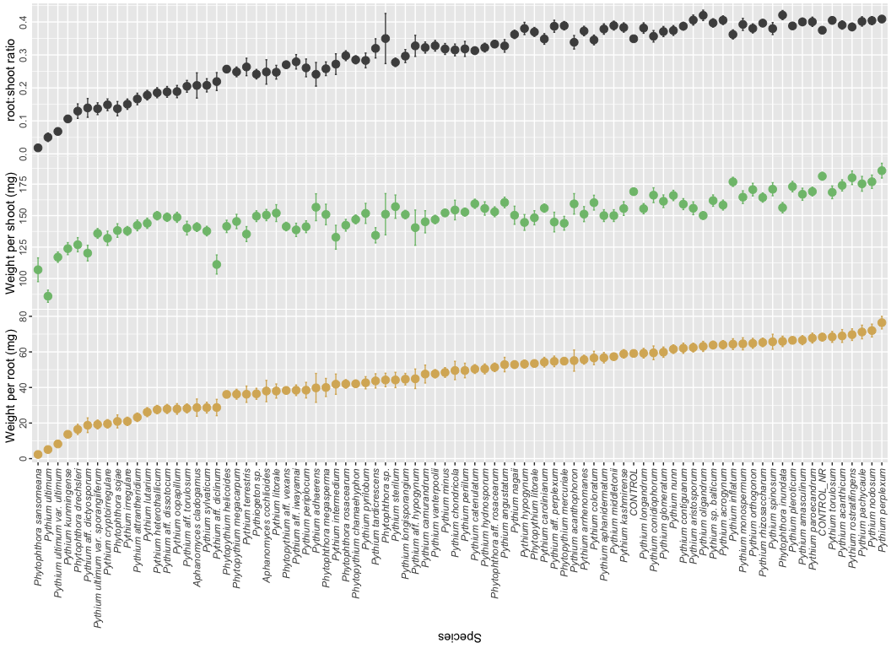


##Root measurements - pathogenicity data

```r
#Reading the file
root_raw <- read.csv(file = "../data/clean/root_measurements_final.csv")
root_raw$Species <- trim(root_raw$Species)

#Data transformation using different parameters by plyr library
root_measures <- ddply(root_raw, c("Species","Isolate","Set","Rep"), summarise,
              N = length(Area_cm),
              area.r = mean(Area_cm), 
              length.r = mean(Length_cm)
              )

#Summarizing data using different parameters by plyr library
root_sum <- ddply(root_measures, c("Species"), summarise,
              N = length(area.r),
              area.p = mean(area.r),
              sd_ap = sd(area.r),
              se_ap = sd_ap/sqrt(N),
              ln.p = mean(length.r),
              sd_lp = sd(length.r),
              se_lp = sd_lp/sqrt(N)
              )

#Setting limits for error bars
ap_limits <- aes(ymax = area.p + se_ap, ymin=area.p - se_ap)
lp_limits <- aes(ymax = ln.p + se_lp, ymin=ln.p - se_lp)
```

Plots for the root area and root length

```r
plot_area <- ggplot(root_sum, aes(x=reorder(Species, area.p, median), y=area.p)) +
  geom_point(stat = "summary", fun.y = "mean", size=3, col="#4d4d4d") +
  geom_errorbar(ap_limits, width=0.2, col="#4d4d4d") + theme_gray() +
  theme(axis.text.x=element_text(angle=90, hjust = 1, vjust = 0.5, face="italic"),
        axis.text.y=element_text(angle=90, hjust = 0.5),
        plot.margin=unit(c(1,1,1,1), "mm")) +
  labs(x="Species", y = expression(paste("Root area (",cm^"2",")")))

plot_len <- ggplot(root_sum, aes(x=reorder(Species, area.p, median), y=ln.p)) +
  geom_point(stat = "summary", fun.y = "mean", size=3, col="#7fbf7b") +
  geom_errorbar(lp_limits, width=0.2, col="#7fbf7b") + theme_gray() +
  #theme(axis.text.x=element_text(angle=90, hjust = 1, vjust = 0.5, face="italic"),
  #      axis.text.y=element_text(angle=90)) +
  theme(axis.ticks = element_blank(), 
        axis.text.x = element_blank(),
        axis.text.y=element_text(angle=90, hjust = 0.5),
        plot.margin=unit(c(1,1,-7,1), "mm")) +
  labs(x="", y = "Root Length (cm)")

grid.draw(rbind(ggplotGrob(plot_len), ggplotGrob(plot_area), size="last"))
```

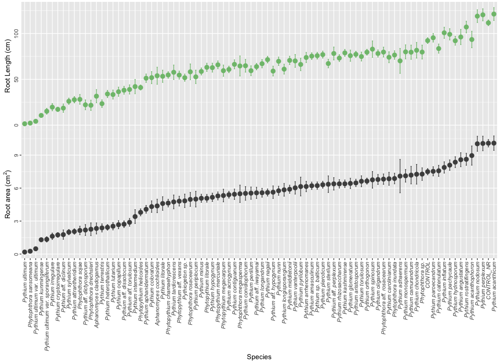

Merge data for root weight, shoot weight, and root measurements.

```r
#Data for table publication
Root_data <- left_join(dryw_sum,root_sum, by="Species")
Root_data$N.x <- with(Root_data, N.x/9)

#Selecting the columns desired
Root_data <- Root_data %>% dplyr::select(Species,N.x,mean_wpr,
                                         se_wpr,mean_wps,se_wps,
                                         mean_rs,se_rs, area.p,se_ap,ln.p,se_lp)

#Renaming column data
Root_data <- dplyr::rename(Root_data, N=N.x, Weight.Root=mean_wpr, se.wr=se_wpr,
                    Weight.Shoot=mean_wps, se.ws=se_wps, Root.Shoot=mean_rs,
                    se.rs=se_rs, Root.Area=area.p, se.area=se_ap,
                    Root.length=ln.p, se.length=se_lp)

kable(Root_data, digits = 3, format = "markdown")
```


|Species                             |  N| Weight.Root| se.wr| Weight.Shoot|  se.ws| Root.Shoot| se.rs| Root.Area| se.area| Root.length| se.length|
|:-----------------------------------|--:|-----------:|-----:|------------:|------:|----------:|-----:|---------:|-------:|-----------:|---------:|
|Aphanomyces cladogamus              |  1|      28.667| 4.853|      140.889|  3.450|      0.207| 0.038|     2.330|   0.503|      31.646|     7.178|
|Aphanomyces cochlioides             |  1|      38.000| 6.000|      150.444|  4.444|      0.248| 0.037|     4.379|   0.613|      53.977|     9.329|
|CONTROL                             |  7|      59.143| 1.711|      169.048|  2.663|      0.349| 0.008|     7.496|   0.283|      92.328|     3.147|
|CONTROL_NR                          |  7|      68.317| 2.130|      181.270|  3.153|      0.375| 0.009|    10.086|   0.336|     111.718|     3.121|
|Phytophthora aff. rosacearum        |  3|      51.333| 2.397|      153.037|  3.942|      0.333| 0.011|     6.816|   0.472|      79.789|     5.395|
|Phytophthora drechsleri             |  1|      16.444| 2.863|      126.889|  5.619|      0.130| 0.022|     2.257|   0.582|      21.703|     5.614|
|Phytophthora inundata               |  3|      65.926| 2.924|      156.296|  4.140|      0.421| 0.014|     6.875|   0.481|      76.578|     4.592|
|Phytophthora megasperma             |  1|      40.000| 5.088|      150.889|  8.159|      0.258| 0.021|     5.485|   0.791|      64.646|    10.979|
|Phytophthora rosacearum             |  3|      42.000| 2.377|      142.370|  4.631|      0.298| 0.015|     4.973|   0.631|      58.232|     8.622|
|Phytophthora sansomeana             |  2|       2.333| 0.518|      107.000|  9.437|      0.018| 0.004|     0.258|   0.063|       2.254|     0.563|
|Phytophthora sojae                  |  3|      20.926| 3.647|      138.148|  5.372|      0.137| 0.022|     2.147|   0.389|      28.181|     5.324|
|Phytophthora sp.                    |  1|      44.222| 3.792|      151.111| 16.395|      0.350| 0.076|     7.274|   0.570|      79.816|     7.606|
|Phytopythium aff. vexans            |  2|      38.333| 1.955|      141.344|  3.358|      0.270| 0.011|     4.813|   0.442|      54.681|     4.386|
|Phytopythium chamaehyphon           |  3|      42.074| 2.074|      146.963|  3.543|      0.285| 0.012|     4.637|   0.346|      54.824|     3.552|
|Phytopythium helicoides             |  2|      36.111| 1.699|      141.444|  4.906|      0.257| 0.010|     3.794|   0.318|      41.125|     2.731|
|Phytopythium litorale               |  3|      53.481| 1.730|      148.296|  5.603|      0.370| 0.014|     5.076|   0.352|      63.166|     4.454|
|Phytopythium megacarpum             |  1|      36.222| 2.778|      145.333|  5.706|      0.249| 0.015|     5.326|   0.575|      59.494|     6.113|
|Phytopythium mercuriale             |  3|      54.815| 1.758|      143.926|  5.458|      0.389| 0.013|     5.288|   0.362|      65.888|     4.230|
|Pythiogeton sp.                     |  1|      36.444| 3.051|      149.556|  4.253|      0.242| 0.014|     4.840|   0.614|      51.840|     3.914|
|Pythium acanthicum                  |  3|      68.963| 3.586|      174.000|  4.458|      0.391| 0.013|    10.091|   0.658|     121.304|     7.037|
|Pythium acanthophoron               |  1|      55.111| 5.964|      159.333|  8.145|      0.338| 0.021|     8.961|   0.875|      93.521|     9.012|
|Pythium acrogynum                   |  3|      64.000| 2.365|      158.370|  3.930|      0.405| 0.013|     5.401|   0.310|      60.841|     3.581|
|Pythium adhaerens                   |  1|      39.778| 8.127|      156.667| 10.693|      0.241| 0.036|     7.093|   1.519|      70.184|    13.626|
|Pythium aff. diclinum               |  3|      28.741| 4.584|      111.185|  7.586|      0.219| 0.027|     1.768|   0.426|      18.602|     4.557|
|Pythium aff. dictyosporum           |  2|      18.778| 4.110|      120.222|  6.216|      0.139| 0.028|     2.186|   0.498|      22.220|     5.379|
|Pythium aff. dissotocum             |  3|      27.926| 2.545|      148.741|  3.330|      0.188| 0.016|     2.715|   0.301|      38.133|     4.282|
|Pythium aff. hypogynum              |  1|      44.889| 5.488|      140.444| 13.979|      0.328| 0.032|     5.630|   0.572|      59.058|     5.346|
|Pythium aff. iwayamai               |  1|      38.444| 2.977|      138.667|  5.270|      0.279| 0.022|     5.568|   0.509|      63.914|     3.509|
|Pythium aff. perplexum              |  3|      54.667| 2.972|      144.889|  7.795|      0.387| 0.018|     6.387|   0.566|      78.246|     7.074|
|Pythium aff. torulosum              |  3|      28.222| 2.536|      140.074|  5.445|      0.205| 0.018|     2.889|   0.352|      38.977|     5.004|
|Pythium amasculinum                 |  3|      66.593| 2.524|      166.963|  4.778|      0.400| 0.011|     6.212|   0.335|      75.352|     3.655|
|Pythium angustatum                  |  1|      52.889| 4.043|      160.444|  4.200|      0.327| 0.019|     8.585|   0.636|      96.254|     8.287|
|Pythium aphanidermatum              |  3|      56.741| 2.906|      150.000|  4.679|      0.379| 0.016|     4.073|   0.350|      51.256|     4.599|
|Pythium aristosporum                |  3|      62.444| 2.454|      155.852|  5.086|      0.406| 0.015|     6.473|   0.332|      77.329|     3.358|
|Pythium arrhenomanes                |  3|      55.630| 2.517|      151.185|  5.964|      0.373| 0.014|     6.148|   0.471|      73.888|     5.519|
|Pythium attrantheridium             |  3|      23.259| 2.368|      142.222|  4.228|      0.166| 0.018|     2.051|   0.247|      27.772|     3.462|
|Pythium camurandrum                 |  1|      47.556| 5.031|      145.111|  8.795|      0.322| 0.017|     7.182|   0.796|      79.656|     7.761|
|Pythium carolinianum                |  3|      54.222| 2.722|      155.926|  3.256|      0.348| 0.016|     6.849|   0.590|      74.149|     5.954|
|Pythium catenulatum                 |  3|      50.370| 2.469|      159.407|  3.645|      0.313| 0.011|     7.573|   0.503|      83.610|     4.966|
|Pythium chondricola                 |  1|      49.556| 5.162|      154.444|  7.780|      0.315| 0.018|     7.262|   0.899|      81.759|     8.577|
|Pythium coloratum                   |  3|      56.593| 3.759|      160.296|  5.876|      0.345| 0.015|     4.316|   0.521|      51.893|     6.566|
|Pythium conidiophorum               |  3|      59.481| 3.862|      166.222|  5.908|      0.357| 0.017|     5.518|   0.623|      64.866|     6.973|
|Pythium contiguanum                 |  3|      62.074| 2.859|      159.111|  4.349|      0.387| 0.012|     5.440|   0.472|      66.416|     4.915|
|Pythium cryptoirregulare            |  1|      19.556| 2.375|      132.000|  5.657|      0.149| 0.018|     1.740|   0.215|      17.280|     2.335|
|Pythium glomeratum                  |  3|      59.852| 2.892|      161.407|  5.021|      0.371| 0.015|     6.429|   0.471|      75.849|     6.110|
|Pythium heterothallicum             |  3|      27.556| 2.349|      149.926|  3.346|      0.186| 0.015|     2.431|   0.254|      34.058|     3.957|
|Pythium hydnosporum                 |  2|      50.444| 2.803|      155.667|  5.322|      0.322| 0.013|     8.360|   0.495|      92.168|     4.829|
|Pythium hypogynum                   |  3|      53.185| 2.230|      144.593|  6.265|      0.380| 0.019|     5.164|   0.379|      62.808|     4.852|
|Pythium inflatum                    |  3|      64.370| 3.040|      176.815|  3.633|      0.362| 0.014|     7.879|   0.513|     100.851|     6.087|
|Pythium intermedium                 |  3|      41.852| 5.690|      132.815|  9.483|      0.272| 0.031|     3.410|   0.632|      42.129|     7.779|
|Pythium irregulare                  |  3|      20.963| 2.325|      137.852|  3.497|      0.151| 0.016|     1.618|   0.291|      19.662|     3.980|
|Pythium kashmirense                 |  3|      58.889| 2.371|      155.630|  5.466|      0.383| 0.014|     6.394|   0.344|      78.918|     3.796|
|Pythium kunmingense                 |  2|      13.667| 1.510|      123.778|  4.774|      0.106| 0.010|     1.301|   0.108|      10.641|     1.174|
|Pythium litorale                    |  1|      38.000| 3.986|      152.000|  6.700|      0.248| 0.021|     4.599|   0.618|      53.376|     6.658|
|Pythium longandrum                  |  3|      59.259| 2.697|      155.481|  4.048|      0.382| 0.016|     5.578|   0.401|      67.096|     4.512|
|Pythium longisporangium             |  3|      44.667| 3.257|      150.815|  3.371|      0.296| 0.020|     5.844|   0.578|      61.178|     5.407|
|Pythium lutarium                    |  3|      26.148| 2.542|      143.926|  4.074|      0.178| 0.015|     2.535|   0.333|      33.427|     4.884|
|Pythium middletonii                 |  3|      57.333| 1.725|      150.000|  4.668|      0.389| 0.014|     5.898|   0.367|      70.706|     4.533|
|Pythium minus                       |  3|      48.444| 2.731|      152.148|  2.826|      0.318| 0.017|     5.075|   0.365|      58.632|     3.784|
|Pythium monospermum                 |  2|      64.556| 3.391|      164.667|  5.044|      0.393| 0.018|     7.119|   0.575|      80.031|     7.670|
|Pythium nagaii                      |  3|      52.889| 2.112|      150.296|  7.172|      0.362| 0.013|     5.602|   0.321|      71.571|     3.604|
|Pythium nodosum                     |  3|      72.000| 3.614|      176.889|  5.308|      0.404| 0.012|    10.035|   0.683|     119.017|     6.931|
|Pythium nunn                        |  3|      61.556| 2.414|      166.000|  4.086|      0.374| 0.015|     5.760|   0.411|      69.767|     4.598|
|Pythium oligandrum                  |  3|      63.111| 2.833|      150.074|  3.024|      0.420| 0.016|     6.786|   0.455|      78.245|     3.923|
|Pythium oopapillum                  |  3|      27.926| 2.967|      148.667|  3.986|      0.189| 0.019|     2.670|   0.368|      36.522|     4.982|
|Pythium orthogonon                  |  3|      64.815| 2.801|      170.667|  5.014|      0.380| 0.014|     6.637|   0.273|      79.670|     3.170|
|Pythium pachycaule                  |  3|      71.185| 3.829|      175.259|  5.877|      0.402| 0.014|     8.091|   0.476|      99.187|     6.135|
|Pythium paroecandrum                |  3|      67.778| 2.768|      169.111|  3.458|      0.400| 0.014|     7.528|   0.414|      95.394|     4.674|
|Pythium periilum                    |  3|      49.556| 4.088|      152.815|  3.189|      0.318| 0.023|     5.543|   0.561|      59.440|     5.378|
|Pythium periplocum                  |  3|      38.489| 4.391|      141.185|  4.697|      0.261| 0.027|     4.998|   0.716|      52.741|     7.378|
|Pythium perplexum                   |  3|      76.444| 3.522|      185.704|  5.867|      0.409| 0.009|    10.063|   0.662|     120.464|     6.615|
|Pythium pleroticum                  |  3|      66.519| 1.516|      173.037|  4.178|      0.388| 0.010|     6.310|   0.311|      77.049|     3.778|
|Pythium pyrilobum                   |  1|      42.667| 3.416|      151.778|  7.968|      0.283| 0.022|     6.144|   0.855|      66.296|     6.810|
|Pythium rhizosaccharum              |  3|      65.333| 2.413|      164.370|  3.684|      0.396| 0.011|     6.389|   0.382|      73.245|     3.738|
|Pythium rostratifingens             |  3|      69.704| 3.244|      180.074|  5.417|      0.385| 0.012|     8.624|   0.545|     107.139|     6.327|
|Pythium sp. balticum                |  3|      63.852| 2.175|      161.926|  4.508|      0.397| 0.013|     6.227|   0.334|      75.855|     3.665|
|Pythium spinosum                    |  3|      65.704| 4.223|      170.963|  5.198|      0.380| 0.018|     6.754|   0.756|      82.996|     8.953|
|Pythium sterilum                    |  1|      44.222| 4.313|      157.111|  9.262|      0.278| 0.013|     6.356|   0.756|      67.293|     4.689|
|Pythium sylvaticum                  |  3|      28.667| 3.027|      137.704|  3.783|      0.208| 0.020|     1.995|   0.241|      26.115|     3.424|
|Pythium tardicrescens               |  3|      43.704| 4.007|      134.370|  6.043|      0.320| 0.029|     4.745|   0.629|      57.746|     7.890|
|Pythium terrestris                  |  1|      36.222| 4.576|      135.333|  5.944|      0.264| 0.026|     2.379|   0.368|      23.475|     4.138|
|Pythium torulosum                   |  3|      68.444| 3.063|      168.519|  5.041|      0.405| 0.011|     6.622|   0.496|      74.909|     4.860|
|Pythium ultimum                     |  3|       5.111| 1.397|       86.000|  4.829|      0.050| 0.013|     0.183|   0.039|       1.539|     0.431|
|Pythium ultimum var. sporangiiferum |  3|      19.200| 2.497|      135.852|  3.871|      0.137| 0.018|     1.337|   0.240|      15.196|     3.169|
|Pythium ultimum var. ultimum        |  3|       8.256| 1.252|      117.037|  4.114|      0.068| 0.010|     0.481|   0.070|       4.228|     0.738|
|Pythium vanterpoolii                |  3|      47.704| 2.306|      146.889|  3.366|      0.328| 0.016|     6.023|   0.567|      70.135|     7.034|

## PCA analysis
Evaluation of data and factor mining

```r
## Combine dataset for multivariate analysis
root_final <- full_join(root_measures,dry_weight, by=c("Species","Isolate","Set","Rep"))
root_final <- root_final[c(-5,-8,-9,-10)]

## Log transforming data
root.log <- root_final
root.log[,5:9] <- log10(root.log[,5:9] + 1)

#### PCA exploration of the data 
library(FactoMineR)
rd.pca <- PCA(root_final[5:9], scale.unit = TRUE, ncp=5, graph = T)
```

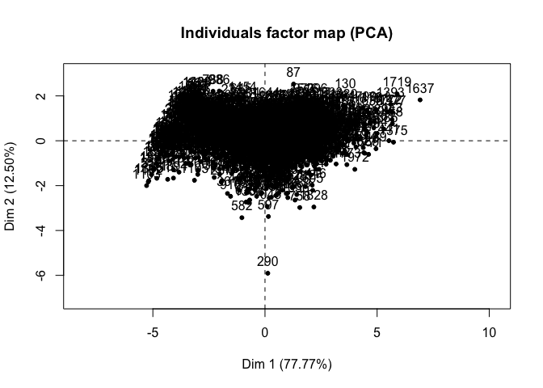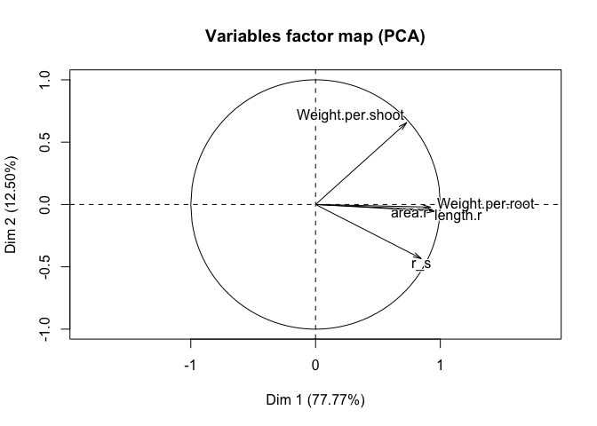

```r
rd.pca$var$contrib
```

```
##                     Dim.1       Dim.2     Dim.3        Dim.4       Dim.5
## area.r           21.85143  0.07472866 30.960461 46.799414397  0.31396659
## length.r         22.45814  0.29210541 24.422796 52.802181492  0.02477689
## Weight.per.root  23.47647  0.46252424 16.603211  0.367029876 59.09076595
## Weight.per.shoot 13.72364 68.96951804  7.844296  0.029938280  9.43261043
## r_s              18.49032 30.20112366 20.169236  0.001435955 31.13788014
```

```r
dimdesc(rd.pca, axes = c(1,2))
```

```
## $Dim.1
## $Dim.1$quanti
##                  correlation p.value
## Weight.per.root    0.9554455       0
## length.r           0.9344938       0
## area.r             0.9217846       0
## r_s                0.8479335       0
## Weight.per.shoot   0.7305066       0
## 
## 
## $Dim.2
## $Dim.2$quanti
##                  correlation       p.value
## Weight.per.shoot  0.65660863 1.088758e-245
## Weight.per.root  -0.05377064  1.647129e-02
## r_s              -0.43449976  2.176565e-92
```

```r
rd.hcpc <- HCPC(rd.pca, nb.clust = 3)
```

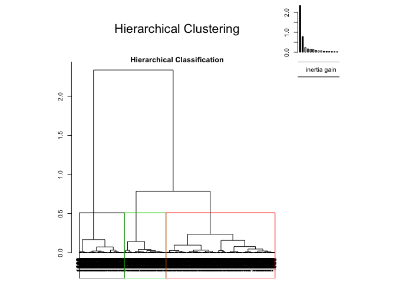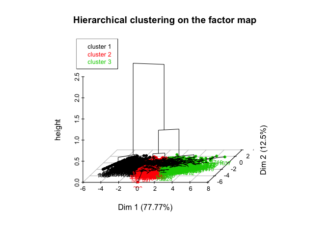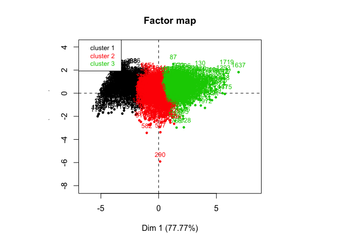

```r
rd.hcpc$desc.var
```

```
## $quanti.var
##                       Eta2       P-value
## area.r           0.7151537  0.000000e+00
## length.r         0.7369130  0.000000e+00
## Weight.per.root  0.7466415  0.000000e+00
## r_s              0.6461200  0.000000e+00
## Weight.per.shoot 0.4185402 1.472615e-234
## 
## $quanti
## $quanti$`1`
##                     v.test Mean in category Overall mean sd in category
## Weight.per.shoot -20.94764      126.0626398  152.5058824    28.68287792
## area.r           -30.19480        1.2790328    5.4490842     1.01800530
## length.r         -31.22751       14.7305969   64.3352076    12.82965337
## Weight.per.root  -33.65093       16.8445190   48.9700855    10.78044091
## r_s              -34.50523        0.1292444    0.3112623     0.08166911
##                  Overall sd       p.value
## Weight.per.shoot 30.3039523  1.971432e-97
## area.r            3.3153470 2.771605e-200
## length.r         38.1333071 4.510673e-214
## Weight.per.root  22.9178307 3.021926e-248
## r_s               0.1266336 6.696198e-261
## 
## $quanti$`2`
##                     v.test Mean in category Overall mean sd in category
## r_s               7.661747        0.3361948    0.3112623     0.08027482
## length.r         -4.862159       59.5706430   64.3352076    17.25607021
## area.r           -5.745685        4.9595756    5.4490842     1.57738798
## Weight.per.shoot -7.661306      146.5397674  152.5058824    20.93595661
##                  Overall sd      p.value
## r_s               0.1266336 1.834204e-14
## length.r         38.1333071 1.161121e-06
## area.r            3.3153470 9.154959e-09
## Weight.per.shoot 30.3039523 1.840523e-14
## 
## $quanti$`3`
##                    v.test Mean in category Overall mean sd in category
## area.r           32.54870        8.7995100    5.4490842     2.30525927
## length.r         32.53470      102.8554223   64.3352076    25.14670345
## Weight.per.root  30.37072       70.5806452   48.9700855    13.12750825
## Weight.per.shoot 26.41642      177.3607038  152.5058824    21.57199182
## r_s              22.34608        0.3991216    0.3112623     0.06366111
##                  Overall sd       p.value
## area.r            3.3153470 2.184623e-232
## length.r         38.1333071 3.446421e-232
## Weight.per.root  22.9178307 1.338450e-202
## Weight.per.shoot 30.3039523 8.875378e-154
## r_s               0.1266336 1.318344e-110
## 
## 
## attr(,"class")
## [1] "catdes" "list "
```

```r
root.clusters <- rd.hcpc$data.clust$clust

root.log.pca <- prcomp(root_final[5:9],
                       center = TRUE,
                       scale. = TRUE)
summary(root.log.pca)
```

```
## Importance of components:
##                           PC1    PC2     PC3     PC4     PC5
## Standard deviation     1.9719 0.7906 0.64773 0.20607 0.15620
## Proportion of Variance 0.7777 0.1250 0.08391 0.00849 0.00488
## Cumulative Proportion  0.7777 0.9027 0.98663 0.99512 1.00000
```

```r
#Bi-plot for PCA analysis
library(ggbiplot)
```

```
## Loading required package: scales
```

```r
g <- ggbiplot(root.log.pca, obs.scale = 1, var.scale = 1, 
              groups = root.clusters, ellipse = TRUE, 
              circle = FALSE, alpha=0.2)
g <- g + scale_color_discrete(name = '') + theme_gray() 
(g <- g + theme(legend.direction = 'horizontal', 
               legend.position = 'top'))
```

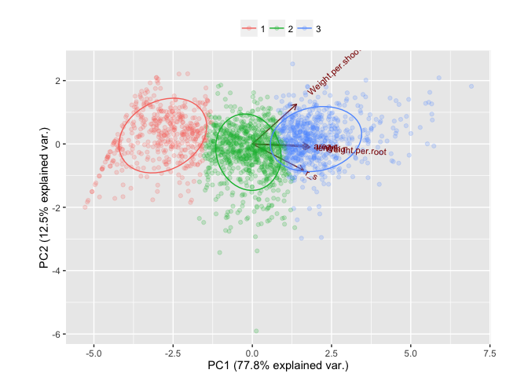


## MANOVA analysis

```r
## MANOVA analysis
# fit <- manova(cbind(area.r, length.r, Weight.per.root)~Species, data=root_scale)
# summary(fit, test=c("Pillai"))
# summary(fit, test=c("Wilks"))
# summary(fit, test=c("Hotelling-Lawley"))
library(nlme)
```

```
## 
## Attaching package: 'nlme'
```

```
## The following object is masked from 'package:dplyr':
## 
##     collapse
```

```
## The following object is masked from 'package:lme4':
## 
##     lmList
```

```r
fit <- lme(cbind(area.r, length.r, Weight.per.root) ~ Species, random= ~1|Isolate, data=root.log)
fit1 <- lme(cbind(area.r, length.r, Weight.per.root) ~ Species, random= ~1|Set/Isolate, data=root.log)
fit2 <- lme(cbind(area.r, length.r, Weight.per.root) ~ Species, random = ~1|Set, data=root.log)
fit3 <- lme(cbind(area.r, length.r, Weight.per.root) ~ Species,
           random = ~1|Set/Species/Isolate, data=root.log)

#model tests
anova(fit,fit1,fit2, fit3)
```

```
##      Model df       AIC       BIC   logLik   Test  L.Ratio p-value
## fit      1 88 -1070.347 -581.8425 623.1735                        
## fit1     2 89 -1475.426 -981.3700 826.7128 1 vs 2 407.0787  <.0001
## fit2     3 88 -1020.193 -531.6890 598.0967 2 vs 3 457.2322  <.0001
## fit3     4 90 -1473.426 -973.8188 826.7128 3 vs 4 457.2322  <.0001
```

```r
#Checking correlation of dependent variables
library(car)
scatterplotMatrix(~ area.r + length.r + Weight.per.root, data = root.log)
```

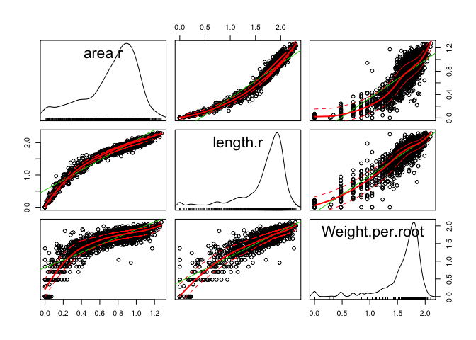

```r
cor.test(root.log$area.r, root.log$length.r, method="pearson")
```

```
## 
## 	Pearson's product-moment correlation
## 
## data:  root.log$area.r and root.log$length.r
## t = 140.31, df = 1987, p-value < 2.2e-16
## alternative hypothesis: true correlation is not equal to 0
## 95 percent confidence interval:
##  0.9488559 0.9569286
## sample estimates:
##       cor 
## 0.9530613
```

```r
cor.test(root.log$Weight.per.root, root.log$length.r, method="pearson")
```

```
## 
## 	Pearson's product-moment correlation
## 
## data:  root.log$Weight.per.root and root.log$length.r
## t = 93.139, df = 1987, p-value < 2.2e-16
## alternative hypothesis: true correlation is not equal to 0
## 95 percent confidence interval:
##  0.893488 0.909896
## sample estimates:
##       cor 
## 0.9020173
```

```r
cor.test(root.log$area.r, root.log$Weight.per.root, method="pearson")
```

```
## 
## 	Pearson's product-moment correlation
## 
## data:  root.log$area.r and root.log$Weight.per.root
## t = 67.17, df = 1987, p-value < 2.2e-16
## alternative hypothesis: true correlation is not equal to 0
## 95 percent confidence interval:
##  0.8192690 0.8461816
## sample estimates:
##       cor 
## 0.8332181
```

```r
cor.test(root_final$area.r, root_final$length.r, method="pearson")
```

```
## 
## 	Pearson's product-moment correlation
## 
## data:  root_final$area.r and root_final$length.r
## t = 146.27, df = 1987, p-value < 2.2e-16
## alternative hypothesis: true correlation is not equal to 0
## 95 percent confidence interval:
##  0.9526648 0.9601486
## sample estimates:
##      cor 
## 0.956564
```

```r
cor.test(root_final$Weight.per.root, root_final$length.r, method="pearson")
```

```
## 
## 	Pearson's product-moment correlation
## 
## data:  root_final$Weight.per.root and root_final$length.r
## t = 61.371, df = 1987, p-value < 2.2e-16
## alternative hypothesis: true correlation is not equal to 0
## 95 percent confidence interval:
##  0.7933566 0.8237539
## sample estimates:
##       cor 
## 0.8090957
```

```r
cor.test(root_final$area.r, root_final$Weight.per.root, method="pearson")
```

```
## 
## 	Pearson's product-moment correlation
## 
## data:  root_final$area.r and root_final$Weight.per.root
## t = 56.95, df = 1987, p-value < 2.2e-16
## alternative hypothesis: true correlation is not equal to 0
## 95 percent confidence interval:
##  0.7701663 0.8036013
## sample estimates:
##       cor 
## 0.7874624
```

```r
library(lsmeans)
plot(fit1)
```

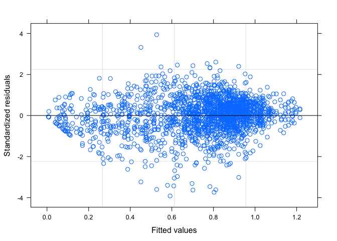

```r
#Variance
VarCorr(fit1)
```

```
##             Variance     StdDev   
## Set =       pdLogChol(1)          
## (Intercept) 0.006668143  0.0816587
## Isolate =   pdLogChol(1)          
## (Intercept) 0.014536808  0.1205687
## Residual    0.013565139  0.1164695
```

```r
#Confidence intervals
fit1.ci <- intervals(fit1)
fit1.ci.2 <- as.data.frame(fit1.ci[[1]]) %>% add_rownames(var = "Species") %>% arrange(est.)
ggplot(fit1.ci.2, aes(x = reorder(Species, est., mean), 
                 y = est., ymin = lower, ymax = upper)) + 
  geom_errorbar() + geom_point() + coord_flip() + theme_bw()
```

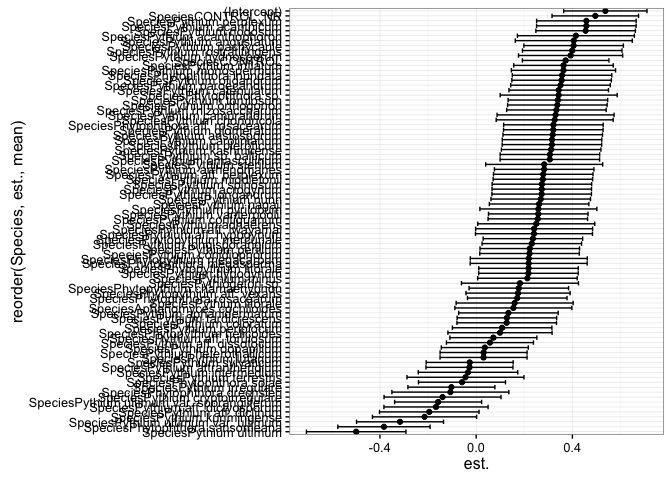

```r
#Contrasts
fit1.ls <- lsmeans(fit1, "Species")
plot(fit1.ls)
```

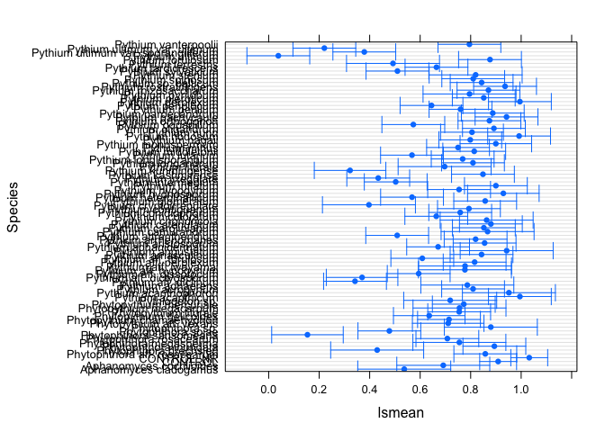

```r
fit1.d <- contrast(fit1.ls, "trt.vs.ctrl", ref=4, adjust="bon")
fit1.dc <- as.data.frame(summary(fit1.d))
kable(fit1.dc, format = "markdown")
```


|contrast                                         |   estimate|        SE|  df|     t.ratio|   p.value|
|:------------------------------------------------|----------:|---------:|---:|-----------:|---------:|
|Aphanomyces cladogamus - CONTROL_NR              | -0.4951197| 0.0915492| 557|  -5.4082386| 0.0000080|
|Aphanomyces cochlioides - CONTROL_NR             | -0.3405201| 0.0915492| 557|  -3.7195327| 0.0186840|
|CONTROL - CONTROL_NR                             | -0.1231859| 0.0426040| 557|  -2.8914201| 0.3387035|
|Phytophthora aff. rosacearum - CONTROL_NR        | -0.1740862| 0.0643896| 557|  -2.7036390| 0.6007798|
|Phytophthora drechsleri - CONTROL_NR             | -0.6023674| 0.0915492| 557|  -6.5797163| 0.0000000|
|Phytophthora inundata - CONTROL_NR               | -0.1381653| 0.0643896| 557|  -2.1457710| 1.0000000|
|Phytophthora megasperma - CONTROL_NR             | -0.2767935| 0.0915492| 557|  -3.0234414| 0.2222095|
|Phytophthora rosacearum - CONTROL_NR             | -0.3243565| 0.0643896| 557|  -5.0374058| 0.0000543|
|Phytophthora sansomeana - CONTROL_NR             | -0.8784392| 0.0721445| 557| -12.1761095| 0.0000000|
|Phytophthora sojae - CONTROL_NR                  | -0.5540462| 0.0643896| 557|  -8.6045917| 0.0000000|
|Phytophthora sp. - CONTROL_NR                    | -0.1521497| 0.0915492| 557|  -1.6619452| 1.0000000|
|Phytopythium aff. vexans - CONTROL_NR            | -0.3210865| 0.0721445| 557|  -4.4506028| 0.0008794|
|Phytopythium chamaehyphon - CONTROL_NR           | -0.3178642| 0.0643896| 557|  -4.9365769| 0.0000894|
|Phytopythium helicoides - CONTROL_NR             | -0.3961406| 0.0721445| 557|  -5.4909332| 0.0000052|
|Phytopythium litorale - CONTROL_NR               | -0.2774939| 0.0643896| 557|  -4.3096082| 0.0016437|
|Phytopythium megacarpum - CONTROL_NR             | -0.2763121| 0.0915492| 557|  -3.0181827| 0.2260381|
|Phytopythium mercuriale - CONTROL_NR             | -0.2593012| 0.0643896| 557|  -4.0270661| 0.0054662|
|Pythiogeton sp. - CONTROL_NR                     | -0.3130774| 0.0915492| 557|  -3.4197742| 0.0571731|
|Pythium acanthicum - CONTROL_NR                  | -0.0370781| 0.0643896| 557|  -0.5758404| 1.0000000|
|Pythium acanthophoron - CONTROL_NR               | -0.0805921| 0.0915492| 557|  -0.8803155| 1.0000000|
|Pythium acrogynum - CONTROL_NR                   | -0.2225047| 0.0643896| 557|  -3.4556002| 0.0502275|
|Pythium adhaerens - CONTROL_NR                   | -0.2452541| 0.0915492| 557|  -2.6789340| 0.6463359|
|Pythium aff. diclinum - CONTROL_NR               | -0.6901490| 0.0643896| 557| -10.7183308| 0.0000000|
|Pythium aff. dictyosporum - CONTROL_NR           | -0.6621413| 0.0721445| 557|  -9.1779892| 0.0000000|
|Pythium aff. dissotocum - CONTROL_NR             | -0.4379118| 0.0643896| 557|  -6.8009711| 0.0000000|
|Pythium aff. hypogynum - CONTROL_NR              | -0.2548470| 0.0915492| 557|  -2.7837183| 0.4723035|
|Pythium aff. iwayamai - CONTROL_NR               | -0.2542446| 0.0915492| 557|  -2.7771374| 0.4818378|
|Pythium aff. perplexum - CONTROL_NR              | -0.2163223| 0.0643896| 557|  -3.3595852| 0.0708911|
|Pythium aff. torulosum - CONTROL_NR              | -0.4236240| 0.0643896| 557|  -6.5790755| 0.0000000|
|Pythium amasculinum - CONTROL_NR                 | -0.1889503| 0.0643896| 557|  -2.9344842| 0.2956927|
|Pythium angustatum - CONTROL_NR                  | -0.0894360| 0.0915492| 557|  -0.9769174| 1.0000000|
|Pythium aphanidermatum - CONTROL_NR              | -0.3610141| 0.0643896| 557|  -5.6067140| 0.0000028|
|Pythium aristosporum - CONTROL_NR                | -0.1768109| 0.0643896| 557|  -2.7459541| 0.5294246|
|Pythium arrhenomanes - CONTROL_NR                | -0.2124559| 0.0643896| 557|  -3.2995371| 0.0875779|
|Pythium attrantheridium - CONTROL_NR             | -0.5230560| 0.0643896| 557|  -8.1232993| 0.0000000|
|Pythium camurandrum - CONTROL_NR                 | -0.1650529| 0.0915492| 557|  -1.8028882| 1.0000000|
|Pythium carolinianum - CONTROL_NR                | -0.1797910| 0.0643896| 557|  -2.7922368| 0.4602156|
|Pythium catenulatum - CONTROL_NR                 | -0.1519902| 0.0643896| 557|  -2.3604782| 1.0000000|
|Pythium chondricola - CONTROL_NR                 | -0.1687392| 0.0915492| 557|  -1.8431545| 1.0000000|
|Pythium coloratum - CONTROL_NR                   | -0.3682536| 0.0643896| 557|  -5.7191480| 0.0000015|
|Pythium conidiophorum - CONTROL_NR               | -0.2734251| 0.0643896| 557|  -4.2464173| 0.0021634|
|Pythium contiguanum - CONTROL_NR                 | -0.2388730| 0.0643896| 557|  -3.7098079| 0.0193984|
|Pythium cryptoirregulare - CONTROL_NR            | -0.6349253| 0.0915492| 557|  -6.9353489| 0.0000000|
|Pythium glomeratum - CONTROL_NR                  | -0.1745490| 0.0643896| 557|  -2.7108268| 0.5880795|
|Pythium heterothallicum - CONTROL_NR             | -0.4642784| 0.0643896| 557|  -7.2104572| 0.0000000|
|Pythium hydnosporum - CONTROL_NR                 | -0.1026331| 0.0721445| 557|  -1.4226051| 1.0000000|
|Pythium hypogynum - CONTROL_NR                   | -0.2778289| 0.0643896| 557|  -4.3148110| 0.0016067|
|Pythium inflatum - CONTROL_NR                    | -0.1321535| 0.0643896| 557|  -2.0524049| 1.0000000|
|Pythium intermedium - CONTROL_NR                 | -0.5289618| 0.0643896| 557|  -8.2150198| 0.0000000|
|Pythium irregulare - CONTROL_NR                  | -0.5981411| 0.0643896| 557|  -9.2894056| 0.0000000|
|Pythium kashmirense - CONTROL_NR                 | -0.1833714| 0.0643896| 557|  -2.8478426| 0.3879541|
|Pythium kunmingense - CONTROL_NR                 | -0.7097188| 0.0721445| 557|  -9.8374635| 0.0000000|
|Pythium litorale - CONTROL_NR                    | -0.3352350| 0.0915492| 557|  -3.6618036| 0.0233170|
|Pythium longandrum - CONTROL_NR                  | -0.2229081| 0.0643896| 557|  -3.4618645| 0.0490971|
|Pythium longisporangium - CONTROL_NR             | -0.2637165| 0.0643896| 557|  -4.0956382| 0.0041095|
|Pythium lutarium - CONTROL_NR                    | -0.4644811| 0.0643896| 557|  -7.2136047| 0.0000000|
|Pythium middletonii - CONTROL_NR                 | -0.2179257| 0.0643896| 557|  -3.3844860| 0.0648812|
|Pythium minus - CONTROL_NR                       | -0.2820693| 0.0643896| 557|  -4.3806653| 0.0012019|
|Pythium monospermum - CONTROL_NR                 | -0.1323096| 0.0721445| 557|  -1.8339526| 1.0000000|
|Pythium nagaii - CONTROL_NR                      | -0.2336312| 0.0643896| 557|  -3.6283997| 0.0264703|
|Pythium nodosum - CONTROL_NR                     | -0.0401710| 0.0643896| 557|  -0.6238735| 1.0000000|
|Pythium nunn - CONTROL_NR                        | -0.2267637| 0.0643896| 557|  -3.5217450| 0.0394277|
|Pythium oligandrum - CONTROL_NR                  | -0.1399959| 0.0643896| 557|  -2.1742010| 1.0000000|
|Pythium oopapillum - CONTROL_NR                  | -0.4591797| 0.0643896| 557|  -7.1312712| 0.0000000|
|Pythium orthogonon - CONTROL_NR                  | -0.1576552| 0.0643896| 557|  -2.4484569| 1.0000000|
|Pythium pachycaule - CONTROL_NR                  | -0.0900390| 0.0643896| 557|  -1.3983462| 1.0000000|
|Pythium paroecandrum - CONTROL_NR                | -0.1444927| 0.0643896| 557|  -2.2440382| 1.0000000|
|Pythium periilum - CONTROL_NR                    | -0.2723205| 0.0643896| 557|  -4.2292624| 0.0023296|
|Pythium periplocum - CONTROL_NR                  | -0.3871455| 0.0643896| 557|  -6.0125476| 0.0000003|
|Pythium perplexum - CONTROL_NR                   | -0.0369668| 0.0643896| 557|  -0.5741117| 1.0000000|
|Pythium pleroticum - CONTROL_NR                  | -0.1801958| 0.0643896| 557|  -2.7985239| 0.4514746|
|Pythium pyrilobum - CONTROL_NR                   | -0.2365405| 0.0915492| 557|  -2.5837545| 0.8522678|
|Pythium rhizosaccharum - CONTROL_NR              | -0.1615637| 0.0643896| 557|  -2.5091578| 1.0000000|
|Pythium rostratifingens - CONTROL_NR             | -0.0958170| 0.0643896| 557|  -1.4880814| 1.0000000|
|Pythium sp. balticum - CONTROL_NR                | -0.1885839| 0.0643896| 557|  -2.9287946| 0.3010742|
|Pythium spinosum - CONTROL_NR                    | -0.2218928| 0.0643896| 557|  -3.4460977| 0.0519887|
|Pythium sterilum - CONTROL_NR                    | -0.2123254| 0.0915492| 557|  -2.3192504| 1.0000000|
|Pythium sylvaticum - CONTROL_NR                  | -0.5220404| 0.0643896| 557|  -8.1075271| 0.0000000|
|Pythium tardicrescens - CONTROL_NR               | -0.3674595| 0.0643896| 557|  -5.7068153| 0.0000016|
|Pythium terrestris - CONTROL_NR                  | -0.5396362| 0.0915492| 557|  -5.8944965| 0.0000006|
|Pythium torulosum - CONTROL_NR                   | -0.1554468| 0.0643896| 557|  -2.4141609| 1.0000000|
|Pythium ultimum - CONTROL_NR                     | -0.9938347| 0.0643896| 557| -15.4347095| 0.0000000|
|Pythium ultimum var. sporangiiferum - CONTROL_NR | -0.6533043| 0.0643896| 557| -10.1461153| 0.0000000|
|Pythium ultimum var. ultimum - CONTROL_NR        | -0.8115652| 0.0643896| 557| -12.6039807| 0.0000000|
|Pythium vanterpoolii - CONTROL_NR                | -0.2369967| 0.0643896| 557|  -3.6806673| 0.0216959|

```r
#### Univariate analysis
#### Area
fit.area <- lme(area.r ~ Species, random= ~1|Set/Isolate, data=root.log)
fit.area.ls <- lsmeans(fit.area, "Species")
fit.area.d <- contrast(fit.area.ls, "trt.vs.ctrl", ref=4, adjust="bon")
area.d.t <- as.data.frame(summary(fit.area.d))
#### Length
fit.length <- lme(length.r ~ Species, random= ~1|Set/Isolate, data=root.log)
fit.length.ls <- lsmeans(fit.length, "Species")
fit.length.d <- contrast(fit.length.ls, "trt.vs.ctrl", ref=4, adjust="bon")
length.d.t <- as.data.frame(summary(fit.length.d))
#### Weight per root
fit.wpr <- lme(Weight.per.root ~ Species, random= ~1|Set/Isolate, data=root.log)
fit.wpr.ls <- lsmeans(fit.wpr, "Species")
fit.wpr.d <- contrast(fit.wpr.ls, "trt.vs.ctrl", ref=4, adjust="bon")
wpr.d.t <- as.data.frame(summary(fit.wpr.d))

#### Merge results
univ.t1 <- full_join(area.d.t, length.d.t, by="contrast") %>% 
  dplyr::select(c(contrast, contains("p.value"))) %>%
  dplyr::rename(ar.p = p.value.x, ln.p = p.value.y)

univ.t2 <- full_join(univ.t1, wpr.d.t, by="contrast") %>%
  dplyr::select(c(contrast, ar.p, ln.p, p.value)) %>%
  dplyr::rename(wpr.p = p.value)

univ.t <- full_join(univ.t2, fit1.dc, by="contrast") %>%
  dplyr::select(c(contrast, p.value, ar.p, ln.p, wpr.p)) %>%
  dplyr::rename(mnv.p = p.value)

univ.t <- cbind(colsplit(univ.t$contrast," - ", names=c('Species','contrast')),univ.t[2:5])

kable(univ.t, digits = 3, format = "markdown")
```


|Species                             |contrast   | mnv.p|  ar.p|  ln.p| wpr.p|
|:-----------------------------------|:----------|-----:|-----:|-----:|-----:|
|Aphanomyces cladogamus              |CONTROL_NR | 0.000| 0.000| 0.002| 0.044|
|Aphanomyces cochlioides             |CONTROL_NR | 0.019| 0.019| 1.000| 1.000|
|CONTROL                             |CONTROL_NR | 0.339| 0.339| 1.000| 1.000|
|Phytophthora aff. rosacearum        |CONTROL_NR | 0.601| 0.601| 1.000| 1.000|
|Phytophthora drechsleri             |CONTROL_NR | 0.000| 0.000| 0.000| 0.000|
|Phytophthora inundata               |CONTROL_NR | 1.000| 1.000| 1.000| 1.000|
|Phytophthora megasperma             |CONTROL_NR | 0.222| 0.222| 1.000| 1.000|
|Phytophthora rosacearum             |CONTROL_NR | 0.000| 0.000| 0.031| 1.000|
|Phytophthora sansomeana             |CONTROL_NR | 0.000| 0.000| 0.000| 0.000|
|Phytophthora sojae                  |CONTROL_NR | 0.000| 0.000| 0.000| 0.000|
|Phytophthora sp.                    |CONTROL_NR | 1.000| 1.000| 1.000| 1.000|
|Phytopythium aff. vexans            |CONTROL_NR | 0.001| 0.001| 0.388| 0.587|
|Phytopythium chamaehyphon           |CONTROL_NR | 0.000| 0.000| 0.163| 1.000|
|Phytopythium helicoides             |CONTROL_NR | 0.000| 0.000| 0.016| 0.251|
|Phytopythium litorale               |CONTROL_NR | 0.002| 0.002| 0.677| 1.000|
|Phytopythium megacarpum             |CONTROL_NR | 0.226| 0.226| 1.000| 1.000|
|Phytopythium mercuriale             |CONTROL_NR | 0.005| 0.005| 1.000| 1.000|
|Pythiogeton sp.                     |CONTROL_NR | 0.057| 0.057| 1.000| 1.000|
|Pythium acanthicum                  |CONTROL_NR | 1.000| 1.000| 1.000| 1.000|
|Pythium acanthophoron               |CONTROL_NR | 1.000| 1.000| 1.000| 1.000|
|Pythium acrogynum                   |CONTROL_NR | 0.050| 0.050| 1.000| 1.000|
|Pythium adhaerens                   |CONTROL_NR | 0.646| 0.646| 1.000| 0.518|
|Pythium aff. diclinum               |CONTROL_NR | 0.000| 0.000| 0.000| 0.000|
|Pythium aff. dictyosporum           |CONTROL_NR | 0.000| 0.000| 0.000| 0.000|
|Pythium aff. dissotocum             |CONTROL_NR | 0.000| 0.000| 0.000| 0.000|
|Pythium aff. hypogynum              |CONTROL_NR | 0.472| 0.472| 1.000| 1.000|
|Pythium aff. iwayamai               |CONTROL_NR | 0.482| 0.482| 1.000| 1.000|
|Pythium aff. perplexum              |CONTROL_NR | 0.071| 0.071| 1.000| 1.000|
|Pythium aff. torulosum              |CONTROL_NR | 0.000| 0.000| 0.000| 0.000|
|Pythium amasculinum                 |CONTROL_NR | 0.296| 0.296| 1.000| 1.000|
|Pythium angustatum                  |CONTROL_NR | 1.000| 1.000| 1.000| 1.000|
|Pythium aphanidermatum              |CONTROL_NR | 0.000| 0.000| 0.016| 1.000|
|Pythium aristosporum                |CONTROL_NR | 0.529| 0.529| 1.000| 1.000|
|Pythium arrhenomanes                |CONTROL_NR | 0.088| 0.088| 1.000| 1.000|
|Pythium attrantheridium             |CONTROL_NR | 0.000| 0.000| 0.000| 0.000|
|Pythium camurandrum                 |CONTROL_NR | 1.000| 1.000| 1.000| 1.000|
|Pythium carolinianum                |CONTROL_NR | 0.460| 0.460| 1.000| 1.000|
|Pythium catenulatum                 |CONTROL_NR | 1.000| 1.000| 1.000| 1.000|
|Pythium chondricola                 |CONTROL_NR | 1.000| 1.000| 1.000| 1.000|
|Pythium coloratum                   |CONTROL_NR | 0.000| 0.000| 0.003| 1.000|
|Pythium conidiophorum               |CONTROL_NR | 0.002| 0.002| 0.343| 1.000|
|Pythium contiguanum                 |CONTROL_NR | 0.019| 0.019| 1.000| 1.000|
|Pythium cryptoirregulare            |CONTROL_NR | 0.000| 0.000| 0.000| 0.000|
|Pythium glomeratum                  |CONTROL_NR | 0.588| 0.588| 1.000| 1.000|
|Pythium heterothallicum             |CONTROL_NR | 0.000| 0.000| 0.000| 0.000|
|Pythium hydnosporum                 |CONTROL_NR | 1.000| 1.000| 1.000| 1.000|
|Pythium hypogynum                   |CONTROL_NR | 0.002| 0.002| 0.339| 1.000|
|Pythium inflatum                    |CONTROL_NR | 1.000| 1.000| 1.000| 1.000|
|Pythium intermedium                 |CONTROL_NR | 0.000| 0.000| 0.000| 0.000|
|Pythium irregulare                  |CONTROL_NR | 0.000| 0.000| 0.000| 0.000|
|Pythium kashmirense                 |CONTROL_NR | 0.388| 0.388| 1.000| 1.000|
|Pythium kunmingense                 |CONTROL_NR | 0.000| 0.000| 0.000| 0.000|
|Pythium litorale                    |CONTROL_NR | 0.023| 0.023| 1.000| 1.000|
|Pythium longandrum                  |CONTROL_NR | 0.049| 0.049| 1.000| 1.000|
|Pythium longisporangium             |CONTROL_NR | 0.004| 0.004| 0.139| 0.894|
|Pythium lutarium                    |CONTROL_NR | 0.000| 0.000| 0.000| 0.000|
|Pythium middletonii                 |CONTROL_NR | 0.065| 0.065| 1.000| 1.000|
|Pythium minus                       |CONTROL_NR | 0.001| 0.001| 0.451| 1.000|
|Pythium monospermum                 |CONTROL_NR | 1.000| 1.000| 1.000| 1.000|
|Pythium nagaii                      |CONTROL_NR | 0.026| 0.026| 1.000| 1.000|
|Pythium nodosum                     |CONTROL_NR | 1.000| 1.000| 1.000| 1.000|
|Pythium nunn                        |CONTROL_NR | 0.039| 0.039| 1.000| 1.000|
|Pythium oligandrum                  |CONTROL_NR | 1.000| 1.000| 1.000| 1.000|
|Pythium oopapillum                  |CONTROL_NR | 0.000| 0.000| 0.000| 0.000|
|Pythium orthogonon                  |CONTROL_NR | 1.000| 1.000| 1.000| 1.000|
|Pythium pachycaule                  |CONTROL_NR | 1.000| 1.000| 1.000| 1.000|
|Pythium paroecandrum                |CONTROL_NR | 1.000| 1.000| 1.000| 1.000|
|Pythium periilum                    |CONTROL_NR | 0.002| 0.002| 0.186| 1.000|
|Pythium periplocum                  |CONTROL_NR | 0.000| 0.000| 0.000| 0.003|
|Pythium perplexum                   |CONTROL_NR | 1.000| 1.000| 1.000| 1.000|
|Pythium pleroticum                  |CONTROL_NR | 0.451| 0.451| 1.000| 1.000|
|Pythium pyrilobum                   |CONTROL_NR | 0.852| 0.852| 1.000| 1.000|
|Pythium rhizosaccharum              |CONTROL_NR | 1.000| 1.000| 1.000| 1.000|
|Pythium rostratifingens             |CONTROL_NR | 1.000| 1.000| 1.000| 1.000|
|Pythium sp. balticum                |CONTROL_NR | 0.301| 0.301| 1.000| 1.000|
|Pythium spinosum                    |CONTROL_NR | 0.052| 0.052| 1.000| 1.000|
|Pythium sterilum                    |CONTROL_NR | 1.000| 1.000| 1.000| 1.000|
|Pythium sylvaticum                  |CONTROL_NR | 0.000| 0.000| 0.000| 0.000|
|Pythium tardicrescens               |CONTROL_NR | 0.000| 0.000| 0.001| 0.104|
|Pythium terrestris                  |CONTROL_NR | 0.000| 0.000| 0.000| 1.000|
|Pythium torulosum                   |CONTROL_NR | 1.000| 1.000| 1.000| 1.000|
|Pythium ultimum                     |CONTROL_NR | 0.000| 0.000| 0.000| 0.000|
|Pythium ultimum var. sporangiiferum |CONTROL_NR | 0.000| 0.000| 0.000| 0.000|
|Pythium ultimum var. ultimum        |CONTROL_NR | 0.000| 0.000| 0.000| 0.000|
|Pythium vanterpoolii                |CONTROL_NR | 0.022| 0.022| 1.000| 1.000|


```r
### Creating two data sets for downstream analysis
#### Root original data set
root_final$Treatment[root_final$Species=="CONTROL"] <- "Control"
root_final$Treatment[root_final$Species=="CONTROL_NR"] <- "Control"
root_final$Treatment[is.na(root_final$Treatment)] <- "Inoculated"
rownames(root_final) <- make.names(root_final[,1], unique = TRUE)

t.test(root_final$Weight.per.shoot~root_final$Treatment)
```

```
## 
## 	Welch Two Sample t-test
## 
## data:  root_final$Weight.per.shoot by root_final$Treatment
## t = 10.805, df = 153.19, p-value < 2.2e-16
## alternative hypothesis: true difference in means is not equal to 0
## 95 percent confidence interval:
##  19.76301 28.60684
## sample estimates:
##    mean in group Control mean in group Inoculated 
##                 175.1587                 150.9738
```

```r
t.test(root_final$Weight.per.root~root_final$Treatment)
```

```
## 
## 	Welch Two Sample t-test
## 
## data:  root_final$Weight.per.root by root_final$Treatment
## t = 10.383, df = 162.34, p-value < 2.2e-16
## alternative hypothesis: true difference in means is not equal to 0
## 95 percent confidence interval:
##  12.76145 18.75522
## sample estimates:
##    mean in group Control mean in group Inoculated 
##                 63.73016                 47.97182
```

```r
t.test(root_final$length.r~root_final$Treatment)
```

```
## 
## 	Welch Two Sample t-test
## 
## data:  root_final$length.r by root_final$Treatment
## t = 15.932, df = 160.52, p-value < 2.2e-16
## alternative hypothesis: true difference in means is not equal to 0
## 95 percent confidence interval:
##  35.24927 45.22433
## sample estimates:
##    mean in group Control mean in group Inoculated 
##                102.02307                 61.78627
```

```r
t.test(root_final$area.r~root_final$Treatment)
```

```
## 
## 	Welch Two Sample t-test
## 
## data:  root_final$area.r by root_final$Treatment
## t = 13.786, df = 148.72, p-value < 2.2e-16
## alternative hypothesis: true difference in means is not equal to 0
## 95 percent confidence interval:
##  3.056356 4.079121
## sample estimates:
##    mean in group Control mean in group Inoculated 
##                 8.790812                 5.223074
```

```r
## Analyzing by variable
##Function boxplot
draw_bp <- function(d, v, c, l){
  plot1 <- ggplot(data=d, aes_string(y=v, x=c)) +
    geom_boxplot(position="identity") + theme_bw() + labs(y=l)
  plot1
}

ar.root <- draw_bp(root_final, "area.r", "Treatment", expression(paste("Root area (",cm^"2",")")))
ln.root <- draw_bp(root_final, "length.r", "Treatment", "Root length (cm)")
wpr <- draw_bp(root_final, "Weight.per.root", "Treatment", "Weight per root (mg)")
wpp <- draw_bp(root_final, "Weight.per.shoot", "Treatment", "Weight per shoot (mg)")


plot_grid(ar.root,ln.root,wpr,wpp, ncol=2, nrow=2, labels = c("A","B","C","D"))
```


```r
## Summarizing data by species - full dataset
root.sp <- ddply(root_final, c("Species"), summarise,
              N = length(area.r),
              ar = mean(area.r), 
              ar.se = sd(area.r)/sqrt(N),
              ln = mean(length.r),
              ln.se = sd(length.r)/sqrt(N),
              wpr = mean(Weight.per.root),
              wpr.se = sd(Weight.per.root)/sqrt(N)
              )

root.sp <- dplyr::full_join(root.sp, univ.t, by="Species")
root.sp[is.na(root.sp)] <- 1

kable(root.sp, digits = 3, format = "markdown")
```


|Species                             |  N|     ar| ar.se|      ln|  ln.se|    wpr| wpr.se|contrast   | mnv.p|  ar.p|  ln.p| wpr.p|
|:-----------------------------------|--:|------:|-----:|-------:|------:|------:|------:|:----------|-----:|-----:|-----:|-----:|
|Aphanomyces cladogamus              |  9|  2.330| 0.503|  31.646|  7.178| 28.667|  4.853|CONTROL_NR | 0.000| 0.000| 0.002| 0.044|
|Aphanomyces cochlioides             |  9|  4.379| 0.613|  53.977|  9.329| 38.000|  6.000|CONTROL_NR | 0.019| 0.019| 1.000| 1.000|
|CONTROL                             | 63|  7.496| 0.283|  92.328|  3.147| 59.143|  1.711|CONTROL_NR | 0.339| 0.339| 1.000| 1.000|
|CONTROL_NR                          | 63| 10.086| 0.336| 111.718|  3.121| 68.317|  2.130|1          | 1.000| 1.000| 1.000| 1.000|
|Phytophthora aff. rosacearum        | 27|  6.816| 0.472|  79.789|  5.395| 51.333|  2.397|CONTROL_NR | 0.601| 0.601| 1.000| 1.000|
|Phytophthora drechsleri             |  9|  2.257| 0.582|  21.703|  5.614| 16.444|  2.863|CONTROL_NR | 0.000| 0.000| 0.000| 0.000|
|Phytophthora inundata               | 27|  6.875| 0.481|  76.578|  4.592| 65.926|  2.924|CONTROL_NR | 1.000| 1.000| 1.000| 1.000|
|Phytophthora megasperma             |  9|  5.485| 0.791|  64.646| 10.979| 40.000|  5.088|CONTROL_NR | 0.222| 0.222| 1.000| 1.000|
|Phytophthora rosacearum             | 27|  4.973| 0.631|  58.232|  8.622| 42.000|  2.377|CONTROL_NR | 0.000| 0.000| 0.031| 1.000|
|Phytophthora sansomeana             | 18|  0.258| 0.063|   2.254|  0.563|  2.333|  0.518|CONTROL_NR | 0.000| 0.000| 0.000| 0.000|
|Phytophthora sojae                  | 27|  2.147| 0.389|  28.181|  5.324| 20.926|  3.647|CONTROL_NR | 0.000| 0.000| 0.000| 0.000|
|Phytophthora sp.                    |  9|  7.274| 0.570|  79.816|  7.606| 44.222|  3.792|CONTROL_NR | 1.000| 1.000| 1.000| 1.000|
|Phytopythium aff. vexans            | 18|  4.813| 0.442|  54.681|  4.386| 38.333|  1.955|CONTROL_NR | 0.001| 0.001| 0.388| 0.587|
|Phytopythium chamaehyphon           | 27|  4.637| 0.346|  54.824|  3.552| 42.074|  2.074|CONTROL_NR | 0.000| 0.000| 0.163| 1.000|
|Phytopythium helicoides             | 18|  3.794| 0.318|  41.125|  2.731| 36.111|  1.699|CONTROL_NR | 0.000| 0.000| 0.016| 0.251|
|Phytopythium litorale               | 27|  5.076| 0.352|  63.166|  4.454| 53.481|  1.730|CONTROL_NR | 0.002| 0.002| 0.677| 1.000|
|Phytopythium megacarpum             |  9|  5.326| 0.575|  59.494|  6.113| 36.222|  2.778|CONTROL_NR | 0.226| 0.226| 1.000| 1.000|
|Phytopythium mercuriale             | 27|  5.288| 0.362|  65.888|  4.230| 54.815|  1.758|CONTROL_NR | 0.005| 0.005| 1.000| 1.000|
|Pythiogeton sp.                     |  9|  4.840| 0.614|  51.840|  3.914| 36.444|  3.051|CONTROL_NR | 0.057| 0.057| 1.000| 1.000|
|Pythium acanthicum                  | 27| 10.091| 0.658| 121.304|  7.037| 68.963|  3.586|CONTROL_NR | 1.000| 1.000| 1.000| 1.000|
|Pythium acanthophoron               |  9|  8.961| 0.875|  93.521|  9.012| 55.111|  5.964|CONTROL_NR | 1.000| 1.000| 1.000| 1.000|
|Pythium acrogynum                   | 27|  5.401| 0.310|  60.841|  3.581| 64.000|  2.365|CONTROL_NR | 0.050| 0.050| 1.000| 1.000|
|Pythium adhaerens                   |  9|  7.093| 1.519|  70.184| 13.626| 39.778|  8.127|CONTROL_NR | 0.646| 0.646| 1.000| 0.518|
|Pythium aff. diclinum               | 27|  1.768| 0.426|  18.602|  4.557| 28.741|  4.584|CONTROL_NR | 0.000| 0.000| 0.000| 0.000|
|Pythium aff. dictyosporum           | 18|  2.186| 0.498|  22.220|  5.379| 18.778|  4.110|CONTROL_NR | 0.000| 0.000| 0.000| 0.000|
|Pythium aff. dissotocum             | 27|  2.715| 0.301|  38.133|  4.282| 27.926|  2.545|CONTROL_NR | 0.000| 0.000| 0.000| 0.000|
|Pythium aff. hypogynum              |  9|  5.630| 0.572|  59.058|  5.346| 44.889|  5.488|CONTROL_NR | 0.472| 0.472| 1.000| 1.000|
|Pythium aff. iwayamai               |  9|  5.568| 0.509|  63.914|  3.509| 38.444|  2.977|CONTROL_NR | 0.482| 0.482| 1.000| 1.000|
|Pythium aff. perplexum              | 27|  6.387| 0.566|  78.246|  7.074| 54.667|  2.972|CONTROL_NR | 0.071| 0.071| 1.000| 1.000|
|Pythium aff. torulosum              | 27|  2.889| 0.352|  38.977|  5.004| 28.222|  2.536|CONTROL_NR | 0.000| 0.000| 0.000| 0.000|
|Pythium amasculinum                 | 27|  6.212| 0.335|  75.352|  3.655| 66.593|  2.524|CONTROL_NR | 0.296| 0.296| 1.000| 1.000|
|Pythium angustatum                  |  9|  8.585| 0.636|  96.254|  8.287| 52.889|  4.043|CONTROL_NR | 1.000| 1.000| 1.000| 1.000|
|Pythium aphanidermatum              | 27|  4.073| 0.350|  51.256|  4.599| 56.741|  2.906|CONTROL_NR | 0.000| 0.000| 0.016| 1.000|
|Pythium aristosporum                | 27|  6.473| 0.332|  77.329|  3.358| 62.444|  2.454|CONTROL_NR | 0.529| 0.529| 1.000| 1.000|
|Pythium arrhenomanes                | 27|  6.148| 0.471|  73.888|  5.519| 55.630|  2.517|CONTROL_NR | 0.088| 0.088| 1.000| 1.000|
|Pythium attrantheridium             | 27|  2.051| 0.247|  27.772|  3.462| 23.259|  2.368|CONTROL_NR | 0.000| 0.000| 0.000| 0.000|
|Pythium camurandrum                 |  9|  7.182| 0.796|  79.656|  7.761| 47.556|  5.031|CONTROL_NR | 1.000| 1.000| 1.000| 1.000|
|Pythium carolinianum                | 27|  6.849| 0.590|  74.149|  5.954| 54.222|  2.722|CONTROL_NR | 0.460| 0.460| 1.000| 1.000|
|Pythium catenulatum                 | 27|  7.573| 0.503|  83.610|  4.966| 50.370|  2.469|CONTROL_NR | 1.000| 1.000| 1.000| 1.000|
|Pythium chondricola                 |  9|  7.262| 0.899|  81.759|  8.577| 49.556|  5.162|CONTROL_NR | 1.000| 1.000| 1.000| 1.000|
|Pythium coloratum                   | 27|  4.316| 0.521|  51.893|  6.566| 56.593|  3.759|CONTROL_NR | 0.000| 0.000| 0.003| 1.000|
|Pythium conidiophorum               | 27|  5.518| 0.623|  64.866|  6.973| 59.481|  3.862|CONTROL_NR | 0.002| 0.002| 0.343| 1.000|
|Pythium contiguanum                 | 27|  5.440| 0.472|  66.416|  4.915| 62.074|  2.859|CONTROL_NR | 0.019| 0.019| 1.000| 1.000|
|Pythium cryptoirregulare            |  9|  1.740| 0.215|  17.280|  2.335| 19.556|  2.375|CONTROL_NR | 0.000| 0.000| 0.000| 0.000|
|Pythium glomeratum                  | 27|  6.429| 0.471|  75.849|  6.110| 59.852|  2.892|CONTROL_NR | 0.588| 0.588| 1.000| 1.000|
|Pythium heterothallicum             | 27|  2.431| 0.254|  34.058|  3.957| 27.556|  2.349|CONTROL_NR | 0.000| 0.000| 0.000| 0.000|
|Pythium hydnosporum                 | 18|  8.360| 0.495|  92.168|  4.829| 50.444|  2.803|CONTROL_NR | 1.000| 1.000| 1.000| 1.000|
|Pythium hypogynum                   | 27|  5.164| 0.379|  62.808|  4.852| 53.185|  2.230|CONTROL_NR | 0.002| 0.002| 0.339| 1.000|
|Pythium inflatum                    | 27|  7.879| 0.513| 100.851|  6.087| 64.370|  3.040|CONTROL_NR | 1.000| 1.000| 1.000| 1.000|
|Pythium intermedium                 | 27|  3.410| 0.632|  42.129|  7.779| 41.852|  5.690|CONTROL_NR | 0.000| 0.000| 0.000| 0.000|
|Pythium irregulare                  | 27|  1.618| 0.291|  19.662|  3.980| 20.963|  2.325|CONTROL_NR | 0.000| 0.000| 0.000| 0.000|
|Pythium kashmirense                 | 27|  6.394| 0.344|  78.918|  3.796| 58.889|  2.371|CONTROL_NR | 0.388| 0.388| 1.000| 1.000|
|Pythium kunmingense                 | 18|  1.301| 0.108|  10.641|  1.174| 13.667|  1.510|CONTROL_NR | 0.000| 0.000| 0.000| 0.000|
|Pythium litorale                    |  9|  4.599| 0.618|  53.376|  6.658| 38.000|  3.986|CONTROL_NR | 0.023| 0.023| 1.000| 1.000|
|Pythium longandrum                  | 27|  5.578| 0.401|  67.096|  4.512| 59.259|  2.697|CONTROL_NR | 0.049| 0.049| 1.000| 1.000|
|Pythium longisporangium             | 27|  5.844| 0.578|  61.178|  5.407| 44.667|  3.257|CONTROL_NR | 0.004| 0.004| 0.139| 0.894|
|Pythium lutarium                    | 27|  2.535| 0.333|  33.427|  4.884| 26.148|  2.542|CONTROL_NR | 0.000| 0.000| 0.000| 0.000|
|Pythium middletonii                 | 27|  5.898| 0.367|  70.706|  4.533| 57.333|  1.725|CONTROL_NR | 0.065| 0.065| 1.000| 1.000|
|Pythium minus                       | 27|  5.075| 0.365|  58.632|  3.784| 48.444|  2.731|CONTROL_NR | 0.001| 0.001| 0.451| 1.000|
|Pythium monospermum                 | 18|  7.119| 0.575|  80.031|  7.670| 64.556|  3.391|CONTROL_NR | 1.000| 1.000| 1.000| 1.000|
|Pythium nagaii                      | 27|  5.602| 0.321|  71.571|  3.604| 52.889|  2.112|CONTROL_NR | 0.026| 0.026| 1.000| 1.000|
|Pythium nodosum                     | 27| 10.035| 0.683| 119.017|  6.931| 72.000|  3.614|CONTROL_NR | 1.000| 1.000| 1.000| 1.000|
|Pythium nunn                        | 27|  5.760| 0.411|  69.767|  4.598| 61.556|  2.414|CONTROL_NR | 0.039| 0.039| 1.000| 1.000|
|Pythium oligandrum                  | 27|  6.786| 0.455|  78.245|  3.923| 63.111|  2.833|CONTROL_NR | 1.000| 1.000| 1.000| 1.000|
|Pythium oopapillum                  | 27|  2.670| 0.368|  36.522|  4.982| 27.926|  2.967|CONTROL_NR | 0.000| 0.000| 0.000| 0.000|
|Pythium orthogonon                  | 27|  6.637| 0.273|  79.670|  3.170| 64.815|  2.801|CONTROL_NR | 1.000| 1.000| 1.000| 1.000|
|Pythium pachycaule                  | 27|  8.091| 0.476|  99.187|  6.135| 71.185|  3.829|CONTROL_NR | 1.000| 1.000| 1.000| 1.000|
|Pythium paroecandrum                | 27|  7.528| 0.414|  95.394|  4.674| 67.778|  2.768|CONTROL_NR | 1.000| 1.000| 1.000| 1.000|
|Pythium periilum                    | 27|  5.543| 0.561|  59.440|  5.378| 49.556|  4.088|CONTROL_NR | 0.002| 0.002| 0.186| 1.000|
|Pythium periplocum                  | 27|  4.998| 0.716|  52.741|  7.378| 38.489|  4.391|CONTROL_NR | 0.000| 0.000| 0.000| 0.003|
|Pythium perplexum                   | 27| 10.063| 0.662| 120.464|  6.615| 76.444|  3.522|CONTROL_NR | 1.000| 1.000| 1.000| 1.000|
|Pythium pleroticum                  | 27|  6.310| 0.311|  77.049|  3.778| 66.519|  1.516|CONTROL_NR | 0.451| 0.451| 1.000| 1.000|
|Pythium pyrilobum                   |  9|  6.144| 0.855|  66.296|  6.810| 42.667|  3.416|CONTROL_NR | 0.852| 0.852| 1.000| 1.000|
|Pythium rhizosaccharum              | 27|  6.389| 0.382|  73.245|  3.738| 65.333|  2.413|CONTROL_NR | 1.000| 1.000| 1.000| 1.000|
|Pythium rostratifingens             | 27|  8.624| 0.545| 107.139|  6.327| 69.704|  3.244|CONTROL_NR | 1.000| 1.000| 1.000| 1.000|
|Pythium sp. balticum                | 27|  6.227| 0.334|  75.855|  3.665| 63.852|  2.175|CONTROL_NR | 0.301| 0.301| 1.000| 1.000|
|Pythium spinosum                    | 27|  6.754| 0.756|  82.996|  8.953| 65.704|  4.223|CONTROL_NR | 0.052| 0.052| 1.000| 1.000|
|Pythium sterilum                    |  9|  6.356| 0.756|  67.293|  4.689| 44.222|  4.313|CONTROL_NR | 1.000| 1.000| 1.000| 1.000|
|Pythium sylvaticum                  | 27|  1.995| 0.241|  26.115|  3.424| 28.667|  3.027|CONTROL_NR | 0.000| 0.000| 0.000| 0.000|
|Pythium tardicrescens               | 27|  4.745| 0.629|  57.746|  7.890| 43.704|  4.007|CONTROL_NR | 0.000| 0.000| 0.001| 0.104|
|Pythium terrestris                  |  9|  2.379| 0.368|  23.475|  4.138| 36.222|  4.576|CONTROL_NR | 0.000| 0.000| 0.000| 1.000|
|Pythium torulosum                   | 27|  6.622| 0.496|  74.909|  4.860| 68.444|  3.063|CONTROL_NR | 1.000| 1.000| 1.000| 1.000|
|Pythium ultimum                     | 27|  0.183| 0.039|   1.539|  0.431|  5.111|  1.397|CONTROL_NR | 0.000| 0.000| 0.000| 0.000|
|Pythium ultimum var. sporangiiferum | 27|  1.337| 0.240|  15.196|  3.169| 19.200|  2.497|CONTROL_NR | 0.000| 0.000| 0.000| 0.000|
|Pythium ultimum var. ultimum        | 27|  0.481| 0.070|   4.228|  0.738|  8.256|  1.252|CONTROL_NR | 0.000| 0.000| 0.000| 0.000|
|Pythium vanterpoolii                | 27|  6.023| 0.567|  70.135|  7.034| 47.704|  2.306|CONTROL_NR | 0.022| 0.022| 1.000| 1.000|

```r
root.sp$ar.sg <- ifelse(root.sp$ar.p<0.05,"SG","NS")
root.sp$ln.sg <- ifelse(root.sp$ln.p<0.05,"SG","NS")
root.sp$wpr.sg <- ifelse(root.sp$wpr.p<0.05,"SG","NS")
#Setting limits for error bars
ar_lt <- aes(ymax = ar + ar.se, ymin=ar - ar.se)
ln_lt <- aes(ymax = ln + ln.se, ymin=ln - ln.se)
wpr_lt <- aes(ymax = wpr + wpr.se, ymin=wpr - wpr.se)
```


```r
plot_ar <- ggplot(root.sp, aes(x=reorder(Species, ar, median), y=ar)) +
  geom_point(aes(shape=ar.sg), stat = "summary", 
             fun.y = "mean", size=3, colour="#4d4d4d") +
  geom_errorbar(ar_lt, width=0.2, col="#4d4d4d")  + theme_gray() +
  scale_shape_manual(values = c(21,19)) +
  theme(axis.text.x=element_text(angle=90, hjust = 1, vjust = 0.5, 
                                 face="italic", size = 12),
        axis.text.y=element_text(angle=90, hjust = 0.5),
        plot.margin=unit(c(1,1,1,1), "mm"),
        legend.position="none") +
  labs(x="Species", y = expression(paste("Root area (",cm^"2",")")))

plot_ln <- ggplot(root.sp, aes(x=reorder(Species, ar, median), y=ln)) +
  geom_point(aes(shape=ln.sg), stat = "summary", fun.y = "mean", 
             size=3, colour="#005824") +
  geom_errorbar(ln_lt, width=0.2, col="#005824")  + theme_gray() + 
  scale_shape_manual(values = c(21,19)) +
   #theme(axis.text.x=element_text(angle=90, hjust = 1, vjust = 0.5, face="italic"),
  #      axis.text.y=element_text(angle=90)) +
  theme(axis.ticks = element_blank(), 
        axis.text.x = element_blank(),
        axis.text.y=element_text(angle=90, hjust = 0.5),
        plot.margin=unit(c(1,1,-7,1), "mm"),
        legend.position="none") +
  labs(x="", y = "Root Length (cm)")

plot_wpr <- ggplot(root.sp, aes(x=reorder(Species, ar, median), y=wpr)) +
  geom_point(aes(shape=wpr.sg), stat = "summary", fun.y = "mean",
             size=3, colour = "#bf812d") +
  geom_errorbar(wpr_lt, width=0.2, col="#bf812d") + theme_gray() +
  scale_shape_manual(values = c(21,19)) +
  #theme(axis.text.x=element_text(angle=90, hjust = 1, vjust = 0.5, face="italic"),
  #      axis.text.y=element_text(angle=90)) +
  theme(axis.ticks = element_blank(), 
        axis.text.x = element_blank(),
        axis.text.y=element_text(angle=90, hjust = 0.5),
        plot.margin=unit(c(1,1,-7,1), "mm"),
        legend.position="none") +
  labs(x="", y = "Weight per root (mg)")

grid.draw(rbind(ggplotGrob(plot_wpr), ggplotGrob(plot_ln), ggplotGrob(plot_ar), size="last"))
```


## Boxplot based on significance

```r
root.sp1 <- root.sp
root.sp1$Group[root.sp1$mnv.p>0.05] <- "Group 1"
root.sp1$Group[(root.sp1$mnv.p<0.05) & (root.sp1$ln.p>0.05) | (root.sp1$mnv.p<0.05) &(root.sp1$wpr.p>0.05)] <- "Group 2"
root.sp1$Group[(root.sp1$mnv.p<0.05) & (root.sp1$ln.p<0.05) & (root.sp1$wpr.p<0.05)] <- "Group 3"


## Plots by clusters
a <- draw_bp(root.sp1, "ar", "Group", expression(paste("Root area (",cm^"2",")")))
b <- draw_bp(root.sp1, "ln", "Group", "Root length (cm)")
c <- draw_bp(root.sp1, "wpr", "Group", "Weight per root (mg)")

plot_grid(a,b,c, ncol=3, nrow=1, labels = c("A","B","C"))
```

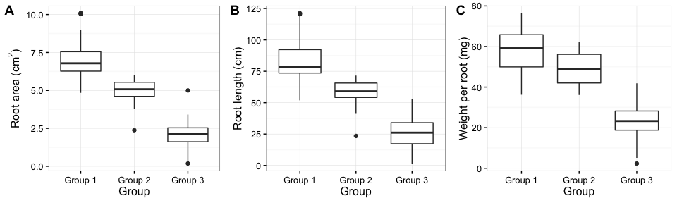

```r
#function for actual mode of data
#mode_f <- function(x){as.integer(which.max(table(x)))}
```


### LDA Analysis (Not included)

```r
#### LDA analysis data set
root.lda.data <- cbind(root_final[1:4],log10(root_final[,5:9] + 1), root_final[10])
root.lda.data[5:8] <- scale(root.lda.data[5:8], center = TRUE, scale = TRUE)

root_lda <- lda(Species ~ area.r + length.r + Weight.per.root, data=root.lda.data)
root.lda.p <- predict(root_lda)

prop.lda <- root_lda$svd^2/sum(root_lda$svd^2)

dataset = data.frame(species = root.lda.data[,"Treatment"],
                     pca = root.log.pca$x, lda = root.lda.p$x)

(p1 <- ggplot(dataset) + geom_point(aes(lda.LD1, lda.LD2, colour = species, shape = species), size = 2.5, position = position_jitter(width=0.3, height=0.3)) + theme_gray() + 
  labs(x = paste("LD1 (", percent(prop.lda[1]), ")", sep=""),
       y = paste("LD2 (", percent(prop.lda[2]), ")", sep="")))
```

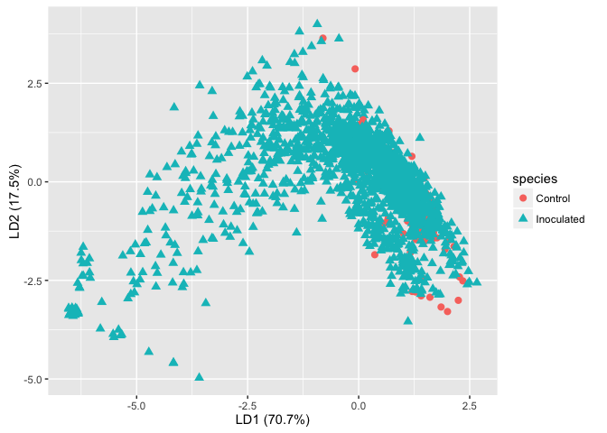


### Prevalence of pathogenic species

```r
#Vector for pathogenic species
c3 <- root.sp1[(root.sp1$mnv.p<0.05) & (root.sp1$ln.p<0.05),1]

#Read abundance data
Isolate_data <- read.csv("../data/clean/Isolates_11-12_final.csv")

#Summarise data by year
Data_11_12 <- ddply(Isolate_data, c("Species","State"), summarise,
                   N = as.numeric(length(qDef)),
                   freq = (N/length(Isolate_data$Year))*100
                   )

#Subsetting the data
Data_11_12.sub <- subset(Data_11_12, Data_11_12$Species %in% c3, c(Species, State, N))
D11_12 <- spread(Data_11_12.sub, State, N)
D11_12[is.na(D11_12)] <- 0
D11_12 <- gather(D11_12, State, N, Arkansas:Wisconsin)

D11_12$brk <- cut(D11_12$N, breaks = c(-0.5,0,10,50,100,150,200),
                  labels=c("0","1-10","10-50","50-100","100-150","150-200"))

#Tile plot
(prev.plot <- ggplot(D11_12, aes(x=State,y=reorder(Species, N, median))) + 
  geom_tile(aes(fill=brk)) + 
  scale_fill_brewer(palette = "GnBu", type = "seq", name="Isolates (n)") +
  theme_bw() +
  labs(y="Species") + 
  theme(axis.text.x=element_text(angle=-60, hjust=0, colour="black"), 
        axis.text.y=element_text(face="italic", colour="black")))
```


```r
## Non pathogenic species prevalence
c4 <- root.sp1[(root.sp1$mnv.p>0.05) & (root.sp1$ln.p>0.05),1]

Data_11_12.sub2 <- subset(Data_11_12, Data_11_12$Species %in% c4, c(Species, State, N))
D11_12.2 <- spread(Data_11_12.sub2, State, N)
D11_12.2[is.na(D11_12.2)] <- 0
D11_12.2 <- gather(D11_12.2, State, N, Arkansas:Wisconsin)

D11_12.2$brk <- cut(D11_12.2$N, breaks = c(-0.5,0,10,50,100,150,200), 
                  labels=c("0","1-10","10-50","50-100","100-150","150-200"))

(prev.plot2 <- ggplot(D11_12.2, aes(x=State,y=reorder(Species, N, median))) + 
  geom_tile(aes(fill=brk)) + 
  scale_fill_brewer(palette = "GnBu", type = "seq", name="Isolates (n)") +
  theme_bw() +
  labs(y="Species") + 
  theme(axis.text.x=element_text(angle=-60, hjust=0, colour="black"), 
        axis.text.y=element_text(face="italic", colour="black")))
```

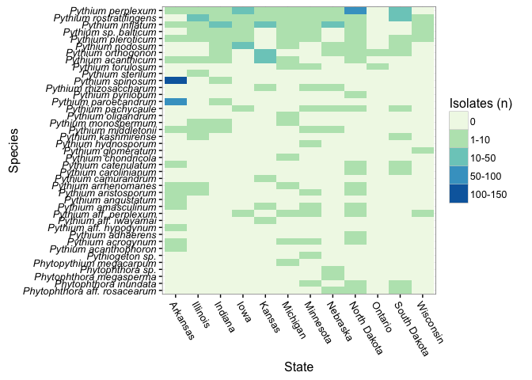
